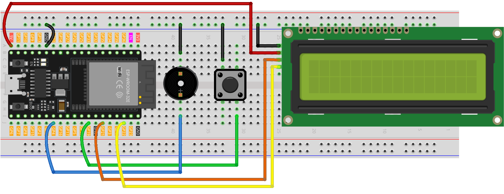

.. _dino_run:

Dino Run 
==============================================================

.. note::
  
  🌟 Welcome to the SunFounder Facebook Community! Whether you're into Raspberry Pi, Arduino, or ESP32, you'll find inspiration, help ideas here.
   
  - ✅ Be the first to get free learning resources. 
   
  - ✅ Stay updated on new products & exclusive giveaways. 
   
  - ✅ Share your creations and get real feedback.
   
  * 👉 Need faster updates or support? Click [|link_sf_facebook|] join our Facebook community 

  * 👉 Or join our WhatsApp group: Click [|link_sf_whatsapp|]
   
🎁 Kit purchase
------------------------
  
Looking for parts? Check out our all-in-one kits below — packed with components, beginner-friendly guides, and tons of fun.

.. image:: img/esp32_kit.png
   :width: 100%
   :align: center
   :target: https://www.sunfounder.com/products/sunfounder-esp32-ultimate-starter-kit-with-esp32-camera-extension-board-battery?_pos=1&_sid=7dcb30fb6&_ss=r&ref=jbzmncle

.. raw:: html

     

.. list-table::
   :widths: 20 20 20
   :header-rows: 1

   * - Name
     - Includes ESP32 board
     - PURCHASE LINK
   * - ESP32 Ultimate Starter Kit
     - ESP32 WROOM 32E +
     - |link_esp32_kit_buy|
   * - Universal Maker Sensor Kit
     -
     - |link_umsk_buy|

Course Introduction
------------------------

In this lesson, you’ll learn how to use a 1602 LCD, a button, and a passive buzzer with the ESP32 to create a dinosaur running challenge game. 

The LCD will display the game screen, and players can press the button to make the dinosaur jump or duck to avoid obstacles. 
Each successful dodge will increase the player's score.

.. raw:: html

  <iframe width="700" height="394" src="https://www.youtube.com/embed/F0T6iaKXVK4?si=Karb2NAZJZZJK4qm" title="YouTube video player" frameborder="0" allow="accelerometer; autoplay; clipboard-write; encrypted-media; gyroscope; picture-in-picture; web-share" referrerpolicy="strict-origin-when-cross-origin" allowfullscreen></iframe>

.. note::

  If this is your first time working with an ESP32 project, we recommend downloading and reviewing the basic materials first.
  
  * :ref:`install_arduino`
  * :ref:`introduce_arduino`
  * :ref:`install_esp32`

**Required Components**

In this project, we need the following components:

.. list-table::
    :widths: 5 20 5 20
    :header-rows: 1

    *   - SN
        - COMPONENT INTRODUCTION	
        - QUANTITY
        - PURCHASE LINK

    *   - 1
        - ESP-WROOM-32 ESP32 ESP-32S Development Board
        - 1
        - |link_esp32_buy|
    *   - 2
        - USB Type-C cable
        - 1
        - 
    *   - 3
        - Breadboard
        - 1
        - |link_breadboard_buy|
    *   - 4
        - Wires
        - Several
        - |link_wires_buy|
    *   - 5
        - I2C LCD 1602
        - 1
        - |link_i2clcd1602_buy|
    *   - 6
        - Button
        - 1
        - |link_button_buy|
    *   - 7
        - Passive buzzer
        - 1
        - |link_passive_buzzer_buy|

**Wiring**

**Common Connections:**

* **I2C LCD 1602**

  - **SDA:** Connect to **GPIO21** on the ESP32.
  - **SCL:** Connect to **GPIO22** on the ESP32.
  - **GND:** Connect to breadboard’s negative power bus.
  - **VCC:** Connect to **5V** on the ESP32.

* **Passive Buzzer**

  - **＋:** Connect to **GPIO4** on the ESP32.
  - **－:** Connect to breadboard’s negative power bus.

* **Button**

  - Connect to breadboard’s negative power bus.
  - Connect to **GPIO19** on the ESP32.

**Writing the Code**

.. note::

    * You can copy this code into **Arduino IDE**. 
    * To install the library, use the Arduino Library Manager and search for **LiquidCrystal I2C** and install it.
    * Don't forget to select the board(ESP32 Dev module) and the correct port before clicking the **Upload** button.

.. code-block:: arduino

      #include <Wire.h>
      #include <LiquidCrystal_I2C.h>
      #include <esp_system.h>   // for esp_random() seed (ESP32)

      // -------- Pins (ESP32) --------
      #define BUTTON_PIN 19          // push button to GND (INPUT_PULLUP)
      #define BUZZER_PIN 4           // passive buzzer
      #define I2C_SDA    21
      #define I2C_SCL    22

      LiquidCrystal_I2C lcd(0x27, 16, 2); // change to 0x3F if needed

      // Obstacle types
      #define CACTUS 2
      #define BIRD   3

      // Custom characters
      byte dino_left[8] = {
        0b00000,0b00000,0b00010,0b00010,0b00011,0b00011,0b00001,0b00001
      };
      byte dino_right[8] = {
        0b00111,0b00111,0b00111,0b00100,0b11100,0b11100,0b11000,0b01000
      };
      byte cactus[8] = {
        0b00100,0b10100,0b10100,0b10101,0b01101,0b00101,0b00110,0b00100
      };
      byte bird[8] = {
        0b00100,0b01110,0b11111,0b01110,0b01010,0b00000,0b00000,0b00000
      };

      // ==================== Global Variables ====================

      bool isUp = false;
      bool gameOver = false;

      int distance = 0;
      int hundreds = 0;
      int totalSteps = 0;

      // Speed control
      int obstacleSpeed = 200;
      int minSpeed = 120;
      int speedIncrement = 20;

      // First obstacle
      int obstacleX1 = 13;
      int obstacleType1 = CACTUS;
      int lastObstacleType1 = BIRD;
      int repeatCount1 = 0;
      int oldObstacleX1 = 13;
      int oldObstacleRow1 = 1;

      // Second obstacle
      int obstacleX2 = -1;
      int obstacleType2 = CACTUS;
      int lastObstacleType2 = BIRD;
      int repeatCount2 = 0;
      int oldObstacleX2 = -1;
      int oldObstacleRow2 = 1;

      int oldDinoRow = 1;

      // ---------------- Function Declarations ----------------
      void startGame();
      void moveObstacle();
      void drawDinosaur();
      void endGame();

      int  getObstacleRow(int type);
      int  pickObstacleType(int &lastType, int &repeatCount);
      int  pickObstacleType2Diversify(int firstType);
      void fixImpossibleOverlap(int whoJustGenerated);

      // ---------------- Setup & Loop ----------------
      void setup() {
        // I2C on ESP32
        Wire.begin(I2C_SDA, I2C_SCL);
        lcd.init();
        lcd.backlight();

        lcd.createChar(0, dino_left);
        lcd.createChar(1, dino_right);
        lcd.createChar(2, cactus);
        lcd.createChar(3, bird);

        pinMode(BUTTON_PIN, INPUT_PULLUP);
        pinMode(BUZZER_PIN, OUTPUT);

        // Robust random seed on ESP32
        randomSeed((uint32_t)esp_random() ^ micros());

        startGame();
      }

      void loop() {
        static unsigned long lastButtonTime = 0;
        if (digitalRead(BUTTON_PIN) == LOW) {
          unsigned long now = millis();
          if (now - lastButtonTime > 200) {
            lastButtonTime = now;
            if (gameOver) {
              startGame();
            } else {
              isUp = !isUp;
            }
          }
        }

        if (!gameOver) {
          moveObstacle();
        }
      }

      // ---------------- Game Logic ----------------
      void startGame() {
        isUp = false;
        gameOver = false;

        distance = 0;
        hundreds = 0;
        totalSteps = 0;
        obstacleSpeed = 200;

        obstacleX1 = 13;
        obstacleType1 = CACTUS;
        lastObstacleType1 = BIRD;
        repeatCount1 = 0;
        oldObstacleX1 = 13;
        oldObstacleRow1 = 1;

        obstacleX2 = -1;
        obstacleType2 = CACTUS;
        lastObstacleType2 = BIRD;
        repeatCount2 = 0;
        oldObstacleX2 = -1;
        oldObstacleRow2 = 1;

        oldDinoRow = 1;

        lcd.clear();
        lcd.setCursor(0, 0); lcd.print(" Dino Run 16x2 ");
        lcd.setCursor(0, 1); lcd.print(" Press BTN...  ");
        delay(1000);
        lcd.clear();
      }

      void moveObstacle() {
        static unsigned long lastMoveTime = 0;
        unsigned long now = millis();

        if (now - lastMoveTime >= (unsigned long)obstacleSpeed) {
          lastMoveTime = now;

          if (oldObstacleX1 >= 0 && oldObstacleX1 < 16) {
            lcd.setCursor(oldObstacleX1, oldObstacleRow1); lcd.write(' ');
          }
          if (oldObstacleX2 >= 0 && oldObstacleX2 < 16) {
            lcd.setCursor(oldObstacleX2, oldObstacleRow2); lcd.write(' ');
          }

          distance++;
          if (distance > 99) { distance = 0; hundreds++; }
          totalSteps = hundreds * 100 + distance;

          if (totalSteps >= 100 && obstacleX2 < 0) {
            obstacleX2 = 16;
            obstacleType2 = pickObstacleType2Diversify(obstacleType1);
            fixImpossibleOverlap(2);
          }

          obstacleX1--;
          if (totalSteps >= 100) obstacleX2--;

          if (obstacleX1 < 0) {
            obstacleX1 = 13;
            obstacleType1 = pickObstacleType(lastObstacleType1, repeatCount1);
            fixImpossibleOverlap(1);
            if (obstacleSpeed > minSpeed) {
              obstacleSpeed -= speedIncrement;
              if (obstacleSpeed < minSpeed) obstacleSpeed = minSpeed;
            }
          }

          if (totalSteps >= 100 && obstacleX2 < 0) {
            obstacleX2 = 16;
            obstacleType2 = pickObstacleType2Diversify(obstacleType1);
            fixImpossibleOverlap(2);
          }

          drawDinosaur();

          int row1 = getObstacleRow(obstacleType1);
          if (obstacleX1 >= 0 && obstacleX1 < 16) {
            lcd.setCursor(obstacleX1, row1);
            lcd.write(byte(obstacleType1));
          }
          oldObstacleX1 = obstacleX1;
          oldObstacleRow1 = row1;

          int row2 = getObstacleRow(obstacleType2);
          if (totalSteps >= 100 && obstacleX2 >= 0 && obstacleX2 < 16) {
            lcd.setCursor(obstacleX2, row2);
            lcd.write(byte(obstacleType2));
            oldObstacleX2 = obstacleX2;
            oldObstacleRow2 = row2;
          }

          lcd.setCursor(14, 0); lcd.print(hundreds);
          lcd.setCursor(14, 1); lcd.print(distance / 10);
          lcd.setCursor(15, 1); lcd.print(distance % 10);

          if ((obstacleX1 == 1 || obstacleX1 == 2)) {
            if ((obstacleType1 == CACTUS && !isUp) || (obstacleType1 == BIRD && isUp)) {
              endGame(); return;
            }
          }
          if (totalSteps >= 100 && (obstacleX2 == 1 || obstacleX2 == 2)) {
            if ((obstacleType2 == CACTUS && !isUp) || (obstacleType2 == BIRD && isUp)) {
              endGame(); return;
            }
          }
        }
      }

      void drawDinosaur() {
        int newRow = isUp ? 0 : 1;
        if (newRow != oldDinoRow) {
          lcd.setCursor(1, oldDinoRow); lcd.write(' ');
          lcd.setCursor(2, oldDinoRow); lcd.write(' ');
        }
        lcd.setCursor(1, newRow); lcd.write(byte(0));
        lcd.setCursor(2, newRow); lcd.write(byte(1));
        oldDinoRow = newRow;
      }

      void endGame() {
        gameOver = true;

        // buzzer sequence
        tone(BUZZER_PIN, 400, 100); delay(150);
        tone(BUZZER_PIN, 600, 100); delay(150);
        tone(BUZZER_PIN, 800, 150); delay(200);
        tone(BUZZER_PIN, 600, 150); delay(200);
        tone(BUZZER_PIN, 400, 200); delay(250);
        noTone(BUZZER_PIN);

        lcd.clear();
        lcd.setCursor(2, 0); lcd.print("GAME OVER!!!");
        lcd.setCursor(1, 1); lcd.print("Steps: ");
        lcd.print(totalSteps);
      }

      // ---------------- Utility ----------------
      int getObstacleRow(int type) {
        return (type == CACTUS) ? 1 : 0;
      }

      int pickObstacleType(int &lastType, int &repeatCount) {
        bool limitRepeat = (totalSteps < 100);
        int newType = (random(2) == 0) ? CACTUS : BIRD;

        if (!limitRepeat) return newType;

        if (repeatCount >= 2) {
          newType = (lastType == CACTUS) ? BIRD : CACTUS;
          repeatCount = 1;
        } else {
          if (newType == lastType) repeatCount++;
          else repeatCount = 1;
        }
        lastType = newType;
        return newType;
      }

      int pickObstacleType2Diversify(int firstType) {
        int r = random(100);
        if (r < 90) {
          return (firstType == CACTUS) ? BIRD : CACTUS;
        } else {
          return firstType;
        }
      }

      void fixImpossibleOverlap(int whoJustGenerated) {
        while (true) {
          int row1 = getObstacleRow(obstacleType1);
          int row2 = getObstacleRow(obstacleType2);
          int dx = abs(obstacleX1 - obstacleX2);
          if (!(row1 != row2 && dx < 2)) break;

          if (whoJustGenerated == 1) {
            obstacleType1 = pickObstacleType2Diversify(obstacleType2);
            row1 = getObstacleRow(obstacleType1);
            dx = abs(obstacleX1 - obstacleX2);
            if (row1 != row2 && dx < 2) {
              obstacleX1 = obstacleX2 + 2;
            }
          } else {
            obstacleType2 = pickObstacleType2Diversify(obstacleType1);
            row2 = getObstacleRow(obstacleType2);
            dx = abs(obstacleX1 - obstacleX2);
            if (row1 != row2 && dx < 2) {
              obstacleX2 = obstacleX1 + 2;
            }
          }
        }
      }
