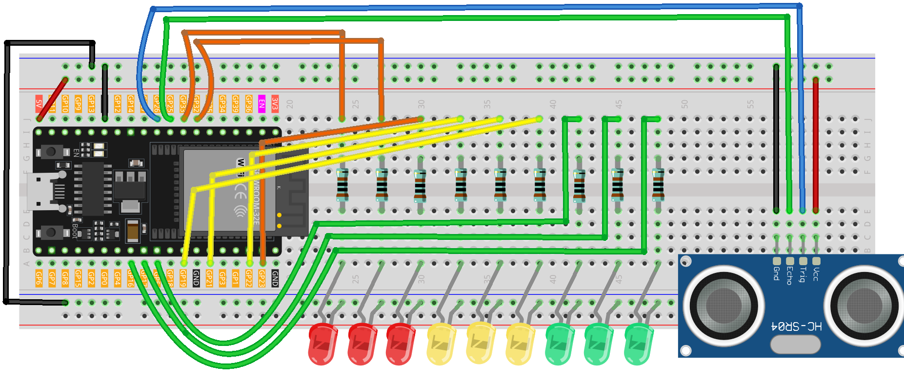

.. _distance_display1.0:

Distance Display 1.0
==============================================================

.. note::
  
  🌟 Welcome to the SunFounder Facebook Community! Whether you're into Raspberry Pi, Arduino, or ESP32, you'll find inspiration, help ideas here.
   
  - ✅ Be the first to get free learning resources. 
   
  - ✅ Stay updated on new products & exclusive giveaways. 
   
  - ✅ Share your creations and get real feedback.
   
  * 👉 Need faster updates or support? Click [|link_sf_facebook|] join our Facebook community 

  * 👉 Or join our WhatsApp group: Click [|link_sf_whatsapp|]
   
  * 🎁 Looking for parts?Check out our all-in-one kits below — packed with components, beginner-friendly guides, and tons of fun.
  
  .. list-table::
    :widths: 20 20 20
    :header-rows: 1

    *   - Name	
        - Includes ESP32 board
        - PURCHASE LINK
    *   - ESP32 Ultimate Starter Kit	
        - ESP32 WROOM 32E +
        - |link_esp32_kit_buy|
    *   - Universal Maker Sensor Kit
        - 
        - |link_umsk_buy|

Course Introduction
------------------------

In this project, we use an ultrasonic sensor and three groups of LEDs (green, yellow, red) to simulate a radar-style proximity alert system with the ESP32 board. 

The system measures the distance to an object and activates different LED groups based on how close the object is: green LEDs indicate a safe distance (≤15 cm), yellow LEDs warn that the object is getting closer (≤10 cm), and red LEDs signal a critical proximity alert (≤5 cm). The LEDs turn on from left to right and turn off from right to left to enhance the visual effect.

.. .. raw:: html
 
..  <iframe width="700" height="394" src="https://www.youtube.com/embed/zgxBlPbx5Dw?si=VVic5yUzM2WCicIs" title="YouTube video player" frameborder="0" allow="accelerometer; autoplay; clipboard-write; encrypted-media; gyroscope; picture-in-picture; web-share" referrerpolicy="strict-origin-when-cross-origin" allowfullscreen></iframe>

.. note::

  If this is your first time working with an ESP32 project, we recommend downloading and reviewing the basic materials first.
  
  * :ref:`install_arduino`
  * :ref:`introduce_arduino`
  * :ref:`install_esp32`

**Required Components**

In this project, we need the following components:

.. list-table::
    :widths: 5 20 5 20
    :header-rows: 1

    *   - SN
        - COMPONENT INTRODUCTION	
        - QUANTITY
        - PURCHASE LINK

    *   - 1
        - ESP-WROOM-32 ESP32 ESP-32S Development Board
        - 1
        - |link_esp32_buy|
    *   - 2
        - USB Type-C cable
        - 1
        - 
    *   - 3
        - Breadboard
        - 1
        - |link_breadboard_buy|
    *   - 4
        - Wires
        - Several
        - |link_wires_buy|
    *   - 5
        - 1kΩ resistor
        - several
        - |link_resistor_buy|
    *   - 6
        - Ultrasonic Sensor Module
        - 1
        - |link_ultrasonic_buy|
    *   - 7
        - LED
        - several
        - |link_led_buy|

**Wiring**

**Common Connections:**

* **LED**

  - Connect the red LEDs **cathode**  to the negative power bus on the breadboard, and the LEDs **anode** to a **1kΩ resistor** then to **GPIO33** , **GPIO32** , **GPIO23** on the ESP32.
  - Connect the yellow LEDs **cathode**  to the negative power bus on the breadboard, and the LEDs **anode** to a **1kΩ resistor** then to **GPIO22** , **GPIO21** , **GPIO19** on the ESP32.
  - Connect the green LEDs **cathode**  to the negative power bus on the breadboard, and the LEDs **anode** to a **1kΩ resistor** then to **GPIO16** , **GPIO17** , **GPIO18** on the ESP32.

* **Ultrasonic Sensor Module**

  - **Trig:** Connect to **GPIO26** on the ESP32.
  - **Echo:** Connect to **GPIO25** on the ESP32.
  - **GND:** Connect to breadboard’s negative power bus.
  - **VCC:** Connect to breadboard’s red power bus.

**Writing the Code**

.. note::

    * You can copy this code into **Arduino IDE**. 
    * Don't forget to select the board(ESP32 Dev Module) and the correct port before clicking the **Upload** button.

.. code-block:: arduino

      // ESP32 version: Ultrasonic distance → 3 LED bars (green/yellow/red)

      #include <Arduino.h>

      // --- Ultrasonic sensor pins (ESP32) ---
      const int trigPin = 26;   // TRIG (3.3V logic OK)
      const int echoPin = 25;   // ECHO (MUST be level-shifted down to 3.3V)

      // --- Three LED groups from left to right (ESP32 safe GPIOs) ---
      // Use a series resistor (220–330 Ω) for each LED
      const int greenLEDs[]  = {16, 17, 18};   // Green LEDs = safe distance
      const int yellowLEDs[] = {19, 21, 22};   // Yellow LEDs = getting closer
      const int redLEDs[]    = {23, 32, 33};   // Red LEDs = very close

      // Flags to track if each LED group is on
      bool greenOn  = false;
      bool yellowOn = false;
      bool redOn    = false;

      void turnOnLEDs(const int ledArray[]);
      void turnOffLEDsReverse(const int ledArray[]);
      float readSensorData();

      void setup() {
        Serial.begin(115200);

        pinMode(trigPin, OUTPUT);
        pinMode(echoPin, INPUT); // echo is 3.3V *after* level shifting (see wiring)

        // Set all LED pins as outputs and turn them off
        for (int i = 0; i < 3; i++) {
          pinMode(greenLEDs[i], OUTPUT);  digitalWrite(greenLEDs[i], LOW);
          pinMode(yellowLEDs[i], OUTPUT); digitalWrite(yellowLEDs[i], LOW);
          pinMode(redLEDs[i], OUTPUT);    digitalWrite(redLEDs[i], LOW);
        }

        Serial.println("Ultrasonic sensor (ESP32):");
      }

      void loop() {
        float distance = readSensorData();  // distance in cm
        Serial.print(distance, 1);
        Serial.println(" cm");

        if (distance <= 15) {
          // ≤15 cm: turn on green bar
          if (!greenOn) {
            turnOnLEDs(greenLEDs);
            greenOn = true;
          }

          if (distance <= 10) {
            // ≤10 cm: turn on yellow bar
            if (!yellowOn) {
              turnOnLEDs(yellowLEDs);
              yellowOn = true;
            }

            if (distance <= 5) {
              // ≤5 cm: turn on red bar
              if (!redOn) {
                turnOnLEDs(redLEDs);
                redOn = true;
              }
            } else {
              // >5 cm: turn off red bar (right-to-left)
              if (redOn) {
                turnOffLEDsReverse(redLEDs);
                redOn = false;
              }
            }

          } else {
            // >10 cm: turn off yellow bar
            if (yellowOn) {
              turnOffLEDsReverse(yellowLEDs);
              yellowOn = false;
            }
          }

        } else {
          // >15 cm: turn everything off (right-to-left for effect)
          if (redOn)    { turnOffLEDsReverse(redLEDs);    redOn = false; }
          if (yellowOn) { turnOffLEDsReverse(yellowLEDs); yellowOn = false; }
          if (greenOn)  { turnOffLEDsReverse(greenLEDs);  greenOn = false; }
        }

        delay(50);
      }

      // Measure distance using ultrasonic sensor (HC-SR04 style)
      float readSensorData() {
        digitalWrite(trigPin, LOW);
        delayMicroseconds(2);

        digitalWrite(trigPin, HIGH);
        delayMicroseconds(10);

        digitalWrite(trigPin, LOW);

        // Timeout ~30ms to avoid blocking too long
        unsigned long duration = pulseIn(echoPin, HIGH, 30000UL);

        // If timed out, return a large value
        if (duration == 0) return 999.0;

        // Convert to centimeters
        return duration / 58.0f;
      }

      // Turn on LEDs from left to right
      void turnOnLEDs(const int ledArray[]) {
        for (int i = 0; i < 3; i++) {
          if (digitalRead(ledArray[i]) == LOW) {
            digitalWrite(ledArray[i], HIGH);
            delay(60);
          }
        }
      }

      // Turn off LEDs from right to left
      void turnOffLEDsReverse(const int ledArray[]) {
        for (int i = 2; i >= 0; i--) {
          if (digitalRead(ledArray[i]) == HIGH) {
            digitalWrite(ledArray[i], LOW);
            delay(60);
          }
        }
      }
