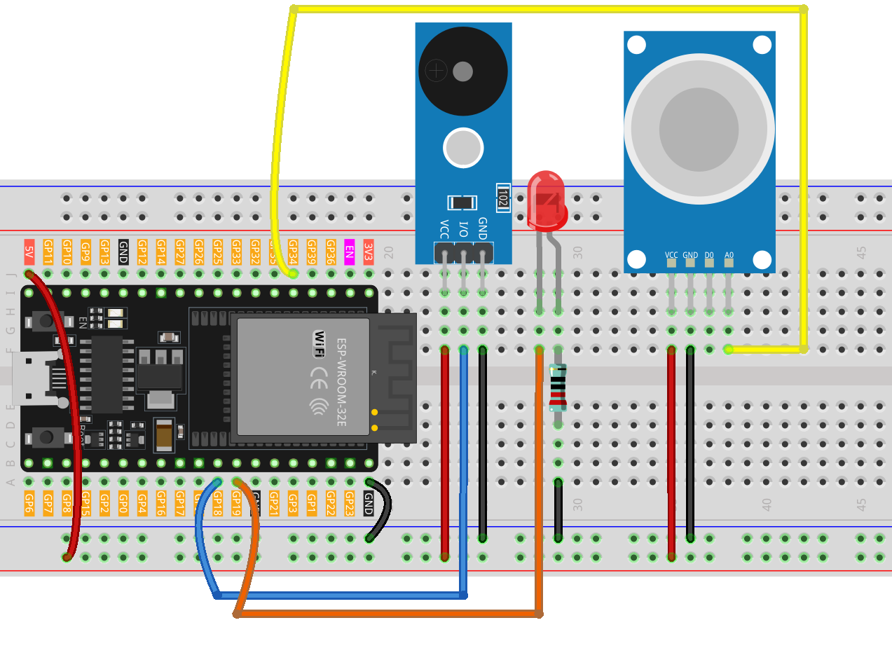

.. _gas_leak:

Gas Leak Monitor
==============================================================

.. note::
  
  🌟 Welcome to the SunFounder Facebook Community! Whether you're into Raspberry Pi, Arduino, or ESP32, you'll find inspiration, help ideas here.
   
  - ✅ Be the first to get free learning resources. 
   
  - ✅ Stay updated on new products & exclusive giveaways. 
   
  - ✅ Share your creations and get real feedback.
   
  * 👉 Need faster updates or support? Click [|link_sf_facebook|] join our Facebook community 

  * 👉 Or join our WhatsApp group: Click [|link_sf_whatsapp|]
   
  * 🎁 Looking for parts?Check out our all-in-one kits below — packed with components, beginner-friendly guides, and tons of fun.
  
  .. list-table::
    :widths: 20 20 20
    :header-rows: 1

    *   - Name	
        - Includes ESP32 board
        - PURCHASE LINK
    *   - ESP32 Ultimate Starter Kit	
        - ESP32 WROOM 32E +
        - |link_esp32_kit_buy|
    *   - Universal Maker Sensor Kit
        - 
        - |link_umsk_buy|

Course Introduction
------------------------

This project simulates a basic gas leak detection system using an MQ-2 gas sensor, a red LED, and a buzzer. 

The sensor continuously monitors gas concentration. If the reading exceeds a set threshold, the buzzer sounds and the LED blinks to indicate danger. 

Otherwise, the system remains silent and the LED stays off.

.. raw:: html
 
  <iframe width="700" height="394" src="https://www.youtube.com/embed/u_BaA3E5RoU?si=1Q7Of_WqkBNTvA5s" title="YouTube video player" frameborder="0" allow="accelerometer; autoplay; clipboard-write; encrypted-media; gyroscope; picture-in-picture; web-share" referrerpolicy="strict-origin-when-cross-origin" allowfullscreen></iframe>

.. note::

  If this is your first time working with an ESP32 project, we recommend downloading and reviewing the basic materials first.
  
  * :ref:`install_arduino`
  * :ref:`introduce_arduino`
  * :ref:`install_esp32`

**Required Components**

In this project, we need the following components:

.. list-table::
    :widths: 5 20 5 20
    :header-rows: 1

    *   - SN
        - COMPONENT INTRODUCTION	
        - QUANTITY
        - PURCHASE LINK

    *   - 1
        - ESP-WROOM-32 ESP32 ESP-32S Development Board
        - 1
        - |link_esp32_buy|
    *   - 2
        - USB Type-C cable
        - 1
        - 
    *   - 3
        - Breadboard
        - 1
        - |link_breadboard_buy|
    *   - 4
        - Wires
        - Several
        - |link_wires_buy|
    *   - 5
        - Buzzer Modudle
        - 1
        - |link_buzzer_module_buy|
    *   - 6
        - LED
        - 1
        - |link_led_buy|
    *   - 7
        - MQ-2 Gas Sensor Module
        - 1
        - |link_gas_leak_buy|
    *   - 8
        - 220Ω resistor
        - 1
        - |link_resistor_buy|

**Wiring**

**Common Connections:**

* **MQ-2 Gas Sensor Module**

  - **A0:** Connect to **GPIO34** on the ESP32.
  - **GND:** Connect to breadboard’s negative power bus.
  - **VCC:** Connect to breadboard’s red power bus.

* **Buzzer Modudle**

  - **I/O:** Connect to **GPIO18** on the ESP32.
  - **GND:** Connect to breadboard’s negative power bus.
  - **VCC:** Connect to breadboard’s red power bus.

* **LED**

  - Connect the LED **anode** to **GPIO19** on the ESP32, and the **cathode** to a **220Ω resistor** , then to the negative power bus on the breadboard.

**Writing the Code**

.. note::

    * You can copy this code into **Arduino IDE**. 
    * Don't forget to select the board(ESP32 Dev Module) and the correct port before clicking the **Upload** button.

.. code-block:: arduino

      /*
        Board: ESP32 Dev Module (or similar)
        Components: MQ-2 gas sensor (analog), red LED, buzzer
        Purpose: Simulate gas leak detection.

        Logic:
        - If gas concentration > threshold: buzzer sounds, red LED blinks.
        - Otherwise: buzzer is off, red LED is off.
      */

      const int sensorPin = 34;      // MQ-2 analog output (ESP32 ADC pin)
      const int buzzerPin = 18;      // Buzzer pin (GPIO 18)
      const int redLEDPin = 19;      // Red LED pin (GPIO 19)

      int sensorValue = 0;           // Variable to store sensor value

      // On ESP32, analogRead() returns 0–4095 (12-bit).
      // Original threshold 90 (on 0–1023) ≈ 360 on 0–4095.
      const int threshold = 720;     // Gas detection threshold (tune as needed)

      void setup() {
        Serial.begin(115200);        // Initialize serial monitor (higher baud for ESP32)

        pinMode(buzzerPin, OUTPUT);  // Set buzzer pin as output
        pinMode(redLEDPin, OUTPUT);  // Set red LED pin as output

        digitalWrite(buzzerPin, LOW);
        digitalWrite(redLEDPin, LOW);
      }

      void loop() {
        // Read sensor value (0–4095 on ESP32 ADC)
        sensorValue = analogRead(sensorPin);

        Serial.print("Analog output: ");
        Serial.println(sensorValue);

        if (sensorValue > threshold) {
          // Gas above threshold: buzzer ON, LED blinking
          tone(buzzerPin, 500);          // 500 Hz tone on buzzer
          digitalWrite(redLEDPin, HIGH); // LED ON
          delay(250);
          digitalWrite(redLEDPin, LOW);  // LED OFF
          delay(250);                    // Total blink period = 500 ms
        } else {
          // Gas below threshold: buzzer OFF, LED OFF
          noTone(buzzerPin);             // Stop buzzer
          digitalWrite(redLEDPin, LOW);  // LED OFF
          delay(50);
        }
      }
