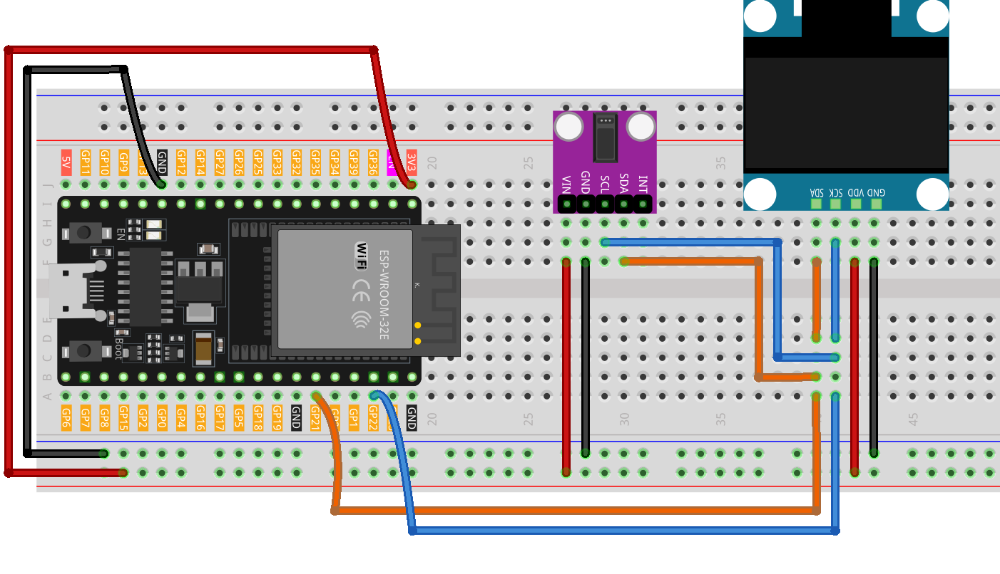

.. _heart_rate_monitor:

Heart rate monitor
==============================================================

.. note::
  
  🌟 Welcome to the SunFounder Facebook Community! Whether you're into Raspberry Pi, Arduino, or ESP32, you'll find inspiration, help ideas here.
   
  - ✅ Be the first to get free learning resources. 
   
  - ✅ Stay updated on new products & exclusive giveaways. 
   
  - ✅ Share your creations and get real feedback.
   
  * 👉 Need faster updates or support? Click [|link_sf_facebook|] join our Facebook community 

  * 👉 Or join our WhatsApp group: Click [|link_sf_whatsapp|]
   
Kit purchase
------------------------
  
Looking for parts? Check out our all-in-one kits below — packed with components, beginner-friendly guides, and tons of fun.

.. image:: img/esp32_kit.png
   :width: 100%
   :align: center
   :target: https://www.sunfounder.com/products/sunfounder-esp32-ultimate-starter-kit-with-esp32-camera-extension-board-battery?_pos=1&_sid=7dcb30fb6&_ss=r&ref=jbzmncle

.. raw:: html

     

.. list-table::
   :widths: 20 20 20
   :header-rows: 1

   * - Name
     - Includes ESP32 board
     - PURCHASE LINK
   * - ESP32 Ultimate Starter Kit
     - ESP32 WROOM 32E +
     - |link_esp32_kit_buy|
   * - Universal Maker Sensor Kit
     -
     - |link_umsk_buy|

Course Introduction
------------------------

This project aims to build a simple Heart Rate Monitor using a MAX30102 pulse oximeter sensor and an SSD1306 OLED Display. The code takes measurements of the heart rate by determining the time between heartbeats. By taking four measurements, it computes their average and presents the resultant average heart rate on an OLED screen. If the sensor doesn’t detect a finger, it sends a prompt to the user to position their finger correctly on the sensor.

.. raw:: html

  <iframe width="700" height="394" src="https://www.youtube.com/embed/KiaRa18CN0Q?si=vRm7X8Die5KdJ_3X" title="YouTube video player" frameborder="0" allow="accelerometer; autoplay; clipboard-write; encrypted-media; gyroscope; picture-in-picture; web-share" referrerpolicy="strict-origin-when-cross-origin" allowfullscreen></iframe>

.. note::

  If this is your first time working with an ESP32 project, we recommend downloading and reviewing the basic materials first.
  
  * :ref:`install_arduino`
  * :ref:`introduce_arduino`
  * :ref:`install_esp32`

**Required Components**

In this project, we need the following components:

.. list-table::
    :widths: 5 20 5 20
    :header-rows: 1

    *   - SN
        - COMPONENT INTRODUCTION	
        - QUANTITY
        - PURCHASE LINK

    *   - 1
        - ESP-WROOM-32 ESP32 ESP-32S Development Board
        - 1
        - |link_esp32_buy|
    *   - 2
        - USB Type-C cable
        - 1
        - 
    *   - 3
        - Breadboard
        - 1
        - |link_breadboard_buy|
    *   - 4
        - Wires
        - Several
        - |link_wires_buy|
    *   - 5
        - OLED Display Module
        - 1
        - |link_oled_buy|
    *   - 6
        - Pulse Oximeter and Heart Rate Sensor Module (MAX30102)
        - 1
        - |link_heart_rate_buy|

**Wiring**

**Common Connections:**

* **Pulse Oximeter and Heart Rate Sensor Module (MAX30102)**

  - **SDA:** Connect to **GPIO21** on the ESP32.
  - **SCL:** Connect to **GPIO22** on the ESP32.
  - **GND:** Connect to breadboard’s negative power bus.
  - **VIN:** Connect to breadboard’s **3.3V** red power bus.

* **OLED Display Module**

  - **SDA:** Connect to **GPIO21** on the ESP32.
  - **SCK:** Connect to **GPIO22** on the ESP32.
  - **GND:** Connect to breadboard’s negative power bus.
  - **VCC:** Connect to breadboard’s **3.3V** red power bus.

**Writing the Code**

.. note::

    * You can copy this code into **Arduino IDE**. 
    * To install the library, use the Arduino Library Manager and search for **Adafruit SSD1306** , **Adafruit GFX** , **MAX30105** and **heartRate** and install it.
    * Don't forget to select the board(ESP32 Dev module) and the correct port before clicking the **Upload** button.

.. code-block:: arduino

      // ==== ESP32 Version ====

      // Prevent conflict with MAX30105 enum
      #ifdef LED_RED
      #undef LED_RED
      #endif

      #include <Adafruit_GFX.h>
      #include <Adafruit_SSD1306.h>
      #include <Wire.h>
      #include "MAX30105.h"
      #include "heartRate.h"

      // -------- OLED Configuration --------
      #define SCREEN_WIDTH 128
      #define SCREEN_HEIGHT 64
      #define OLED_RESET   -1
      #define SCREEN_ADDRESS 0x3C   // I2C address for most 0.96" OLEDs

      // -------- ESP32 I2C Pins --------
      // Default for most ESP32 boards: SDA=21, SCL=22
      // Change these defines if using a different board
      #define I2C_SDA 21
      #define I2C_SCL 22

      Adafruit_SSD1306 display(SCREEN_WIDTH, SCREEN_HEIGHT, &Wire, OLED_RESET);

      // Heart rate variables
      MAX30105 particleSensor;
      const byte RATE_SIZE = 4;
      byte rates[RATE_SIZE];
      byte rateSpot = 0;
      long lastBeat = 0;
      float beatsPerMinute = 0;
      int beatAvg = 0;

      // Heart icon (small)
      static const unsigned char PROGMEM beat1_bmp[] = {
        0x03,0xC0,0xF0,0x06,0x71,0x8C,0x0C,0x1B,0x06,0x18,0x0E,0x02,0x10,0x0C,0x03,0x10,
        0x04,0x01,0x10,0x04,0x01,0x10,0x40,0x01,0x10,0x40,0x01,0x10,0xC0,0x03,0x08,0x88,
        0x02,0x08,0xB8,0x04,0xFF,0x37,0x08,0x01,0x30,0x18,0x01,0x90,0x30,0x00,0xC0,0x60,
        0x00,0x60,0xC0,0x00,0x31,0x80,0x00,0x1B,0x00,0x00,0x0E,0x00,0x00,0x04,0x00
      };

      // Heart icon (large)
      static const unsigned char PROGMEM beat2_bmp[] = {
        0x01,0xF0,0x0F,0x80,0x06,0x1C,0x38,0x60,0x18,0x06,0x60,0x18,0x10,0x01,0x80,0x08,
        0x20,0x01,0x80,0x04,0x40,0x00,0x00,0x02,0x40,0x00,0x00,0x02,0xC0,0x00,0x08,0x03,
        0x80,0x00,0x08,0x01,0x80,0x00,0x18,0x01,0x80,0x00,0x1C,0x01,0x80,0x00,0x14,0x00,
        0x80,0x00,0x14,0x00,0x80,0x00,0x14,0x00,0x40,0x10,0x12,0x00,0x40,0x10,0x12,0x00,
        0x7E,0x1F,0x23,0xFE,0x03,0x31,0xA0,0x04,0x01,0xA0,0xA0,0x0C,0x00,0xA0,0xA0,0x08,
        0x00,0x60,0xE0,0x10,0x00,0x20,0x60,0x20,0x06,0x00,0x40,0x60,0x03,0x00,0x40,0xC0,
        0x01,0x80,0x01,0x80,0x00,0xC0,0x03,0x00,0x00,0x60,0x06,0x00,0x00,0x30,0x0C,0x00,
        0x00,0x08,0x10,0x00,0x00,0x06,0x60,0x00,0x00,0x03,0xC0,0x00,0x00,0x01,0x80,0x00
      };

      void setup() {
        // Serial monitor for debugging
        Serial.begin(115200);
        delay(100);

        // Initialize I2C with ESP32 SDA/SCL and 400kHz speed
        Wire.begin(I2C_SDA, I2C_SCL, 400000);

        // Initialize OLED display
        if (!display.begin(SSD1306_SWITCHCAPVCC, SCREEN_ADDRESS)) {
          Serial.println("OLED not found");
          while (true) { delay(1000); }
        }
        display.clearDisplay();
        display.display();

        // Initialize MAX30102/30105 sensor (the library supports both)
        if (!particleSensor.begin(Wire, I2C_SPEED_FAST)) {
          Serial.println("MAX30102 not found");
          while (true) { delay(1000); }
        }

        // Sensor configuration
        particleSensor.setup();                    // Use default configuration
        particleSensor.setPulseAmplitudeRed(0x0A); // Low red LED intensity
        particleSensor.setPulseAmplitudeGreen(0);  // Disable green LED

        Serial.println("Place your finger on the sensor.");
      }

      void loop() {
        long irValue = particleSensor.getIR();

        if (irValue > 50000) {
          if (checkForBeat(irValue)) {
            // Calculate BPM
            long now = millis();
            long delta = now - lastBeat;
            lastBeat = now;
            beatsPerMinute = 60.0 / (delta / 1000.0);

            if (beatsPerMinute < 255 && beatsPerMinute > 20) {
              rates[rateSpot++] = (byte)beatsPerMinute;
              rateSpot %= RATE_SIZE;

              int sum = 0;
              for (byte i = 0; i < RATE_SIZE; i++) sum += rates[i];
              beatAvg = sum / RATE_SIZE;

              // Small heart + value
              display.clearDisplay();
              display.drawBitmap(23, 15, beat1_bmp, 24, 21, WHITE);
              display.setTextSize(2);
              display.setTextColor(WHITE);
              display.setCursor(60, 10);
              display.println("BPM");
              display.setCursor(60, 28);
              display.println(beatAvg);
              display.display();

              delay(100);

              // Large heart + updated value
              display.clearDisplay();
              display.drawBitmap(18, 10, beat2_bmp, 32, 32, WHITE);
              display.setTextSize(2);
              display.setTextColor(WHITE);
              display.setCursor(60, 10);
              display.println("BPM");
              display.setCursor(60, 28);
              display.println(beatAvg);
              display.display();
            }

            // Serial output
            Serial.print("IR=");
            Serial.print(irValue);
            Serial.print(", BPM=");
            Serial.print(beatsPerMinute);
            Serial.print(", Avg BPM=");
            Serial.println(beatAvg);
          }
        } else {
          // No finger detected
          display.clearDisplay();
          display.setTextSize(1);
          display.setTextColor(WHITE);
          display.setCursor(30, 5);
          display.println("Please place ");
          display.setCursor(30, 15);
          display.println("your finger ");
          display.setCursor(30, 25);
          display.println("and wait... ");
          display.display();

          Serial.println("Place your finger on the sensor");
          delay(200);  // Prevent watchdog reset
        }
      }
