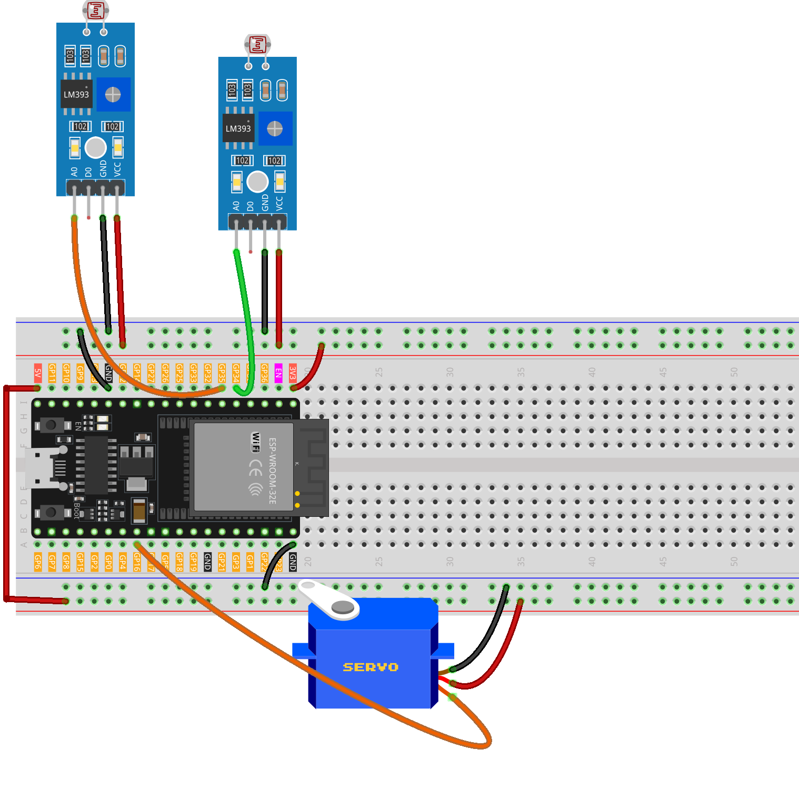

.. _light_tracing:

Light tracing
==============================================================

.. note::
  
  🌟 Welcome to the SunFounder Facebook Community! Whether you're into Raspberry Pi, Arduino, or ESP32, you'll find inspiration, help ideas here.
   
  - ✅ Be the first to get free learning resources. 
   
  - ✅ Stay updated on new products & exclusive giveaways. 
   
  - ✅ Share your creations and get real feedback.
   
  * 👉 Need faster updates or support? Click [|link_sf_facebook|] join our Facebook community 

  * 👉 Or join our WhatsApp group: Click [|link_sf_whatsapp|]
   
  * 🎁 Looking for parts?Check out our all-in-one kits below — packed with components, beginner-friendly guides, and tons of fun.

  .. list-table::
    :widths: 20 20 20
    :header-rows: 1

    *   - Name	
        - Includes ESP32 board
        - PURCHASE LINK
    *   - ESP32 Ultimate Starter Kit	
        - ESP32 WROOM 32E +
        - |link_esp32_kit_buy|
    *   - Universal Maker Sensor Kit
        - 
        - |link_umsk_buy|

Course Introduction
------------------------

This project uses LDRs to detect ambient light changes and control a servo. The original code supports two LDRs, but this experiment uses only one. You can try adding a second LDR for further exploration.

The servo adjusts its angle based on light intensity, simulating responsive movement. A tolerance threshold reduces jitter from small changes. This system is ideal for light-following robots or sun trackers.

.. raw:: html

  <iframe width="700" height="394" src="https://www.youtube.com/embed/eADTA9XNj5Q" title="YouTube video player" frameborder="0" allow="accelerometer; autoplay; clipboard-write; encrypted-media; gyroscope; picture-in-picture; web-share" referrerpolicy="strict-origin-when-cross-origin" allowfullscreen></iframe>

.. note::

  If this is your first time working with an ESP32 project, we recommend downloading and reviewing the basic materials first.
  
  * :ref:`install_arduino`
  * :ref:`introduce_arduino`
  * :ref:`install_esp32`

**Required Components**

In this project, we need the following components:

.. list-table::
    :widths: 5 20 5 20
    :header-rows: 1

    *   - SN
        - COMPONENT INTRODUCTION	
        - QUANTITY
        - PURCHASE LINK

    *   - 1
        - ESP-WROOM-32 ESP32 ESP-32S Development Board
        - 1
        - |link_esp32_buy|
    *   - 2
        - USB Type-C cable
        - 1
        - 
    *   - 3
        - Breadboard
        - 1
        - |link_breadboard_buy|
    *   - 4
        - Wires
        - Several
        - |link_wires_buy|
    *   - 5
        - Digital Servo Motor
        - 1
        - |link_motor_buy|
    *   - 6
        - Photoresistor Module
        - 2
        - |link_photoresistor_module_buy|

**Wiring**

**Common Connections:**

* **Digital Servo Motor**

  - Connect to breadboard’s **5V** positive power bus.
  - Connect to breadboard’s negative power bus.
  - Connect to  **GPIO16** on the ESP32.

* **Photoresistor Module Left**

  - **A0:** Connect to **GPIO34** on the ESP32.
  - **GND:** Connect to breadboard’s negative power bus.
  - **VCC:** Connect to breadboard’s **3.3V** red power bus.

* **Photoresistor Module Right**

  - **A0:** Connect to **GPIO35** on the ESP32.
  - **GND:** Connect to breadboard’s negative power bus.
  - **VCC:** Connect to breadboard’s **3.3V** red power bus.

**Writing the Code**

.. note::

    * You can copy this code into **Arduino IDE**. 
    * To install the library, use the Arduino Library Manager and search for **ESP32Servo** and install it.
    * Don't forget to select the board(ESP32 Dev module) and the correct port before clicking the **Upload** button.

.. code-block:: arduino

      // ===== ESP32 version =====
      #include <ESP32Servo.h>   // Install "ESP32Servo" via Library Manager

      Servo myServo;

      // Use ADC1 pins (safe during WiFi/BLE). GPIO34/35 are input-only, perfect for analog.
      const int ldrLeft  = 34;   // ADC1_CH6
      const int ldrRight = 35;   // ADC1_CH7

      const int servoPin = 16;   // Any PWM-capable GPIO (avoid strapping pins)
      int pos = 90;              // Initial angle centered (0..180)
      int tolerance = 10;        // Deadband to reduce jitter (counts)

      // Optional limits & step
      const int SERVO_MIN_ANGLE = 0;
      const int SERVO_MAX_ANGLE = 180;
      const int STEP_PER_LOOP   = 1;   // how many degrees to move per loop

      void setup() {
        Serial.begin(115200);
        delay(50);

        // Attach servo with explicit pulse range (common: 500–2500 µs; adjust for your servo)
        myServo.attach(servoPin, 500, 2500);
        myServo.write(pos);

        // ESP32 ADC configuration (12-bit, set per-pin attenuation to read up to ~3.3V)
        analogReadResolution(12);                // 0..4095
        analogSetPinAttenuation(ldrLeft,  ADC_11db);
        analogSetPinAttenuation(ldrRight, ADC_11db);

        Serial.println("ESP32 LDR + Servo tracker ready.");
      }

      void loop() {
        int leftValue  = analogRead(ldrLeft);    // 0..4095
        int rightValue = analogRead(ldrRight);   // 0..4095
        int difference = leftValue - rightValue; // positive: more light on left

        Serial.print("Left: ");
        Serial.print(leftValue);
        Serial.print(" | Right: ");
        Serial.print(rightValue);
        Serial.print(" | Diff: ");
        Serial.println(difference);

        // Only move if outside deadband
        if (abs(difference) > tolerance) {
          if (difference > 0 && pos < SERVO_MAX_ANGLE) {
            pos += STEP_PER_LOOP;
          } else if (difference < 0 && pos > SERVO_MIN_ANGLE) {
            pos -= STEP_PER_LOOP;
          }
          // Clamp to [0,180]
          if (pos < SERVO_MIN_ANGLE) pos = SERVO_MIN_ANGLE;
          if (pos > SERVO_MAX_ANGLE) pos = SERVO_MAX_ANGLE;

          myServo.write(pos);
        }

        delay(20); // ~50 Hz update rate
      }
