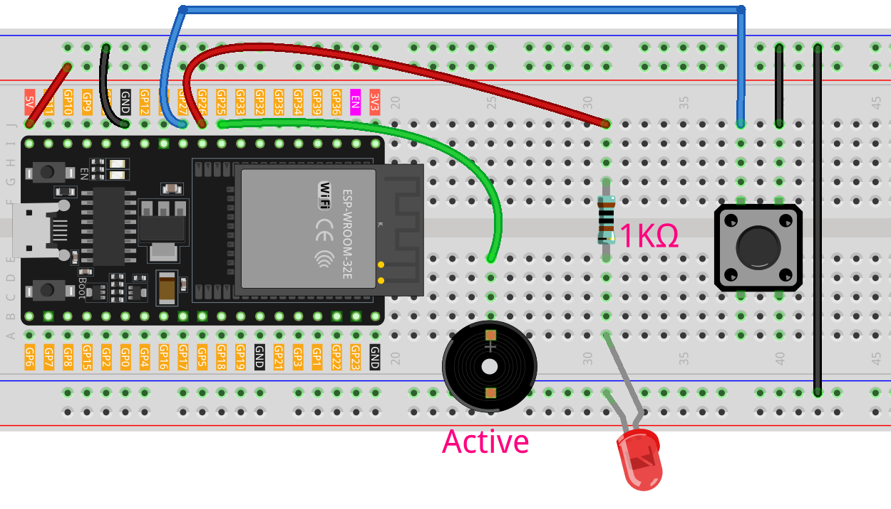

.. _morse_code:

Morse Code
==============================================================

.. note::
  
  🌟 Welcome to the SunFounder Facebook Community! Whether you're into Raspberry Pi, Arduino, or ESP32, you'll find inspiration, help ideas here.
   
  - ✅ Be the first to get free learning resources. 
   
  - ✅ Stay updated on new products & exclusive giveaways. 
   
  - ✅ Share your creations and get real feedback.
   
  * 👉 Need faster updates or support? Click [|link_sf_facebook|] join our Facebook community 

  * 👉 Or join our WhatsApp group: Click [|link_sf_whatsapp|]
   
  * 🎁 Looking for parts? Check out our all-in-one kits below — packed with components, beginner-friendly guides, and tons of fun.
  
  .. list-table::
    :widths: 20 20 20
    :header-rows: 1

    *   - Name	
        - Includes ESP32 board
        - PURCHASE LINK
    *   - ESP32 Ultimate Starter Kit	
        - ESP32 WROOM 32E +
        - |link_esp32_kit_buy|
    *   - Universal Maker Sensor Kit
        - 
        - |link_umsk_buy|

Course Introduction
------------------------

In this lesson, you'll use a button, an LED, and a buzzer with the ESP32 to create a simple Morse code trainer.

By pressing the button for short or long durations, you can input dots and dashes. The LED and buzzer provide immediate feedback, and the serial monitor displays whether you sent a dot (·) or a dash (—). This project is great for learning Morse code basics interactively.

.. raw:: html

  <iframe width="700" height="394" src="https://www.youtube.com/embed/CjHbIoeSSYc" title="YouTube video player" frameborder="0" allow="accelerometer; autoplay; clipboard-write; encrypted-media; gyroscope; picture-in-picture; web-share" referrerpolicy="strict-origin-when-cross-origin" allowfullscreen></iframe>

.. note::

  If this is your first time working with an Arduino project, we recommend downloading and reviewing the basic materials first.
  
  * :ref:`install_arduino`
  * :ref:`introduce_arduino`
  * :ref:`install_esp32`

**Required Components**

In this project, we need the following components:

.. list-table::
    :widths: 5 20 5 20
    :header-rows: 1

    *   - SN
        - COMPONENT INTRODUCTION	
        - QUANTITY
        - PURCHASE LINK

    *   - 1
        - ESP-WROOM-32 ESP32 ESP-32S Development Board
        - 1
        - |link_esp32_buy|
    *   - 2
        - USB Type-C cable
        - 1
        - 
    *   - 3
        - Breadboard
        - 1
        - |link_breadboard_buy|
    *   - 4
        - Wires
        - Several
        - |link_wires_buy|
    *   - 5
        - Active Buzzer
        - 1
        - 
    *   - 6
        - Button
        - 1
        - |link_button_buy|
    *   - 7
        - LED
        - 1
        - |link_led_buy|
    *   - 8
        - 1kΩ resistor
        - 1
        - |link_resistor_buy|

**Wiring**

**Common Connections:**

* **LED**

  - Connect the LED to a **1kΩ resistor**, then to **anode** to **GPIO26** on the ESP32, and the **cathode** to  the negative power bus on the breadboard.

* **Passive Buzzer**

  - **＋:** Connect to **25** on the ESP32.
  - **－:** Connect to breadboard’s negative power bus.

* **Button**

  - Connect to the breadboard’s negative power bus, and the other end to **GPIO27** on the ESP32 board.

**Writing the Code**

.. note::

    * You can copy this code into **Arduino IDE**. 
    * Don't forget to select the board(ESP32 Dev module) and the correct port before clicking the **Upload** button.

.. code-block:: arduino

      // ===== ESP32-Compatible Morse Code Trainer =====
      // NOTE:
      // - Uses internal pull-up on the button (active LOW).
      // - Active buzzer is driven by GPIO HIGH/LOW (no PWM needed).
      // - Avoid ESP32 strapping pins and input-only pins.

      #include <Arduino.h>

      // ---------- Pin Definitions (ESP32 safe GPIOs) ----------
      const int BUTTON_PIN = 27; // Push button to GND (has internal pull-up)
      const int BUZZER_PIN = 25; // Active buzzer (+) to GPIO, (-) to GND
      const int LED_PIN    = 26; // LED anode via 220Ω resistor to GPIO

      // ---------- Timing Constants (milliseconds) ----------
      const int DOT_DURATION   = 200;  // Standard dot duration
      const int DASH_DURATION  = 600;  // Standard dash duration
      const int DEBOUNCE_DELAY = 50;   // Button debounce time

      // ---------- Global State ----------
      bool lastButtonState = HIGH;        // Previous sampled button state
      unsigned long pressStartTime = 0;   // Timestamp when button was pressed

      void activateFeedback();    // Turn ON LED and buzzer
      void deactivateFeedback();  // Turn OFF LED and buzzer
      void handleMorseSymbol();   // Decide dot vs dash after release

      void setup() {
        // Use a higher baud on ESP32 for snappier logs
        Serial.begin(115200);
        while (!Serial) { /* wait on native USB boards; harmless on ESP32 */ }

        // Configure I/O
        pinMode(BUTTON_PIN, INPUT_PULLUP); // Internal pull-up, active LOW
        pinMode(LED_PIN, OUTPUT);
        pinMode(BUZZER_PIN, OUTPUT);

        // Ensure outputs start OFF
        digitalWrite(LED_PIN, LOW);
        digitalWrite(BUZZER_PIN, LOW);

        Serial.println("Morse Code Trainer Ready (ESP32)");
        Serial.println("Short press: Dot (·)   Long press: Dash (—)");
      }

      void loop() {
        // Read current button state (LOW when pressed)
        int currentButtonState = digitalRead(BUTTON_PIN);

        // Detect press edge: HIGH -> LOW
        if (currentButtonState == LOW && lastButtonState == HIGH) {
          delay(DEBOUNCE_DELAY); // Debounce guard
          if (digitalRead(BUTTON_PIN) == LOW) {
            pressStartTime = millis(); // Mark press start time
            activateFeedback();        // Visual + audio ON
            Serial.println("Button PRESSED");
          }
        }

        // Detect release edge: LOW -> HIGH
        if (currentButtonState == HIGH && lastButtonState == LOW) {
          delay(DEBOUNCE_DELAY); // Debounce guard
          if (digitalRead(BUTTON_PIN) == HIGH) {
            deactivateFeedback(); // Turn feedback OFF immediately
            handleMorseSymbol();  // Classify the symbol
          }
        }

        // Update last state for next loop
        lastButtonState = currentButtonState;
      }

      // Turn ON both visual and audio feedback
      void activateFeedback() {
        digitalWrite(LED_PIN, HIGH);
        digitalWrite(BUZZER_PIN, HIGH); // Active buzzer: HIGH = sound
      }

      // Turn OFF both feedback channels
      void deactivateFeedback() {
        digitalWrite(LED_PIN, LOW);
        digitalWrite(BUZZER_PIN, LOW);
      }

      // Decide dot or dash based on press duration
      void handleMorseSymbol() {
        unsigned long pressDuration = millis() - pressStartTime;

        if (pressDuration < DASH_DURATION) {
          Serial.println("Sent: DOT (·)");
          // Enforce minimum dot duration so the tempo feels consistent
          if (pressDuration < DOT_DURATION) {
            delay(DOT_DURATION - pressDuration);
          }
        } else {
          Serial.println("Sent: DASH (—)");
          // Enforce minimum dash duration
          if (pressDuration < DASH_DURATION) {
            delay(DASH_DURATION - pressDuration);
          }
        }
      }
