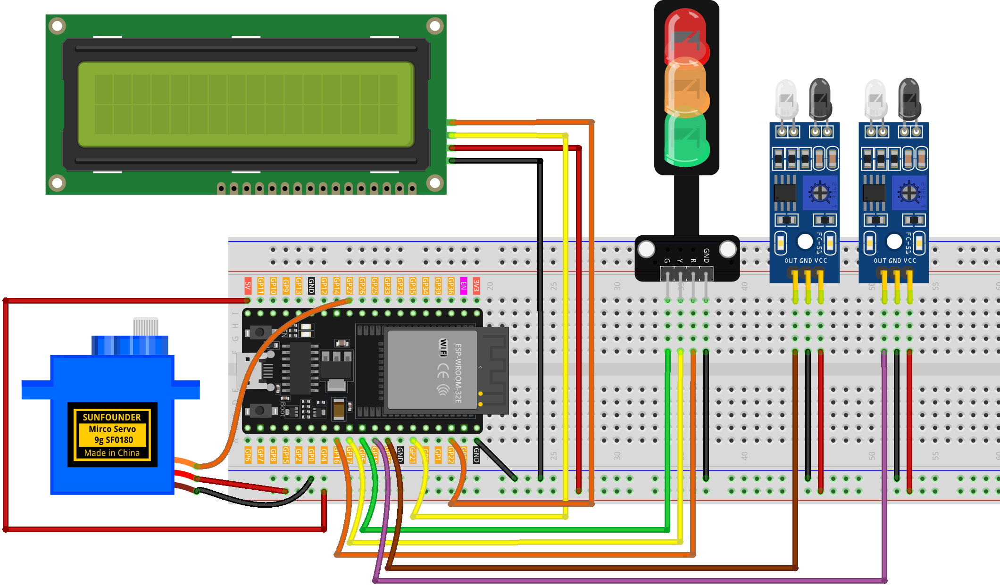

.. _parking_lot:

Parking Lot
==============================================================

.. note::
  
  🌟 Welcome to the SunFounder Facebook Community! Whether you're into Raspberry Pi, Arduino, or ESP32, you'll find inspiration, help ideas here.
   
  - ✅ Be the first to get free learning resources. 
   
  - ✅ Stay updated on new products & exclusive giveaways. 
   
  - ✅ Share your creations and get real feedback.
   
  * 👉 Need faster updates or support? Click [|link_sf_facebook|] join our Facebook community 

  * 👉 Or join our WhatsApp group: Click [|link_sf_whatsapp|]
   
🎁 Kit purchase
------------------------
  
Looking for parts? Check out our all-in-one kits below — packed with components, beginner-friendly guides, and tons of fun.

.. image:: img/esp32_kit.png
   :width: 100%
   :align: center
   :target: https://www.sunfounder.com/products/sunfounder-esp32-ultimate-starter-kit-with-esp32-camera-extension-board-battery?_pos=1&_sid=7dcb30fb6&_ss=r&ref=jbzmncle

.. raw:: html

     

.. list-table::
   :widths: 20 20 20
   :header-rows: 1

   * - Name
     - Includes ESP32 board
     - PURCHASE LINK
   * - ESP32 Ultimate Starter Kit
     - ESP32 WROOM 32E +
     - |link_esp32_kit_buy|
   * - Universal Maker Sensor Kit
     -
     - |link_umsk_buy|

Course Introduction
------------------------

In this project, you will use ESP32 board, a servo motor, IR sensors, and a traffic light module to build an intelligent parking lot barrier system.

The system detects vehicles with IR sensors, automatically controls the barrier gate, updates the car count on the LCD, and manages the traffic light for safe entry and exit.

.. raw:: html

  <iframe width="700" height="394" src="https://www.youtube.com/embed/RfSdhl4-UVo?si=_yOs_GiEbk-0NndU" title="YouTube video player" frameborder="0" allow="accelerometer; autoplay; clipboard-write; encrypted-media; gyroscope; picture-in-picture; web-share" referrerpolicy="strict-origin-when-cross-origin" allowfullscreen></iframe>

.. note::

  If this is your first time working with an ESP32 project, we recommend downloading and reviewing the basic materials first.
  
  * :ref:`install_arduino`
  * :ref:`introduce_arduino`
  * :ref:`install_esp32`

**Required Components**

In this project, we need the following components:

.. list-table::
    :widths: 5 20 5 20
    :header-rows: 1

    *   - SN
        - COMPONENT INTRODUCTION	
        - QUANTITY
        - PURCHASE LINK

    *   - 1
        - ESP-WROOM-32 ESP32 ESP-32S Development Board
        - 1
        - |link_esp32_buy|
    *   - 2
        - USB Type-C cable
        - 1
        - 
    *   - 3
        - Breadboard
        - 1
        - |link_breadboard_buy|
    *   - 4
        - Wires
        - Several
        - |link_wires_buy|
    *   - 5
        - IR Obstacle Avoidance Sensor Module
        - 2
        - |link_IR_module_buy|
    *   - 6
        - Digital Servo Motor
        - 1
        - |link_motor_buy|
    *   - 7
        - I2C LCD 1602
        - 1
        - |link_i2clcd1602_buy|
    *   - 8
        - Traffic Light LED
        - 1
        - |link_trafficlinght_buy|

**Wiring**

**Common Connections:**

* **Traffic light LED**

  - **R:** Connect to **GPIO16** on the ESP32.
  - **Y:** Connect to **GPIO17** on the ESP32.
  - **G:** Connect to **GPIO5** on the ESP32.
  - **GND:** Connect to breadboard’s negative power bus.

* **Digital Servo Motor**

  - Connect to breadboard’s positive power bus.
  - Connect to breadboard’s negative power bus.
  - Connect to  **GPIO27** on the ESP32.

* **IR Obstacle Avoidance Sensor Module Entrance**

  - **OUT:** Connect to **GPIO18** on the ESP32.
  - **GND:** Connect to breadboard’s negative power bus.
  - **VCC:** Connect to breadboard’s red power bus.

* **IR Obstacle Avoidance Sensor Module Exit**

  - **OUT:** Connect to **GPIO19** on the ESP32.
  - **GND:** Connect to breadboard’s negative power bus.
  - **VCC:** Connect to breadboard’s red power bus.

* **I2C LCD 1602**

  - **SDA:** Connect to **GPIO21** on the ESP32.
  - **SCL:** Connect to **GPIO22** on the ESP32.
  - **GND:** Connect to breadboard’s negative power bus.
  - **VCC:** Connect to breadboard’s red power bus.

**Writing the Code**

.. note::

    * You can copy this code into **Arduino IDE**. 
    * To install the library, use the Arduino Library Manager and search for **LiquidCrystal I2C** and **ESP32Servo** and install it.
    * Don't forget to select the board(ESP32 Dev module) and the correct port before clicking the **Upload** button.

.. code-block:: arduino

      // ESP32 version of Parking Lot Gate
      #include <Wire.h>
      #include <LiquidCrystal_I2C.h>
      #include <ESP32Servo.h>

      // === Pin mapping (ESP32 safe GPIOs) ===
      const int SERVO_PIN   = 27;

      const int IR1_PIN     = 18;  // Entrance IR (active LOW)
      const int IR2_PIN     = 19;  // Exit IR (active LOW)

      const int RED_PIN     = 16;
      const int YELLOW_PIN  = 17;
      const int GREEN_PIN   = 5;

      // LCD (I2C 0x27, 16x2)
      LiquidCrystal_I2C lcd(0x27, 16, 2);

      // Servo
      Servo gateServo;

      // Status variable
      int carCount = 2;

      enum State {
        IDLE,
        ENTER_WAIT_YELLOW,
        ENTER_WAIT_GREEN,
        ENTER_WAIT_EXIT,
        EXIT_WAIT_YELLOW,
        EXIT_WAIT_GREEN,
        EXIT_WAIT_EXIT
      };

      State state = IDLE;

      // Timing
      unsigned long stateStartTime     = 0;
      const unsigned long YELLOW_BLINK_TIME = 2000;
      const unsigned long GREEN_TIME        = 1000;
      bool yellowBlinkState = false;
      unsigned long lastBlinkTime      = 0;
      const unsigned long BLINK_INTERVAL   = 300;

      void setTrafficLight(char color);
      void updateLCD();

      void setup() {
        // I2C on ESP32 (SDA=21, SCL=22)
        Wire.begin(21, 22);

        // LCD
        lcd.init();
        lcd.backlight();
        lcd.setCursor(0, 0);
        lcd.print("Parking Lot");
        lcd.setCursor(0, 1);
        lcd.print("Car Count: ");
        lcd.print(carCount);

        // Servo (50 Hz typical). Optionally specify pulse range for your servo:
        // gateServo.attach(SERVO_PIN, 500, 2500);
        gateServo.attach(SERVO_PIN);
        gateServo.write(0); // barrier down

        // IR sensors: use internal pull-ups; active LOW when beam broken/object present
        pinMode(IR1_PIN, INPUT_PULLUP);
        pinMode(IR2_PIN, INPUT_PULLUP);

        // Traffic lights
        pinMode(RED_PIN, OUTPUT);
        pinMode(YELLOW_PIN, OUTPUT);
        pinMode(GREEN_PIN, OUTPUT);
        setTrafficLight('R');
      }

      void loop() {
        bool ir1State = (digitalRead(IR1_PIN) == LOW); // LOW = triggered
        bool ir2State = (digitalRead(IR2_PIN) == LOW); // LOW = triggered
        unsigned long now = millis();

        switch (state) {
          case IDLE:
            setTrafficLight('R');
            gateServo.write(0); // barrier down
            if (ir1State) { // entry detected
              state = ENTER_WAIT_YELLOW;
              stateStartTime = now;
              lastBlinkTime = now;
              yellowBlinkState = false;
            } else if (ir2State) { // exit detected
              state = EXIT_WAIT_YELLOW;
              stateStartTime = now;
              lastBlinkTime = now;
              yellowBlinkState = false;
            }
            break;

          case ENTER_WAIT_YELLOW:
            if (now - lastBlinkTime > BLINK_INTERVAL) {
              yellowBlinkState = !yellowBlinkState;
              digitalWrite(YELLOW_PIN, yellowBlinkState ? HIGH : LOW);
              lastBlinkTime = now;
            }
            if (now - stateStartTime > YELLOW_BLINK_TIME) {
              digitalWrite(YELLOW_PIN, LOW);
              setTrafficLight('G');
              gateServo.write(90); // raise barrier
              state = ENTER_WAIT_GREEN;
              stateStartTime = now;
            }
            break;

          case ENTER_WAIT_GREEN:
            if (now - stateStartTime > GREEN_TIME) {
              state = ENTER_WAIT_EXIT; // wait for IR2 to count entry
            }
            break;

          case ENTER_WAIT_EXIT:
            if (ir2State) {
              carCount++;
              updateLCD();
              setTrafficLight('R');
              gateServo.write(0); // barrier down
              state = IDLE;
              // wait until IR released (simple debounce)
              while (digitalRead(IR2_PIN) == LOW) { delay(10); }
            }
            break;

          case EXIT_WAIT_YELLOW:
            if (now - lastBlinkTime > BLINK_INTERVAL) {
              yellowBlinkState = !yellowBlinkState;
              digitalWrite(YELLOW_PIN, yellowBlinkState ? HIGH : LOW);
              lastBlinkTime = now;
            }
            if (now - stateStartTime > YELLOW_BLINK_TIME) {
              digitalWrite(YELLOW_PIN, LOW);
              setTrafficLight('G');
              gateServo.write(90); // raise barrier
              state = EXIT_WAIT_GREEN;
              stateStartTime = now;
            }
            break;

          case EXIT_WAIT_GREEN:
            if (now - stateStartTime > GREEN_TIME) {
              state = EXIT_WAIT_EXIT; // wait for IR1 to count exit
            }
            break;

          case EXIT_WAIT_EXIT:
            if (ir1State) {
              if (carCount > 0) carCount--;
              updateLCD();
              setTrafficLight('R');
              gateServo.write(0); // barrier down
              state = IDLE;
              while (digitalRead(IR1_PIN) == LOW) { delay(10); }
            }
            break;
        }
      }

      void setTrafficLight(char color) {
        switch (color) {
          case 'R':
            digitalWrite(RED_PIN, HIGH);
            digitalWrite(YELLOW_PIN, LOW);
            digitalWrite(GREEN_PIN, LOW);
            break;
          case 'Y':
            digitalWrite(RED_PIN, LOW);
            digitalWrite(YELLOW_PIN, HIGH);
            digitalWrite(GREEN_PIN, LOW);
            break;
          case 'G':
            digitalWrite(RED_PIN, LOW);
            digitalWrite(YELLOW_PIN, LOW);
            digitalWrite(GREEN_PIN, HIGH);
            break;
        }
      }

      void updateLCD() {
        lcd.setCursor(0, 1);
        lcd.print("Car Count:    ");
        lcd.setCursor(11, 1);
        lcd.print(carCount);
      }
