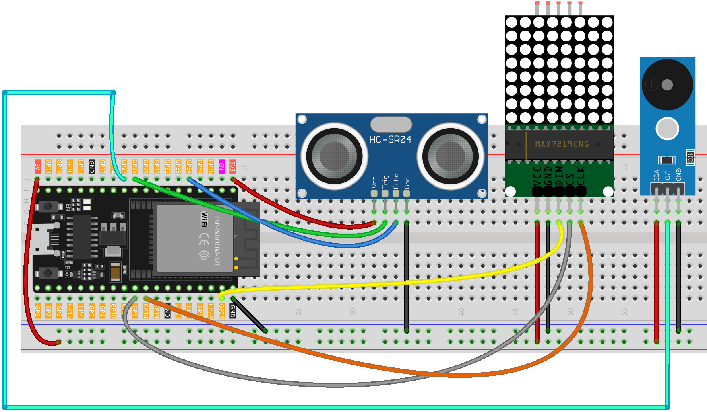

.. _parking_sensor1.0:

Parking Sensor 1.0
==============================================================

.. note::
  
  🌟 Welcome to the SunFounder Facebook Community! Whether you're into Raspberry Pi, Arduino, or ESP32, you'll find inspiration, help ideas here.
   
  - ✅ Be the first to get free learning resources. 
   
  - ✅ Stay updated on new products & exclusive giveaways. 
   
  - ✅ Share your creations and get real feedback.
   
  * 👉 Need faster updates or support? Click [|link_sf_facebook|] join our Facebook community 

  * 👉 Or join our WhatsApp group: Click [|link_sf_whatsapp|]
   
🎁 Kit purchase
------------------------
  
Looking for parts? Check out our all-in-one kits below — packed with components, beginner-friendly guides, and tons of fun.

.. image:: img/esp32_kit.png
   :width: 100%
   :align: center
   :target: https://www.sunfounder.com/products/sunfounder-esp32-ultimate-starter-kit-with-esp32-camera-extension-board-battery?_pos=1&_sid=7dcb30fb6&_ss=r&ref=jbzmncle

.. raw:: html

     

.. list-table::
   :widths: 20 20 20
   :header-rows: 1

   * - Name
     - Includes ESP32 board
     - PURCHASE LINK
   * - ESP32 Ultimate Starter Kit
     - ESP32 WROOM 32E +
     - |link_esp32_kit_buy|
   * - Universal Maker Sensor Kit
     -
     - |link_umsk_buy|

Course Introduction
------------------------

In this lesson, we’ll build a basic parking assistance system (v1.0) using an Ultrasonic Sensor Module, MAX7219 Dot Matrix Module, and a passive buzzer Module with ESP32 board.

As an obstacle approaches the ultrasonic sensor, the buzzer will emit warning sounds that become increasingly rapid, while the dot matrix display will show a rough visual representation of the obstacle’s proximity.

.. raw:: html
 
  <iframe width="700" height="394" src="https://www.youtube.com/embed/HrPzxBVWeXQ?si=t3RYeDSQuq24C4ux" title="YouTube video player" frameborder="0" allow="accelerometer; autoplay; clipboard-write; encrypted-media; gyroscope; picture-in-picture; web-share" referrerpolicy="strict-origin-when-cross-origin" allowfullscreen></iframe>

.. note::

  If this is your first time working with an ESP32 project, we recommend downloading and reviewing the basic materials first.
  
  * :ref:`install_arduino`
  * :ref:`introduce_arduino`
  * :ref:`install_esp32`

**Required Components**

In this project, we need the following components:

.. list-table::
    :widths: 5 20 5 20
    :header-rows: 1

    *   - SN
        - COMPONENT INTRODUCTION	
        - QUANTITY
        - PURCHASE LINK

    *   - 1
        - ESP-WROOM-32 ESP32 ESP-32S Development Board
        - 1
        - |link_esp32_buy|
    *   - 2
        - USB Type-C cable
        - 1
        - 
    *   - 3
        - Breadboard
        - 1
        - |link_breadboard_buy|
    *   - 4
        - Wires
        - Several
        - |link_wires_buy|
    *   - 5
        - Ultrasonic Sensor Module
        - 1
        - |link_ultrasonic_buy|
    *   - 6
        - MAX7219 Dot Matrix Module
        - 1
        - |link_martix1_buy|
    *   - 7
        - Alarm Sound Module
        - 1
        - |link_buzzer_module_buy|

**Wiring**

**Common Connections:**

* **Passive Buzzer Module**

  - **VCC:** Connect to breadboard’s red power bus.
  - **I/O:** Connect to **GPIO27** on the ESP32.
  - **GND:** Connect to breadboard’s negative power bus.

* **MAX7219 Dot Matrix Module**

  - **CLK:** Connect to **GPIO18** on the ESP32.
  - **CS:** Connect to **GPIO5** on the ESP32.
  - **DIN:** Connect to **GPIO18** on the ESP32.
  - **GND:** Connect to breadboard’s negative power bus.
  - **VCC:** Connect to breadboard’s red power bus.

* **Ultrasonic Sensor Module**

  - **Trig:** Connect to **GPIO26** on the ESP32.
  - **Echo:** Connect to **GPIO34** on the ESP32.
  - **GND:** Connect to **GND** on the ESP32.
  - **VCC:** Connect to **3.3V** on the ESP32.

**Writing the Code**

.. note::

    * You can copy this code into **Arduino IDE**. 
    * To install the library, use the Arduino Library Manager and search for **MD_MAX72xx** and install it.
    * Don't forget to select the board(ESP32 Dev module) and the correct port before clicking the **Upload** button.

.. code-block:: arduino

      #include <MD_MAX72xx.h>
      #include <SPI.h>

      // ===== MAX7219 hardware type & device count =====
      #define HARDWARE_TYPE MD_MAX72XX::FC16_HW   // Common 8x8 FC-16 module
      #define MAX_DEVICES   1

      // ===== ESP32 hardware SPI pins =====
      // VSPI default: MOSI=23, SCK=18; only CS needs to be defined here
      const uint8_t CS_PIN = 5;

      // Hardware SPI constructor (recommended)
      MD_MAX72XX mx(HARDWARE_TYPE, CS_PIN, MAX_DEVICES);

      // ===== Pin definitions (ESP32 safe GPIOs) =====
      const int echoPin   = 34;  // Ultrasonic Echo (input-only pin, safe for ESP32)
      const int trigPin   = 26;  // Ultrasonic Trig (output)
      const int buzzerPin = 27;  // Buzzer (supports tone())

      int previousColumnsLit = 0;       // Last number of lit columns

      // Buzzer non-blocking control variables
      unsigned long lastBeepTime = 0;   // Timestamp of last beep toggle
      bool isBeepOn = false;            // Current buzzer state
      unsigned long beepInterval = 500; // Interval for buzzer toggle in ms

      void setup() {
        Serial.begin(115200);

        pinMode(echoPin, INPUT);
        pinMode(trigPin, OUTPUT);
        pinMode(buzzerPin, OUTPUT);

        // Initialize MAX72xx (replaces LedControl's shutdown/intensity/clear)
        mx.begin();
        mx.control(MD_MAX72XX::INTENSITY, 8);  // Brightness level 0–15
        mx.clear();
      }

      void loop() {
        // 1) Read distance and update LED columns
        float distance = readSensorData();
        int columnsToLight = calculateColumnsToLight(distance);
        displayColumnsWithTransition(previousColumnsLit, columnsToLight);
        previousColumnsLit = columnsToLight;

        // 2) Update buzzer speed based on distance and toggle buzzer
        updateBeepInterval(distance);
        updateBeepState();

        // 3) Debug print
        Serial.print("Distance: ");
        Serial.print(distance);
        Serial.println(" cm");
      }

      // Read distance from ultrasonic sensor in centimeters
      float readSensorData() {
        digitalWrite(trigPin, LOW);
        delayMicroseconds(2);
        digitalWrite(trigPin, HIGH);
        delayMicroseconds(10);
        digitalWrite(trigPin, LOW);

        float duration = pulseIn(echoPin, HIGH); // microseconds
        float distance = duration / 58.0;        // convert to centimeters
        return distance;
      }

      // Map distance to number of LED matrix columns (0 to 8)
      int calculateColumnsToLight(float distance) {
        if (distance > 20) {
          return 0;
        } else {
          int cols = (20 - distance) / 2;  // Every 2 cm closer lights one column
          return constrain(cols, 0, 8);
        }
      }

      // Animate LED columns lighting/unlighting with small blocking delay
      void displayColumnsWithTransition(int previousColumns, int currentColumns) {
        if (currentColumns > previousColumns) {
          // Light up new columns from left to right
          for (int col = previousColumns; col < currentColumns; col++) {
            for (int row = 0; row <= col; row++) {
              mx.setPoint(col, row, true);  // Light up (row, col)
            }
            delay(50);
          }
        } else if (currentColumns < previousColumns) {
          // Turn off columns from left to right
          for (int col = previousColumns - 1; col >= currentColumns; col--) {
            for (int row = 0; row <= col; row++) {
              mx.setPoint(col, row, false); // Turn off (row, col)
            }
            delay(50);
          }
        }
      }

      // Beep policy:
      // <6 cm   -> fast beep (100 ms)
      // <12 cm  -> medium beep (300 ms)
      // <18 cm  -> slow beep (500 ms)
      // >=18 cm -> no beep
      void updateBeepInterval(float distance) {
        if (distance < 6) {
          beepInterval = 100;
        } else if (distance < 12) {
          beepInterval = 300;
        } else if (distance < 18) {
          beepInterval = 500;
        } else {
          beepInterval = 0;
          noTone(buzzerPin);
          isBeepOn = false;
        }
      }

      // Toggle buzzer on/off without blocking using millis()
      void updateBeepState() {
        if (beepInterval == 0) return;

        unsigned long now = millis();
        if (now - lastBeepTime >= beepInterval) {
          if (isBeepOn) {
            noTone(buzzerPin);
            isBeepOn = false;
          } else {
            tone(buzzerPin, 1000);  // 1 kHz tone
            isBeepOn = true;
          }
          lastBeepTime = now;
        }
      }
