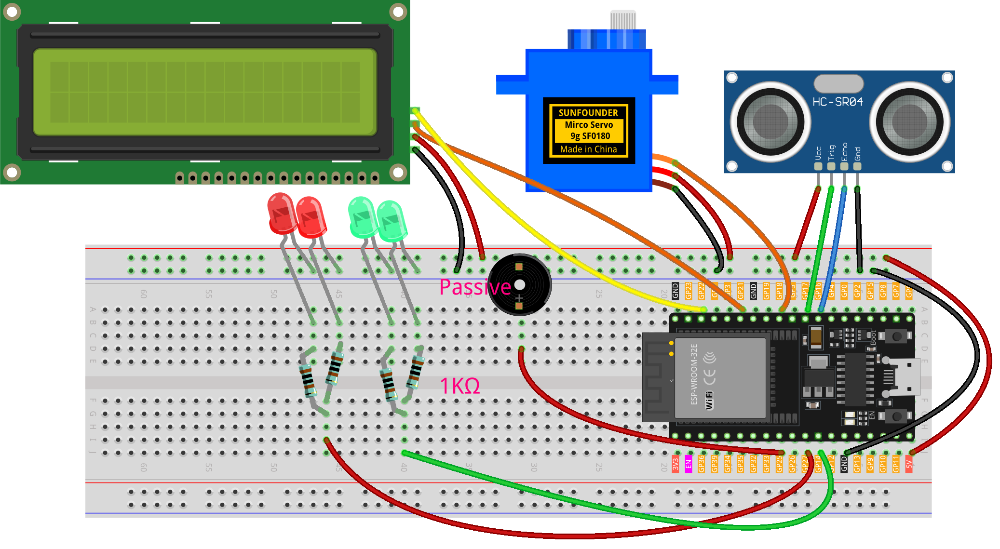

.. _radar_guard1.0:

Radar Guard 1.0
==============================================================

.. note::
  
  🌟 Welcome to the SunFounder Facebook Community! Whether you're into Raspberry Pi, Arduino, or ESP32, you'll find inspiration, help ideas here.
   
  - ✅ Be the first to get free learning resources. 
   
  - ✅ Stay updated on new products & exclusive giveaways. 
   
  - ✅ Share your creations and get real feedback.
   
  * 👉 Need faster updates or support? Click [|link_sf_facebook|] join our Facebook community 

  * 👉 Or join our WhatsApp group: Click [|link_sf_whatsapp|]
   
  * 🎁 Looking for parts?Check out our all-in-one kits below — packed with components, beginner-friendly guides, and tons of fun.
  
  .. list-table::
    :widths: 20 20 20
    :header-rows: 1

    *   - Name	
        - Includes Arduino board
        - PURCHASE LINK
    *   - ESP32 Ultimate Starter Kit	
        - ESP32 WROOM 32E +
        - |link_esp32_kit_buy|
    *   - Universal Maker Sensor Kit
        - 
        - |link_umsk_buy|

Course Introduction
------------------------

In this lesson, we will learn how to use the Ultrasonic Sensor Module, Digital Servo Motor, and I2C LCD 1602 with the ESP32 to create a radar defense system.

When the ultrasonic sensor module is running, it emits an audible alarm and flashes the red LED if it detects an obstacle within its sensing range. 
If no obstacle is detected, indicating a safe state, the green LED stays on.

.. raw:: html
 
  <iframe width="700" height="394" src="https://www.youtube.com/embed/B7F48zrEFLs?si=EtaT9N5HMKYPoXi8" title="YouTube video player" frameborder="0" allow="accelerometer; autoplay; clipboard-write; encrypted-media; gyroscope; picture-in-picture; web-share" referrerpolicy="strict-origin-when-cross-origin" allowfullscreen></iframe>

.. note::

  If this is your first time working with an Arduino project, we recommend downloading and reviewing the basic materials first.
  
  * :ref:`install_arduino`
  * :ref:`introduce_arduino`
  * :ref:`install_esp32`

**Required Components**

In this project, we need the following components:

.. list-table::
    :widths: 5 20 5 20
    :header-rows: 1

    *   - SN
        - COMPONENT INTRODUCTION	
        - QUANTITY
        - PURCHASE LINK

    *   - 1
        - ESP-WROOM-32 ESP32 ESP-32S Development Board
        - 1
        - |link_esp32_buy|
    *   - 2
        - USB Type-C cable
        - 1
        - 
    *   - 3
        - Breadboard
        - 1
        - |link_breadboard_buy|
    *   - 4
        - Wires
        - Several
        - |link_wires_buy|
    *   - 5
        - 1kΩ resistor
        - 4
        - |link_resistor_buy|
    *   - 6
        - Ultrasonic Sensor Module
        - 1
        - |link_ultrasonic_buy|
    *   - 7
        - LED
        - 4
        - |link_led_buy|
    *   - 8
        - I2C LCD 1602
        - 1
        - |link_i2clcd1602_buy|
    *   - 9
        - Digital Servo Motor
        - 1
        - |link_motor_buy|
    *   - 10
        - Passive Buzzer
        - 1
        - |link_passive_buzzer_buy|

**Wiring**

**Common Connections:**

* **LED**

  - **Green**: Connect the LEDs **cathode** to the negative power bus on the breadboard, and the LED **anode** to a **1kΩ resistor** then to **GPIO14** on the Arduino.
  - **Red**: Connect the LEDs **cathode** to the negative power bus on the breadboard, and the LED **anode** to a **1kΩ resistor** then to **GPIO27** on the Arduino.

* **Digital Servo Motor**

  - Connect to breadboard’s positive power bus.
  - Connect to breadboard’s negative power bus.
  - Connect to **GPIO18** on the ESP32.

* **Passive Buzzer**

  - **＋:** Connect to **GPIO25** on the ESP32.
  - **－:** Connect to breadboard’s negative power bus.

* **I2C LCD 1602**

  - **SDA:** Connect to **GPIO21** on the ESP32.
  - **SCL:** Connect to **GPIO22** on the ESP32.
  - **GND:** Connect to breadboard’s negative power bus.
  - **VCC:** Connect to breadboard’s red power bus.

* **Ultrasonic Sensor Module**

  - **Trig:** Connect to **GPIO17** on the ESP32.
  - **Echo:** Connect to **GPIO16** on the ESP32.
  - **GND:** Connect to breadboard’s negative power bus.
  - **VCC:** Connect to breadboard’s red power bus.

**Writing the Code**

.. note::

    * You can copy this code into **Arduino IDE**. 
    * To install the library, use the Arduino Library Manager and search for **ESP32Servo** and **LiquidCrystal I2C** and install it.
    * Don't forget to select the board(ESP32 Dev module) and the correct port before clicking the **Upload** button.

.. code-block:: arduino

      #include <ESP32Servo.h>
      #include <Wire.h>
      #include <LiquidCrystal_I2C.h>

      // ----------------- Pin mapping (ESP32) -----------------
      const int trigPin  = 17;
      const int echoPin  = 16;   // Connected through voltage divider to 3.3V!
      const int servoPin = 18;

      const int redLed   = 27;
      const int greenLed = 14;
      const int buzzer   = 25;

      // ----------------- LCD -----------------
      LiquidCrystal_I2C lcd(0x27, 16, 2);  // If not displayed, change to 0x3F

      // ----------------- Settings -----------------
      const int alertDistance = 20;             // Alarm if less than 20cm
      const unsigned long updateInterval = 20;  // Servo scan step interval (ms)

      // Smooth scanning
      int currentAngle = 0;
      int increment = 1;        // Change by 1° each step

      unsigned long lastServoUpdate = 0;

      // Consecutive trigger count
      int triggerCount = 0;

      // State record (to update LCD only on state change)
      enum RadarState { EMPTY, WARNING };
      RadarState lastState = EMPTY;

      // Servo object
      Servo radarServo;

      void setup() {
        // Servo (set pulse range according to servo spec)
        radarServo.setPeriodHertz(50);  // 50Hz
        radarServo.attach(servoPin, 500, 2400); // Default 500-2400us pulse width

        // Ultrasonic sensor
        pinMode(trigPin, OUTPUT);
        pinMode(echoPin, INPUT);

        // LED and buzzer
        pinMode(redLed, OUTPUT);
        pinMode(greenLed, OUTPUT);
        pinMode(buzzer, OUTPUT);

        // I2C/LCD
        Wire.begin(21, 22);  // SDA=21, SCL=22
        lcd.init();
        lcd.backlight();
        lcd.clear();

        // Initial state
        lcdSetEmpty();
        setNormalState();
      }

      void loop() {
        unsigned long currentMillis = millis();

        // When not alarming, do smooth scan + periodic measurement
        if (currentMillis - lastServoUpdate >= updateInterval) {
          lastServoUpdate = currentMillis;

          // Update servo angle
          radarServo.write(currentAngle);

          // Measure distance every 5°
          if (currentAngle % 5 == 0) {
            float distance = getDistance();
            if (distance < alertDistance) {
              triggerCount++;      // Consecutive detections under threshold
            } else {
              triggerCount = 0;    // Safe, reset counter
            }

            // Trigger alarm only after 5 consecutive detections
            if (triggerCount >= 5) {
              if (lastState != WARNING) {
                lastState = WARNING;
                lcdSetWarning();
              }
              alertMode();         // Alarm until safe
              triggerCount = 0;    // Reset counter after alarm
            } else {
              // Show normal state
              if (lastState != EMPTY) {
                lastState = EMPTY;
                lcdSetEmpty();
                setNormalState();
              }
            }
          }

          // Smooth angle increment/decrement
          currentAngle += increment;
          if (currentAngle >= 180) {
            currentAngle = 180;
            increment = -1;
          } else if (currentAngle <= 0) {
            currentAngle = 0;
            increment = 1;
          }
        }
      }

      // Ultrasonic distance measurement (returns cm)
      float getDistance() {
        digitalWrite(trigPin, LOW);
        delayMicroseconds(2);
        digitalWrite(trigPin, HIGH);
        delayMicroseconds(10);
        digitalWrite(trigPin, LOW);

        // pulseIn timeout 30000us (≈30ms)
        long duration = pulseIn(echoPin, HIGH, 30000);
        if (duration == 0) return 9999.0;  // Timeout means very far
        float distance = duration * 0.034f / 2.0f;
        return distance;
      }

      // Alarm mode: continuous flash/beep until object removed
      void alertMode() {
        // During alarm, green LED off
        digitalWrite(greenLed, LOW);

        // Keep alarming while object present
        while (getDistance() < alertDistance) {
          digitalWrite(redLed, HIGH);
          digitalWrite(buzzer, HIGH);
          delay(100);
          digitalWrite(redLed, LOW);
          digitalWrite(buzzer, LOW);
          delay(100);
        }

        // Back to normal
        lcdSetEmpty();
        setNormalState();
        lastState = EMPTY;
      }

      // Normal state: green LED on, red LED and buzzer off
      void setNormalState() {
        digitalWrite(greenLed, HIGH);
        digitalWrite(redLed, LOW);
        digitalWrite(buzzer, LOW);
      }

      // LCD: show “Area is Empty”
      void lcdSetEmpty() {
        lcd.clear();
        // "Area is Empty" = 14 chars, center = (16-14)/2=1
        lcd.setCursor(1, 0);
        lcd.print("Area is Empty");
        lcd.setCursor(0, 1);
        lcd.print("                ");
      }

      // LCD: show warning
      void lcdSetWarning() {
        lcd.clear();
        // "WARNING!!" = 9 chars, center = (16-9)/2≈4
        lcd.setCursor(4, 0);
        lcd.print("WARNING!!");
        // Second line "Foreign Body" starting at col 2
        lcd.setCursor(2, 1);
        lcd.print("Foreign Body");
      }
