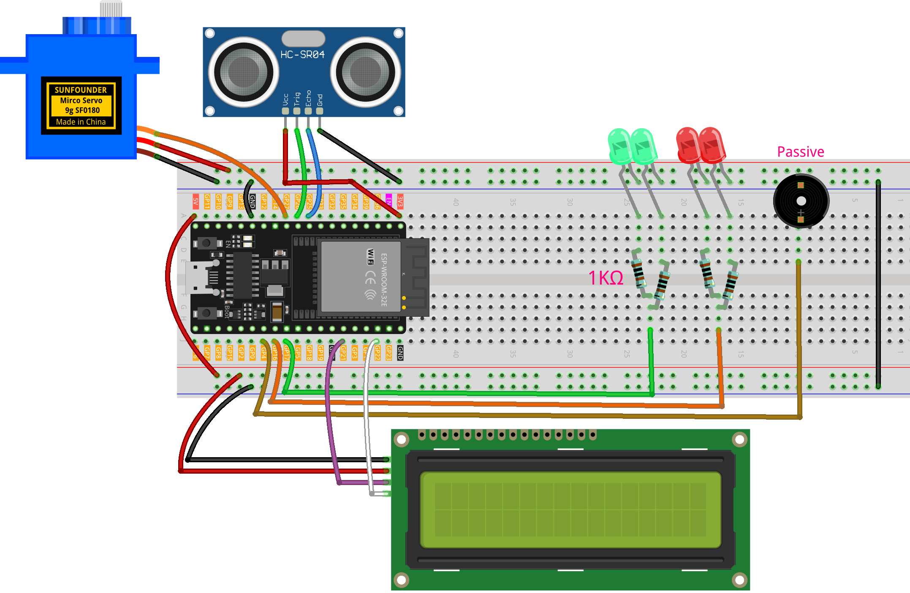

.. _radar_guard2.0:

Radar Guard 2.0
==============================================================

.. note::
  
  🌟 Welcome to the SunFounder Facebook Community! Whether you're into Raspberry Pi, Arduino, or ESP32, you'll find inspiration, help ideas here.
   
  - ✅ Be the first to get free learning resources. 
   
  - ✅ Stay updated on new products & exclusive giveaways. 
   
  - ✅ Share your creations and get real feedback.
   
  * 👉 Need faster updates or support? Click [|link_sf_facebook|] join our Facebook community 

  * 👉 Or join our WhatsApp group: Click [|link_sf_whatsapp|]
   
  * 🎁 Looking for parts?Check out our all-in-one kits below — packed with components, beginner-friendly guides, and tons of fun.
  
  .. list-table::
    :widths: 20 20 20
    :header-rows: 1

    *   - Name	
        - Includes ESP32 board
        - PURCHASE LINK
    *   - ESP32 Ultimate Starter Kit	
        - ESP32 WROOM 32E +
        - |link_esp32_kit_buy|
    *   - Universal Maker Sensor Kit
        - 
        - |link_umsk_buy|

Course Introduction
------------------------

In this lesson, we will learn how to use the Ultrasonic Sensor Module, Digital Servo Motor, and I2C LCD 1602 with the ESP32 Board to create a radar defense system version 2.0.

When the ultrasonic sensor module is running, it emits an audible alarm and flashes the red LED if it detects an obstacle within its sensing range. 
If no obstacle is detected, indicating a safe state, the green LED stays on.

.. .. raw:: html
 
.. <iframe width="700" height="394" src="https://www.youtube.com/embed/enMBMfVlbpY?si=LOntoW4GBtHXT783" title="YouTube video player" frameborder="0" allow="accelerometer; autoplay; clipboard-write; encrypted-media; gyroscope; picture-in-picture; web-share" referrerpolicy="strict-origin-when-cross-origin" allowfullscreen></iframe>

.. note::

  If this is your first time working with an Arduino project, we recommend downloading and reviewing the basic materials first.
  
  * :ref:`install_arduino`
  * :ref:`introduce_arduino`
  * :ref:`install_esp32`

**Required Components**

In this project, we need the following components:

.. list-table::
    :widths: 5 20 5 20
    :header-rows: 1

    *   - SN
        - COMPONENT INTRODUCTION	
        - QUANTITY
        - PURCHASE LINK

    *   - 1
        - ESP-WROOM-32 ESP32 ESP-32S Development Board
        - 1
        - |link_esp32_buy|
    *   - 2
        - USB Type-C cable
        - 1
        - 
    *   - 3
        - Breadboard
        - 1
        - |link_breadboard_buy|
    *   - 4
        - Wires
        - Several
        - |link_wires_buy|
    *   - 5
        - 1kΩ resistor
        - 4
        - |link_resistor_buy|
    *   - 6
        - Ultrasonic Sensor Module
        - 1
        - |link_ultrasonic_buy|
    *   - 7
        - LED
        - 4
        - |link_led_buy|
    *   - 8
        - I2C LCD 1602
        - 1
        - |link_i2clcd1602_buy|
    *   - 9
        - Digital Servo Motor
        - 1
        - |link_motor_buy|
    *   - 10
        - Passive Buzzer
        - 1
        - |link_passive_buzzer_buy|

**Wiring**

**Common Connections:**

* **LED**

  - **Green:** Connect the LEDs **anode** to a **1kΩ resistor** then to the  **GPIO17** on ESP32, and the LEDs **cathode** to  negative power bus on the breadboard.
  - **Red:** Connect the LEDs **anode** to a **1kΩ resistor** then to the  **GPIO16** on ESP32, and the LEDs **cathode** to  negative power bus on the breadboard.

* **Digital Servo Motor**

  - Connect to breadboard’s positive power bus.
  - Connect to breadboard’s negative power bus.
  - Connect to **GPIO27** on the ESP32.

* **Passive Buzzer**

  - **＋:** Connect to **GPIO4** on the ESP32.
  - **－:** Connect to breadboard’s negative power bus.

* **I2C LCD 1602**

  - **SDA:** Connect to **GPIO21** on the ESP32.
  - **SCL:** Connect to **GPIO22** on the ESP32.
  - **GND:** Connect to breadboard’s negative power bus.
  - **VCC:** Connect to breadboard’s red power bus.

* **Ultrasonic Sensor Module**

  - **Trig:** Connect to **GPIO26** on the ESP32.
  - **Echo:** Connect to **GPIO25** on the ESP32.
  - **GND:** Connect to breadboard’s negative power bus.
  - **VCC:** Connect to breadboard’s red power bus.

**Writing the Code**

.. note::

    * You can copy this code into **Arduino IDE**. 
    * To install the library, use the Arduino Library Manager and search for **LiquidCrystal I2C** and **ESP32Servo** and install it.
    * Don't forget to select the board(Arduino UNO R4 Minima/WIFI) and the correct port before clicking the **Upload** button.

.. code-block:: arduino

      #include <Arduino.h>
      #include <Wire.h>
      #include <LiquidCrystal_I2C.h>
      #include <ESP32Servo.h>

      // --- Pins ---
      const int trigPin  = 26;
      const int echoPin  = 25;
      const int servoPin = 27;
      const int redLed   = 16;
      const int greenLed = 17;
      const int buzzer   = 4;    // Passive buzzer

      LiquidCrystal_I2C lcd(0x27, 16, 2);

      // --- Config ---
      const int alertDistance = 30;                 
      const unsigned long updateInterval = 20;     
      const int triggerThreshold = 2;              
      const unsigned long displayDuration = 500;   
      const unsigned long blinkInterval   = 200;   

      Servo radarServo;
      int currentAngle = 0;
      int increment    = 1;
      unsigned long lastServoUpdate = 0;

      bool displayAlarm = false;
      bool alarmActive  = false;
      int  triggerCount = 0;
      int  detectedAngle = 0;
      unsigned long displayStartTime = 0;
      unsigned long lastBlinkTime    = 0;
      bool blinkState = false;

      const int BUZZ_CH = 0;      

      static inline void buzzerOn(uint32_t freqHz) {
      #if defined(ESP_ARDUINO_VERSION_MAJOR) && (ESP_ARDUINO_VERSION_MAJOR >= 3)
        ledcWriteTone(buzzer, freqHz);    // 
      #else
        ledcWriteTone(BUZZ_CH, freqHz);   //
      #endif
      }
      static inline void buzzerOff() {
      #if defined(ESP_ARDUINO_VERSION_MAJOR) && (ESP_ARDUINO_VERSION_MAJOR >= 3)
        ledcWriteTone(buzzer, 0);
      #else
        ledcWriteTone(BUZZ_CH, 0);
      #endif
      }

      void lcdSetEmpty();
      void startAlarmDisplay();
      void alarmBlink();
      void exitAlarm();
      float getDistance();

      void setup() {
        Wire.begin(21, 22);

        lcd.init();
        lcd.backlight();
        lcd.clear();
        lcdSetEmpty();

        pinMode(trigPin, OUTPUT);
        pinMode(echoPin, INPUT);
        pinMode(redLed, OUTPUT);
        pinMode(greenLed, OUTPUT);

        radarServo.attach(servoPin);
        radarServo.write(currentAngle);

      #if defined(ESP_ARDUINO_VERSION_MAJOR) && (ESP_ARDUINO_VERSION_MAJOR >= 3)

        ledcAttach(buzzer, /*freq*/1000, /*resolution bits*/10);
      #else

        ledcSetup(BUZZ_CH, /*freq*/1000, /*resolution bits*/10);
        ledcAttachPin(buzzer, BUZZ_CH);
      #endif

        digitalWrite(greenLed, HIGH);
      }

      void loop() {
        unsigned long now = millis();

        if (now - lastServoUpdate >= updateInterval) {
          lastServoUpdate = now;
          radarServo.write(currentAngle);

          if (currentAngle % 5 == 0) {
            float d = getDistance();

            if (!displayAlarm && !alarmActive) {
              triggerCount = (d < alertDistance) ? (triggerCount + 1) : 0;
              if (triggerCount >= triggerThreshold) {
                triggerCount = 0;
                detectedAngle = currentAngle;
                startAlarmDisplay();
              }
            } else if (alarmActive && d >= alertDistance) {
              exitAlarm();
            }
          }

          currentAngle += increment;
          if (currentAngle >= 180) { currentAngle = 180; increment = -1; }
          else if (currentAngle <= 0) { currentAngle = 0; increment = 1; }
        }

        if (displayAlarm) {
          if (now - displayStartTime >= displayDuration) {
            displayAlarm  = false;
            alarmActive   = true;
            lastBlinkTime = now;
          }
        } else if (alarmActive) {
          alarmBlink();
        }
      }

      void startAlarmDisplay() {
        displayAlarm     = true;
        alarmActive      = false;
        displayStartTime = millis();

        digitalWrite(greenLed, LOW);
        digitalWrite(redLed, LOW);
        buzzerOff();

        lcd.clear();
        char buf[8];
        snprintf(buf, sizeof(buf), "%d", detectedAngle);
        int len1 = strlen(buf) + 1;
        int start1 = (16 - len1) / 2;
        lcd.setCursor(start1, 0);
        lcd.print(buf);
        lcd.write(223); // '°'

        const char* msg = "Foreign Body";
        int len2 = strlen(msg);
        int start2 = (16 - len2) / 2;
        lcd.setCursor(start2, 1);
        lcd.print(msg);
      }

      void alarmBlink() {
        unsigned long now = millis();
        if (now - lastBlinkTime >= blinkInterval) {
          lastBlinkTime = now;
          blinkState = !blinkState;
          digitalWrite(redLed, blinkState);
          if (blinkState) buzzerOn(1000); else buzzerOff();
        }
      }

      void exitAlarm() {
        displayAlarm = false;
        alarmActive  = false;
        triggerCount = 0;

        digitalWrite(redLed, LOW);
        buzzerOff();
        digitalWrite(greenLed, HIGH);
        lcdSetEmpty();
      }

      void lcdSetEmpty() {
        lcd.clear();
        lcd.setCursor(1, 0);
        lcd.print("Area is Empty");
      }

      float getDistance() {
        digitalWrite(trigPin, LOW);  delayMicroseconds(2);
        digitalWrite(trigPin, HIGH); delayMicroseconds(10);
        digitalWrite(trigPin, LOW);
        long duration = pulseIn(echoPin, HIGH, 30000);
        return duration * 0.034f / 2.0f;
      }
