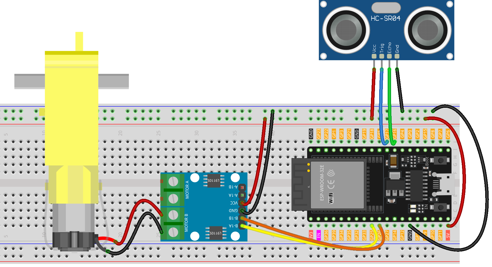

.. _smart_stop1:

Smart Stop 1.0
==============================================================

.. note::
  
  🌟 Welcome to the SunFounder Facebook Community! Whether you're into Raspberry Pi, Arduino, or ESP32, you'll find inspiration, help ideas here.
   
  - ✅ Be the first to get free learning resources. 
   
  - ✅ Stay updated on new products & exclusive giveaways. 
   
  - ✅ Share your creations and get real feedback.
   
  * 👉 Need faster updates or support? Click [|link_sf_facebook|] join our Facebook community 

  * 👉 Or join our WhatsApp group: Click [|link_sf_whatsapp|]
   
  * 🎁 Looking for parts?Check out our all-in-one kits below — packed with components, beginner-friendly guides, and tons of fun.
  
  .. list-table::
    :widths: 20 20 20
    :header-rows: 1

    *   - Name	
        - Includes Arduino board
        - PURCHASE LINK
    *   - ESP32 Ultimate Starter Kit	
        - ESP32 WROOM 32E +
        - |link_esp32_kit_buy|
    *   - Universal Maker Sensor Kit
        - 
        - |link_umsk_buy|

Course Introduction
------------------------

In this lesson, you’ll learn how to use an L9110 Motor Driver Module, an Ultrasonic Sensor Module, and a TT motor with the ESP32 to create a Smart Stop 1.0 system.

As the obstacle gets closer to the Ultrasonic Sensor Module, the TT motor gradually slows down until it comes to a stop.

.. raw:: html

  <iframe width="700" height="394" src="https://www.youtube.com/embed/bhixXz3299A?si=7XPRHgXTFmnrQfIz" title="YouTube video player" frameborder="0" allow="accelerometer; autoplay; clipboard-write; encrypted-media; gyroscope; picture-in-picture; web-share" referrerpolicy="strict-origin-when-cross-origin" allowfullscreen></iframe>

.. note::

  If this is your first time working with an Arduino project, we recommend downloading and reviewing the basic materials first.
  
  * :ref:`install_arduino`
  * :ref:`introduce_arduino`
  * :ref:`install_esp32`

**Required Components**

In this project, we need the following components:

.. list-table::
    :widths: 5 20 5 20
    :header-rows: 1

    *   - SN
        - COMPONENT INTRODUCTION	
        - QUANTITY
        - PURCHASE LINK

    *   - 1
        - ESP-WROOM-32 ESP32 ESP-32S Development Board
        - 1
        - |link_esp32_buy|
    *   - 2
        - USB Cable
        - 1
        - 
    *   - 3
        - Breadboard
        - 1
        - |link_breadboard_buy|
    *   - 4
        - Wires
        - Several
        - |link_wires_buy|
    *   - 5
        - L9110 Motor Driver Module
        - 1
        - 
    *   - 6
        - Ultrasonic Sensor Module
        - 1
        - |link_ultrasonic_buy|
    *   - 7
        - TT Motor
        - 1
        - 

**Wiring**

**Common Connections:**

* **Ultrasonic Sensor Module**

  - **Trig:** Connect to **GPIO17** on the ESP32.
  - **Echo:** Connect to **GPIO16** on the ESP32.
  - **GND:** Connect to breadboard’s negative power bus.
  - **VCC:** Connect to breadboard’s **5V** red power bus.

* **TT Motor**

  -  Connect to **MOTOR B** on the L9110 Motor Driver Module.

* **L9110 Motor Driver Module**

  - **GND:** Connect to breadboard’s negative power bus.
  - **VCC:** Connect to breadboard’s **5V** red power bus.
  - **B-1B:** Connect to **GPIO26** on the ESP32.
  - **B-1A:** Connect to **GPIO25** on the ESP32.

**Writing the Code**

.. note::

    * You can copy this code into **Arduino IDE**. 
    * Don't forget to select the board(ESP32 Dev module) and the correct port before clicking the **Upload** button.

.. code-block:: arduino

      #include <Arduino.h>

      // ---- Pin mapping for ESP32 ----
      // Ultrasonic sensor (HC-SR04)
      const int trigPin   = 17;   // TRIG (3.3V OK)
      const int echoPin   = 16;   // ECHO -> must be divided to ~3.3V on ESP32

      // L9110 motor driver (B channel)
      const int motorB_1A = 25;   // L9110 B-IA / IN1B
      const int motorB_2A = 26;   // L9110 B-IB / IN2B

      void setup() {
        Serial.begin(9600);                 // Serial monitor

        // Ultrasonic I/O
        pinMode(trigPin, OUTPUT);
        pinMode(echoPin, INPUT);

        // Motor outputs
        pinMode(motorB_1A, OUTPUT);
        pinMode(motorB_2A, OUTPUT);

        // Ensure motor is stopped at startup
        analogWrite(motorB_1A, 0);
        analogWrite(motorB_2A, 0);
      }

      void loop() {
        float distance = readSensorData();  // Read distance (cm)
        Serial.print("Distance: ");
        Serial.print(distance, 2);
        Serial.println(" cm");

        controlMotor(distance);             // Drive motor based on distance
        delay(100);                         // Small delay to reduce noise
      }

      // Read distance from HC-SR04 (returns centimeters)
      float readSensorData() {
        // Send 10 µs trigger pulse
        digitalWrite(trigPin, LOW);
        delayMicroseconds(2);
        digitalWrite(trigPin, HIGH);
        delayMicroseconds(10);
        digitalWrite(trigPin, LOW);

        // Measure echo pulse width with timeout (30 ms)
        unsigned long duration = pulseIn(echoPin, HIGH, 30000UL);
        if (duration == 0) return 9999.0f;  // Timeout -> treat as very far

        // Convert to centimeters (duration/58 is a common shortcut)
        return duration / 58.0f;
      }

      // Control DC motor via L9110 (forward on B-IA, B-IB kept low)
      void controlMotor(float distance) {
        if (distance < 5) {
          // Stop
          analogWrite(motorB_1A, 0);
          analogWrite(motorB_2A, 0);
        } else if (distance < 8) {
          // Slow
          analogWrite(motorB_1A, 85);
          analogWrite(motorB_2A, 0);
        } else if (distance < 11) {
          // Medium
          analogWrite(motorB_1A, 170);
          analogWrite(motorB_2A, 0);
        } else if (distance > 14) {
          // Max
          analogWrite(motorB_1A, 255);
          analogWrite(motorB_2A, 0);
        } else {
          // 11–14 cm -> stop (matches original implicit behavior)
          analogWrite(motorB_1A, 0);
          analogWrite(motorB_2A, 0);
        }
      }
