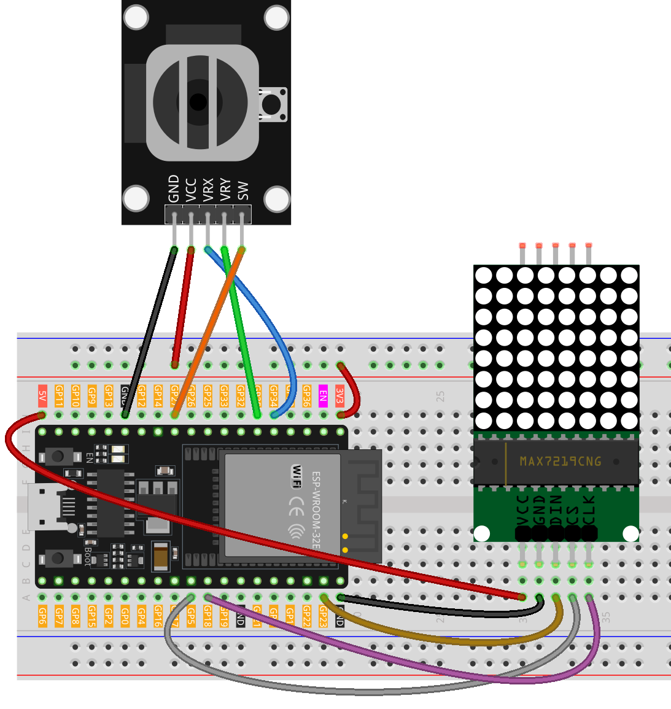

.. _snake_game:

Snake Game
==============================================================

.. note::
  
  🌟 Welcome to the SunFounder Facebook Community! Whether you're into Raspberry Pi, Arduino, or ESP32, you'll find inspiration, help ideas here.
   
  - ✅ Be the first to get free learning resources. 
   
  - ✅ Stay updated on new products & exclusive giveaways. 
   
  - ✅ Share your creations and get real feedback.
   
  * 👉 Need faster updates or support? Click [|link_sf_facebook|] join our Facebook community 

  * 👉 Or join our WhatsApp group: Click [|link_sf_whatsapp|]
  
  * 🎁 Looking for parts?Check out our all-in-one kits below — packed with components, beginner-friendly guides, and tons of fun.
  
  .. list-table::
    :widths: 20 20 20
    :header-rows: 1

    *   - Name	
        - Includes ESP32 board
        - PURCHASE LINK
    *   - ESP32 Ultimate Starter Kit	
        - ESP32 WROOM 32E +
        - |link_esp32_kit_buy|
    *   - Universal Maker Sensor Kit
        - 
        - |link_umsk_buy|

Course Introduction
------------------------
In this lesson, we’ll use a MAX7219 Dot Matrix Module, a joystick module, and ESP32 board to play a Snake game.

The snake’s movement will be controlled using the joystick.

.. raw:: html
 
  <iframe width="700" height="394" src="https://www.youtube.com/embed/JYAngkay4rQ?si=R_KSomKPMemVo-fx" title="YouTube video player" frameborder="0" allow="accelerometer; autoplay; clipboard-write; encrypted-media; gyroscope; picture-in-picture; web-share" referrerpolicy="strict-origin-when-cross-origin" allowfullscreen></iframe>

.. note::

  If this is your first time working with an ESP32 project, we recommend downloading and reviewing the basic materials first.
  
  * :ref:`install_arduino`
  * :ref:`introduce_arduino`
  * :ref:`install_esp32`

**Required Components**

In this project, we need the following components:

.. list-table::
    :widths: 5 20 5 20
    :header-rows: 1

    *   - SN
        - COMPONENT INTRODUCTION	
        - QUANTITY
        - PURCHASE LINK

    *   - 1
        - ESP-WROOM-32 ESP32 ESP-32S Development Board
        - 1
        - |link_esp32_buy|
    *   - 2
        - USB Type-C cable
        - 1
        - 
    *   - 3
        - Breadboard
        - 1
        - |link_breadboard_buy|
    *   - 4
        - Wires
        - Several
        - |link_wires_buy|
    *   - 5
        - Joystick Module
        - 1
        - |link_joystick_buy|
    *   - 6
        - MAX7219 Dot Matrix Module
        - 1
        - |link_martix1_buy|

**Wiring**

**Common Connections:**

* **MAX7219 Dot Matrix Module**

  - **CLK:** Connect to **GPIO18** on the ESP32.
  - **CS:** Connect to **GPIO5** on the ESP32.
  - **DIN:** Connect to **GPIO23** on the ESP32.
  - **GND:** Connect to **GND** on the ESP32.
  - **VCC:** Connect to **5V** on the ESP32.

* **Joystick Module**

  - **SW:** Connect to **GPIO27** on the ESP32.
  - **VRY:** Connect to **GPIO35** on the ESP32.
  - **VRX:** Connect to **GPIO34** on the ESP32.
  - **GND:** Connect to breadboard’s negative power bus.
  - **VCC:** Connect to breadboard’s **3.3V** red power bus.

**Writing the Code**

.. note::

    * You can copy this code into **Arduino IDE**. 
    * To install the library, use the Arduino Library Manager and search for **LedControl** and install it.
    * Don't forget to select the board(ESP32 Dev module) and the correct port before clicking the **Upload** button.

.. code-block:: arduino

      #include <LedControl.h>

      // Initialize the LED matrix
      LedControl lc = LedControl(12, 11, 10, 1); // DIN, CLK, CS, single matrix

      // Joystick pin configuration
      const int xPin = A0;  // VRX connected to A0
      const int yPin = A1;  // VRY connected to A1
      const int swPin = 2;  // SW connected to digital pin 2

      // Define grid size
      #define GRID_SIZE 8

      // Snake settings
      int snake[64][2];      // Stores the position of each segment of the snake, max 64 segments
      int snakeLength = 3;   // Initial length of the snake
      int direction = 0;     // Snake's movement direction: 0=right, 1=down, 2=left, 3=up
      bool gameOverFlag = false; // Flag to indicate if the game is over

      // Dynamic speed control
      int moveSpeed = 300;     // Initial movement speed (in ms)
      const int minSpeed = 100; // Minimum speed (in ms) to avoid uncontrollable gameplay

      // Food position
      int foodX, foodY;

      void setup() {
        lc.shutdown(0, false);  // Wake up the LED matrix
        lc.setIntensity(0, 5);  // Set brightness level
        lc.clearDisplay(0);     // Clear the display

        pinMode(swPin, INPUT_PULLUP); // Configure joystick button as input
        Serial.begin(9600);

        // Initialize the snake's position and spawn the first food
        resetGame();
      }

      void loop() {
        // Check if the game is over
        if (gameOverFlag) {
          if (digitalRead(swPin) == LOW) { // Restart the game if the joystick button is pressed
            delay(200); // Debounce delay
            resetGame();
          }
          return;
        }

        // Update direction at a higher frequency
        static unsigned long lastDirectionTime = 0;
        if (millis() - lastDirectionTime > 50) { // Check direction every 50ms
          updateDirection();
          lastDirectionTime = millis();
        }

        // Control the snake's movement
        static unsigned long lastMoveTime = 0;
        if (millis() - lastMoveTime > moveSpeed) { // Move snake based on its speed
          updateSnake();
          if (checkCollision()) { // Check for collisions
            gameOver();
            return;
          }
          displaySnakeAndFood(); // Refresh the display
          lastMoveTime = millis();
        }
      }

      // Reset the game state to initial conditions
      void resetGame() {
        lc.clearDisplay(0);
        snakeLength = 3;
        direction = 0;
        gameOverFlag = false;
        moveSpeed = 300; // Reset movement speed

        // Initialize the snake's position
        snake[0][0] = 4; snake[0][1] = 2; // Snake head
        snake[1][0] = 4; snake[1][1] = 1; // Snake body
        snake[2][0] = 4; snake[2][1] = 0; // Snake tail

        // Spawn the first food
        generateFood();

        // Display the initial state
        displaySnakeAndFood();
      }

      // Update the snake's position based on its direction
      void updateSnake() {
        // Check if the snake eats the food
        if (snake[0][0] == foodX && snake[0][1] == foodY) {
          snakeLength++; // Increase the snake's length
          generateFood(); // Spawn new food

          // Increase speed by decreasing delay, but do not go below minimum speed
          moveSpeed = max(minSpeed, moveSpeed - 40);
        }

        // Update each segment's position from tail to head
        for (int i = snakeLength - 1; i > 0; i--) {
          snake[i][0] = snake[i - 1][0];
          snake[i][1] = snake[i - 1][1];
        }

        // Update the head's position based on the direction
        if (direction == 0) snake[0][1] += 1;       // Move right
        else if (direction == 1) snake[0][0] += 1;  // Move down
        else if (direction == 2) snake[0][1] -= 1;  // Move left
        else if (direction == 3) snake[0][0] -= 1;  // Move up
      }

      // Display the snake and the food on the LED matrix
      void displaySnakeAndFood() {
        lc.clearDisplay(0); // Clear the LED matrix

        // Display the snake
        for (int i = 0; i < snakeLength; i++) {
          // Rotate the coordinates 90 degrees to match LED matrix orientation
          int rotatedRow = snake[i][1];               // New row = logical column
          int rotatedCol = GRID_SIZE - 1 - snake[i][0]; // New column = GRID_SIZE - 1 - row
          if (rotatedRow >= 0 && rotatedRow < GRID_SIZE && 
              rotatedCol >= 0 && rotatedCol < GRID_SIZE) { // Ensure the point is within bounds
            lc.setLed(0, rotatedRow, rotatedCol, true); // Light up the snake segment
          }
        }

        // Display the food
        int rotatedFoodRow = foodY;                // New row = logical column
        int rotatedFoodCol = GRID_SIZE - 1 - foodX; // New column = GRID_SIZE - 1 - row
        lc.setLed(0, rotatedFoodRow, rotatedFoodCol, true);
      }

      // Update the direction based on joystick input
      void updateDirection() {
        int xValue = analogRead(xPin);
        int yValue = analogRead(yPin);

        if (xValue < 300 && direction != 0) direction = 2; // Move left
        else if (xValue > 700 && direction != 2) direction = 0; // Move right
        else if (yValue < 300 && direction != 1) direction = 3; // Move up
        else if (yValue > 700 && direction != 3) direction = 1; // Move down
      }

      // Check for collisions with boundaries or self
      bool checkCollision() {
        // Check boundary collision
        if (snake[0][0] < 0 || snake[0][0] >= GRID_SIZE || 
            snake[0][1] < 0 || snake[0][1] >= GRID_SIZE) {
          return true; // Collided with boundary
        }

        // Check self-collision
        for (int i = 1; i < snakeLength; i++) {
          if (snake[0][0] == snake[i][0] && snake[0][1] == snake[i][1]) {
            return true; // Collided with itself
          }
        }
        return false;
      }

      // Handle game over state
      void gameOver() {
        gameOverFlag = true;

        // Display an end-game animation
        for (int i = 0; i < GRID_SIZE; i++) {
          for (int j = 0; j < GRID_SIZE; j++) {
            lc.setLed(0, i, j, true); // Light up all LEDs
          }
        }
        delay(2000); // Hold the animation for 2 seconds
        lc.clearDisplay(0);
      }

      // Randomly generate a new food position
      void generateFood() {
        // Maintain a list of unoccupied positions
        int availablePositions[GRID_SIZE * GRID_SIZE][2];
        int availableCount = 0;

        // Traverse the matrix and find unoccupied positions
        for (int x = 0; x < GRID_SIZE; x++) {
          for (int y = 0; y < GRID_SIZE; y++) {
            bool isOccupied = false;
            for (int i = 0; i < snakeLength; i++) {
              if (snake[i][0] == x && snake[i][1] == y) {
                isOccupied = true;
                break;
              }
            }
            if (!isOccupied) {
              availablePositions[availableCount][0] = x;
              availablePositions[availableCount][1] = y;
              availableCount++;
            }
          }
        }

        // Randomly select a position from the unoccupied list
        if (availableCount > 0) {
          int randomIndex = random(0, availableCount);
          foodX = availablePositions[randomIndex][0];
          foodY = availablePositions[randomIndex][1];
        }
      }
