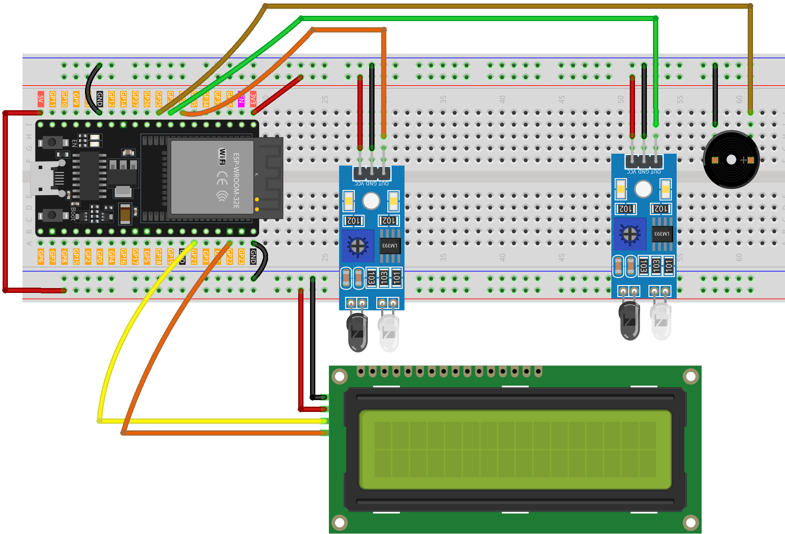

.. _speed_detection:

Speed Detection
==============================================================

.. note::
  
  🌟 Welcome to the SunFounder Facebook Community! Whether you're into Raspberry Pi, Arduino, or ESP32, you'll find inspiration, help ideas here.
   
  - ✅ Be the first to get free learning resources. 
   
  - ✅ Stay updated on new products & exclusive giveaways. 
   
  - ✅ Share your creations and get real feedback.
   
  * 👉 Need faster updates or support? Click [|link_sf_facebook|] join our Facebook community 

  * 👉 Or join our WhatsApp group: Click [|link_sf_whatsapp|]
   
  * 🎁 Looking for parts?Check out our all-in-one kits below — packed with components, beginner-friendly guides, and tons of fun.
  
  .. list-table::
    :widths: 20 20 20
    :header-rows: 1

    *   - Name	
        - Includes Arduino board
        - PURCHASE LINK
    *   - ESP32 Ultimate Starter Kit	
        - ESP32 WROOM 32E +
        - |link_esp32_kit_buy|
    *   - Universal Maker Sensor Kit
        - 
        - |link_umsk_buy|

Course Introduction
------------------------

This project functions as a basic speed detection system using two infrared (IR) sensors and an LCD display. 

When a vehicle passes the front sensor, the system starts a timer; it stops the timer once the vehicle triggers the back sensor. 

Using the known distance between the sensors, the system calculates the vehicle's speed and displays it in km/h on a 16x2 I2C LCD. 

If the speed exceeds a set threshold (e.g., 60 km/h), a buzzer alerts for overspeeding. The LCD resets after each detection cycle, ready for the next vehicle.

.. .. raw:: html
 
..  <iframe width="700" height="394" src="https://www.youtube.com/embed/6tRpIKP6tBY?si=IOseJOS-UzYaJD-5" title="YouTube video player" frameborder="0" allow="accelerometer; autoplay; clipboard-write; encrypted-media; gyroscope; picture-in-picture; web-share" referrerpolicy="strict-origin-when-cross-origin" allowfullscreen></iframe>

.. note::

  If this is your first time working with an Arduino project, we recommend downloading and reviewing the basic materials first.
  
  * :ref:`install_arduino`
  * :ref:`introduce_arduino`
  * :ref:`install_esp32`

**Required Components**

In this project, we need the following components:

.. list-table::
    :widths: 5 20 5 20
    :header-rows: 1

    *   - SN
        - COMPONENT INTRODUCTION	
        - QUANTITY
        - PURCHASE LINK

    *   - 1
        - ESP-WROOM-32 ESP32 ESP-32S Development Board
        - 1
        - |link_esp32_buy|
    *   - 2
        - USB Type-C cable
        - 1
        - 
    *   - 3
        - Breadboard
        - 1
        - |link_breadboard_buy|
    *   - 4
        - Wires
        - Several
        - |link_wires_buy|
    *   - 5
        - I2C LCD 1602
        - 1
        - |link_i2clcd1602_buy|
    *   - 6
        - IR Obstacle Avoidance Sensor Module
        - 2
        - |link_IR_module_buy|
    *   - 7
        - Passive Buzzer
        - 1
        - |link_passive_buzzer_buy|

**Wiring**

**Common Connections:**

* **Passive Buzzer**

  - **＋:** Connect to **GPIO25** on the ESP32.
  - **－:** Connect to breadboard’s negative power bus.

* **I2C LCD 1602**

  - **SDA:** Connect to **GPIO21** on the ESP32.
  - **SCL:** Connect to **GPIO22** on the ESP32.
  - **GND:** Connect to breadboard’s negative power bus.
  - **VCC:** Connect to breadboard’s **5V** red power bus.

* **IR Obstacle Avoidance Sensor Module Front**

  - **OUT:** Connect to **GPIO32** on the Arduino.
  - **GND:** Connect to breadboard’s negative power bus.
  - **VCC:** Connect to breadboard’s **3.3V** red power bus.

* **IR Obstacle Avoidance Sensor Module Back**

  - **OUT:** Connect to **GPIO33** on the Arduino.
  - **GND:** Connect to breadboard’s negative power bus.
  - **VCC:** Connect to breadboard’s **3.3V** red power bus.

**Writing the Code**

.. note::

    * You can copy this code into **Arduino IDE**. 
    * To install the library, use the Arduino Library Manager and search for **LiquidCrystal I2C** and install it.
    * Don't forget to select the board(ESP32 Dev module) and the correct port before clicking the **Upload** button.

.. code-block:: arduino

      #include <Wire.h>
      #include <LiquidCrystal_I2C.h>

      // Use I2C address 0x27, 16x2 LCD
      LiquidCrystal_I2C lcd(0x27, 16, 2);

      // ---- Pin map (ESP32 DevKit v1 safe choices) ----
      // IR sensors (digital, active LOW)
      const int irFront = 32;   // Front IR sensor input (GPIO32)
      const int irBack  = 33;   // Back IR sensor input  (GPIO33)

      // Active buzzer (driven HIGH to beep)
      const int buzzer  = 25;   // Buzzer output (GPIO25)

      // Distance between the two sensors in meters
      float distanceMeters = 1.30;

      // Timing
      unsigned long t1 = 0, t2 = 0;
      bool carDetected = false;

      void setup() {
        // ESP32 I2C pins: SDA=21, SCL=22 (set bus here before using lcd)
        Wire.begin(21, 22);

        // Inputs/outputs
        pinMode(irFront, INPUT);   // Use INPUT unless your sensor needs pull-ups
        pinMode(irBack,  INPUT);
        pinMode(buzzer,  OUTPUT);
        digitalWrite(buzzer, LOW);

        // LCD init
        lcd.init();
        lcd.backlight();
        lcd.setCursor(0, 0);
        lcd.print("No car detected");
      }

      void loop() {
        // Wait for a car to pass the front sensor (active LOW)
        if (!carDetected && digitalRead(irFront) == LOW) {
          carDetected = true;
          t1 = millis();

          lcd.clear();
          lcd.setCursor(0, 0);
          lcd.print("Searching...");

          // Wait until back sensor is triggered, with timeout safeguard
          const unsigned long waitTimeoutMs = 5000; // 5 s failsafe
          unsigned long startWait = millis();
          while (digitalRead(irBack) == HIGH) {
            if (millis() - startWait > waitTimeoutMs) {
              // Timeout: reset state and notify
              lcd.clear();
              lcd.setCursor(0, 0);
              lcd.print("Back sensor TO");
              delay(1500);
              lcd.clear();
              lcd.setCursor(0, 0);
              lcd.print("No car detected");
              carDetected = false;
              return;
            }
            delay(1);
          }

          t2 = millis();

          // Compute speed
          unsigned long deltaT = t2 - t1;          // ms
          float timeSec = deltaT / 1000.0f;        // s
          float speedKmh = (distanceMeters / timeSec) * 3.6f;

          lcd.clear();
          lcd.setCursor(0, 0);
          lcd.print("Speed: ");
          lcd.print((int)speedKmh);
          lcd.print(" km/h");

          lcd.setCursor(0, 1);
          if (speedKmh <= 60.0f) {
            lcd.print("Normal Speed");
          } else {
            lcd.print("Over Speeding");
            digitalWrite(buzzer, HIGH);
            delay(1000);
            digitalWrite(buzzer, LOW);
          }

          delay(3000);
          lcd.clear();
          lcd.setCursor(0, 0);
          lcd.print("No car detected");
          carDetected = false;
        }
      }
