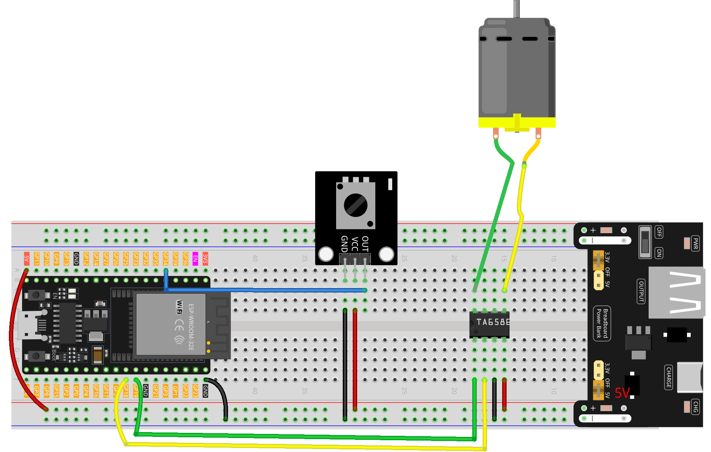

.. _speed_dial:

Speed Dial
==============================================================

.. note::
  
  🌟 Welcome to the SunFounder Facebook Community! Whether you're into Raspberry Pi, Arduino, or ESP32, you'll find inspiration, help ideas here.
   
  - ✅ Be the first to get free learning resources. 
   
  - ✅ Stay updated on new products & exclusive giveaways. 
   
  - ✅ Share your creations and get real feedback.
   
  * 👉 Need faster updates or support? Click [|link_sf_facebook|] join our Facebook community 

  * 👉 Or join our WhatsApp group: Click [|link_sf_whatsapp|]
   
  * 🎁 Looking for parts? Check out our all-in-one kits below — packed with components, beginner-friendly guides, and tons of fun.
  
  .. list-table::
    :widths: 20 20 20
    :header-rows: 1

    *   - Name	
        - Includes ESP32 board
        - PURCHASE LINK
    *   - ESP32 Ultimate Starter Kit	
        - ESP32 WROOM 32E +
        - |link_esp32_kit_buy|
    *   - Universal Maker Sensor Kit
        - 
        - |link_umsk_buy|

Course Introduction
------------------------

In this lesson, you'll use a potentiometer and a DC motor with the ESP32 to create a simple motor speed control system.

By rotating the potentiometer, you can adjust the motor speed from stop to full speed. The ESP32 reads the potentiometer value, maps it to PWM output, and drives the motor in one direction with variable speed.

.. raw:: html

  <iframe width="700" height="394" src="https://www.youtube.com/embed/4Poj-7nh6OQ?si=a453mqSETV96tWv1" title="YouTube video player" frameborder="0" allow="accelerometer; autoplay; clipboard-write; encrypted-media; gyroscope; picture-in-picture; web-share" referrerpolicy="strict-origin-when-cross-origin" allowfullscreen></iframe>

.. note::

  If this is your first time working with an ESP32 project, we recommend downloading and reviewing the basic materials first.
  
  * :ref:`install_arduino`
  * :ref:`introduce_arduino`
  * :ref:`install_esp32`

**Required Components**

In this project, we need the following components:

.. list-table::
    :widths: 5 20 5 20
    :header-rows: 1

    *   - SN
        - COMPONENT INTRODUCTION	
        - QUANTITY
        - PURCHASE LINK

    *   - 1
        - ESP-WROOM-32 ESP32 ESP-32S Development Board
        - 1
        - |link_esp32_buy|
    *   - 2
        - USB Cable
        - 1
        - 
    *   - 3
        - Breadboard
        - 1
        - |link_breadboard_buy|
    *   - 4
        - Wires
        - Several
        - |link_wires_buy|
    *   - 5
        - TA6586 - Motor Driver Chip
        - 1
        - 
    *   - 6
        - Potentiometer Sensor Module
        - 1
        - |link_potentiometer_module_buy|
    *   - 7
        - TT Motor
        - 1
        - 
    *   - 8
        - Power Supply
        - 1
        - |link_power_buy|

**Wiring**

**Common Connections:**

* **Potentiometer Sensor Module**

  - **OUT:** Connect to **GPIO34** on the ESP32.
  - **GND:** Connect to breadboard’s negative power bus.
  - **VCC:** Connect to breadboard’s red power bus.

* **TA6586 - Motor Driver Chip**

  - **BI:** Connect to **GPIO19** on the ESP32.
  - **FI:** Connect to **GPIO18** on the ESP32.
  - **GND:** Connect to breadboard’s negative power bus.
  - **VCC:** Connect to breadboard’s red power bus.

* **TT Motor**

  -  Connect to **B0**, **F0** on the **TA6586 - Motor Driver Chip**.

**Writing the Code**

.. note::

    * You can copy this code into **Arduino IDE**. 
    * Don't forget to select the board(ESP32 Dev Module) and the correct port before clicking the **Upload** button.

.. code-block:: arduino

      // Potentiometer and motor control for ESP32 using analogWrite()

      const int potPin    = 34;  // Potentiometer signal pin (ESP32 ADC input)
      const int motorPin1 = 18;  // Motor PWM pin
      const int motorPin2 = 19;  // Motor direction pin

      void setup() {
        // Motor pins as output
        pinMode(motorPin1, OUTPUT);
        pinMode(motorPin2, OUTPUT);

        // Potentiometer pin as input
        pinMode(potPin, INPUT);

        // Set initial motor state
        digitalWrite(motorPin1, LOW);
        digitalWrite(motorPin2, LOW);
      }

      void loop() {
        // Read analog value from potentiometer (0–4095 on ESP32)
        int val = analogRead(potPin);

        // Map value to PWM range (0–255)
        int speed = map(val, 0, 4095, 0, 255);

        // Set direction (LOW = one direction)
        digitalWrite(motorPin2, LOW);

        // Drive motor with mapped speed
        analogWrite(motorPin1, speed);

        delay(10);  // Small delay for stability
      }
