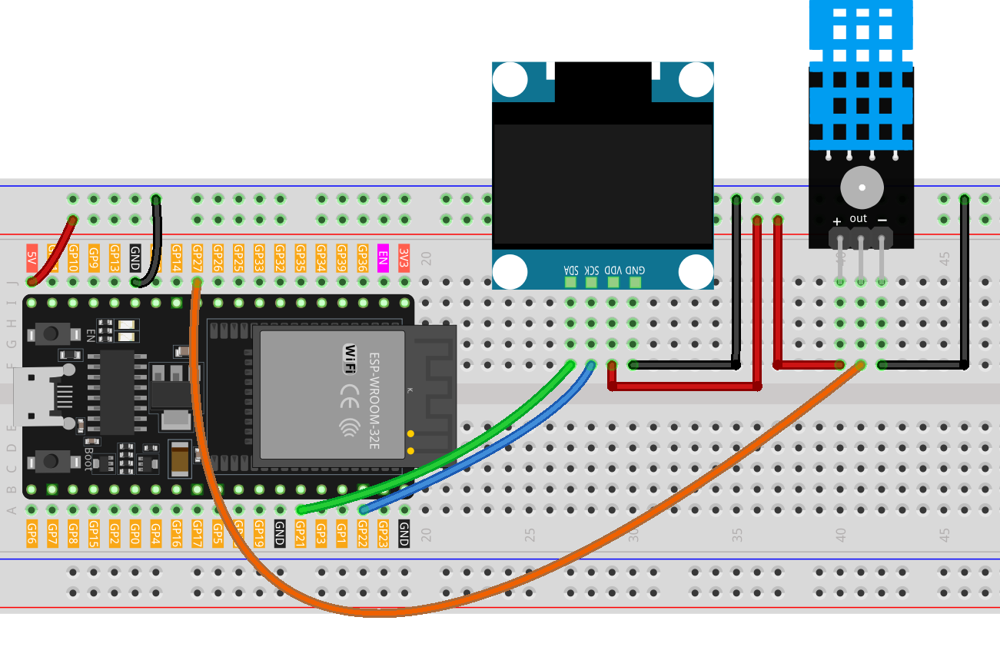

.. _temphumid_monitor:

TempHumid Monitor
==============================================================

.. note::
  
  🌟 Welcome to the SunFounder Facebook Community! Whether you're into Raspberry Pi, Arduino, or ESP32, you'll find inspiration, help ideas here.
   
  - ✅ Be the first to get free learning resources. 
   
  - ✅ Stay updated on new products & exclusive giveaways. 
   
  - ✅ Share your creations and get real feedback.
   
  * 👉 Need faster updates or support? Click [|link_sf_facebook|] join our Facebook community 

  * 👉 Or join our WhatsApp group: Click [|link_sf_whatsapp|]
   
🎁 Kit purchase
------------------------
  
Looking for parts? Check out our all-in-one kits below — packed with components, beginner-friendly guides, and tons of fun.

.. image:: img/esp32_kit.png
   :width: 100%
   :align: center
   :target: https://www.sunfounder.com/products/sunfounder-esp32-ultimate-starter-kit-with-esp32-camera-extension-board-battery?_pos=1&_sid=7dcb30fb6&_ss=r&ref=jbzmncle

.. raw:: html

     

.. list-table::
   :widths: 20 20 20
   :header-rows: 1

   * - Name
     - Includes ESP32 board
     - PURCHASE LINK
   * - ESP32 Ultimate Starter Kit
     - ESP32 WROOM 32E +
     - |link_esp32_kit_buy|
   * - Universal Maker Sensor Kit
     -
     - |link_umsk_buy|

Course Introduction
------------------------

This ESP32 project uses a DHT11 sensor and an OLED display to monitor and display real-time temperature and humidity. 

The data is updated every 0.5 seconds and shown clearly on a 128x64 I2C OLED screen. If sensor readings fail, an error message is displayed. 

This setup is ideal for simple environmental monitoring applications.

.. raw:: html

  <iframe width="700" height="394" src="https://www.youtube.com/embed/9n0D3amkl0E" title="YouTube video player" frameborder="0" allow="accelerometer; autoplay; clipboard-write; encrypted-media; gyroscope; picture-in-picture; web-share" referrerpolicy="strict-origin-when-cross-origin" allowfullscreen></iframe>

.. note::

  If this is your first time working with an ESP32 project, we recommend downloading and reviewing the basic materials first.

  * :ref:`install_arduino`
  * :ref:`introduce_arduino`
  * :ref:`install_esp32`

**Required Components**

In this project, we need the following components:

.. list-table::
    :widths: 5 20 5 20
    :header-rows: 1

    *   - SN
        - COMPONENT INTRODUCTION	
        - QUANTITY
        - PURCHASE LINK

    *   - 1
        - ESP-WROOM-32 ESP32 ESP-32S Development Board
        - 1
        - |link_esp32_buy|
    *   - 2
        - USB Type-C cable
        - 1
        - 
    *   - 3
        - Breadboard
        - 1
        - |link_breadboard_buy|
    *   - 4
        - Wires
        - Several
        - |link_wires_buy|
    *   - 5
        - DHT-11 Module
        - 1
        - |link_dht11m_buy|
    *   - 6
        - OLED Display Module
        - 1
        - |link_oled_buy|

**Wiring**

**Common Connections:**

* **DHT-11 Module**

  - **OUT:** Connect to **GPIO27** on the ESP32.
  - **-**:** Connect to breadboard’s negative power bus.
  - **+:** Connect to breadboard’s red power bus.

* **OLED Display Module**

  - **SDA:** Connect to **GPIO21** on the ESP32.
  - **SCK:** Connect to **GPIO22** on the ESP32.
  - **GND:** Connect to breadboard’s negative power bus.
  - **VCC:** Connect to breadboard’s red power bus.

**Writing the Code**

.. note::

    * You can copy this code into **Arduino IDE**. 
    * To install the library, use the Arduino Library Manager and search for **DHT** , **Adafruit SSD1306** and **Adafruit GFX** and install it.
    * Don't forget to select the board(ESP32 Dev module) and the correct port before clicking the **Upload** button.

.. code-block:: arduino

      #include <DHT.h>
      #include <SPI.h>
      #include <Wire.h>
      #include <Adafruit_GFX.h>
      #include <Adafruit_SSD1306.h>

      // ======== Display config ========
      #define SCREEN_WIDTH 128                 // OLED width in pixels
      #define SCREEN_HEIGHT 64                 // OLED height in pixels
      #define OLED_RESET    -1                 // No dedicated reset pin
      #define SCREEN_ADDRESS 0x3C              // Most 128x64 modules use 0x3C

      // ESP32 I2C pins (change if your board uses different ones)
      #define I2C_SDA 21
      #define I2C_SCL 22

      Adafruit_SSD1306 display(SCREEN_WIDTH, SCREEN_HEIGHT, &Wire, OLED_RESET);

      // ======== DHT sensor config ========
      // Use a safe ESP32 GPIO for the DHT data pin (avoid input-only pins 34–39)
      #define DHTPIN 27                        // DHT data pin on ESP32
      #define DHTTYPE DHT11                    // Sensor type
      DHT dht(DHTPIN, DHTTYPE);

      // Suggested sampling interval for DHT11 is ~1s
      const uint32_t SAMPLE_DELAY_MS = 1000;

      void setup() {
        // Faster serial for ESP32
        Serial.begin(115200);
        Serial.println(F("DHT11 with OLED test (ESP32)"));

        // Initialize I2C on explicit ESP32 pins
        Wire.begin(I2C_SDA, I2C_SCL);

        // Initialize display
        if (!display.begin(SSD1306_SWITCHCAPVCC, SCREEN_ADDRESS)) {
          Serial.println(F("SSD1306 allocation failed"));
          for(;;) { /* halt */ }
        }

        // Initialize DHT sensor
        dht.begin();

        // Prepare screen
        display.clearDisplay();
        display.setTextColor(SSD1306_WHITE);
        display.setTextSize(1);
        display.setCursor(0, 0);
        display.println(F("Init OK"));
        display.display();
      }

      void loop() {
        // Respect DHT11 recommended interval to reduce NaNs
        delay(SAMPLE_DELAY_MS);

        // Read humidity and temperature (blocking ~250ms for DHT11)
        float h = dht.readHumidity();
        float t = dht.readTemperature(); // Celsius

        // If reads failed, show an error message
        if (isnan(h) || isnan(t)) {
          Serial.println(F("Failed to read from DHT sensor!"));
          display.clearDisplay();
          display.setTextSize(1);
          display.setTextColor(SSD1306_WHITE);
          display.setCursor(0, 0);
          display.println(F("Sensor error"));
          display.display();
          return;
        }

        // Clear and render fresh values
        display.clearDisplay();

        // Humidity label
        display.setTextSize(1);
        display.setTextColor(SSD1306_WHITE);
        display.setCursor(0, 0);
        display.println(F("Humidity:"));

        // Humidity value (large)
        display.setTextSize(2);
        display.setCursor(0, 10);
        display.print(h, 1);  // 1 decimal place
        display.println(F("%"));

        // Temperature label
        display.setTextSize(1);
        display.setCursor(0, 35);
        display.println(F("Temperature:"));

        // Temperature value (large)
        display.setTextSize(2);
        display.setCursor(0, 45);
        display.print(t, 1);
        display.println(F(" C"));

        // Push buffer to OLED
        display.display();

        // Print to serial for debugging
        Serial.print(F("Humidity: "));
        Serial.print(h, 1);
        Serial.print(F("%  Temperature: "));
        Serial.print(t, 1);
        Serial.println(F(" C"));
      }
