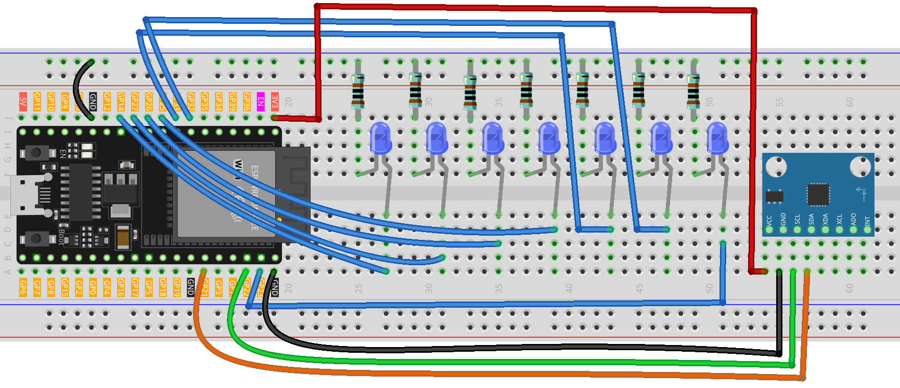

.. _tilt_led1.0:

Tilt LED 1.0
==============================================================

.. note::
  
  🌟 Welcome to the SunFounder Facebook Community! Whether you're into Raspberry Pi, Arduino, or ESP32, you'll find inspiration, help ideas here.
   
  - ✅ Be the first to get free learning resources. 
   
  - ✅ Stay updated on new products & exclusive giveaways. 
   
  - ✅ Share your creations and get real feedback.
   
  * 👉 Need faster updates or support? Click [|link_sf_facebook|] join our Facebook community 

  * 👉 Or join our WhatsApp group: Click [|link_sf_whatsapp|]
   
  * 🎁 Looking for parts?Check out our all-in-one kits below — packed with components, beginner-friendly guides, and tons of fun.
  
  .. list-table::
    :widths: 20 20 20
    :header-rows: 1

    *   - Name	
        - Includes ESP32 board
        - PURCHASE LINK
    *   - ESP32 Ultimate Starter Kit	
        - ESP32 WROOM 32E +
        - |link_esp32_kit_buy|
    *   - Universal Maker Sensor Kit
        - 
        - |link_umsk_buy|

Course Introduction
------------------------

In this lesson, you’ll learn how to use MPU6050 Module with the ESP32 to control the LED show. 

In this setup, the number of lit LEDs will increase as the tilt angle of the MPU6050 increases.

.. raw:: html

  <iframe width="700" height="394" src="https://www.youtube.com/embed/HsPngjLqiGQ" title="YouTube video player" frameborder="0" allow="accelerometer; autoplay; clipboard-write; encrypted-media; gyroscope; picture-in-picture; web-share" referrerpolicy="strict-origin-when-cross-origin" allowfullscreen></iframe>

.. note::

  If this is your first time working with an Arduino project, we recommend downloading and reviewing the basic materials first.

  * :ref:`install_arduino`
  * :ref:`introduce_arduino`
  * :ref:`install_esp32`

**Required Components**

In this project, we need the following components:

.. list-table::
    :widths: 5 20 5 20
    :header-rows: 1

    *   - SN
        - COMPONENT INTRODUCTION	
        - QUANTITY
        - PURCHASE LINK

    *   - 1
        - ESP-WROOM-32 ESP32 ESP-32S Development Board
        - 1
        - |link_esp32_buy|
    *   - 2
        - USB Type-C cable
        - 1
        - 
    *   - 3
        - Breadboard
        - 1
        - |link_breadboard_buy|
    *   - 4
        - Wires
        - Several
        - |link_wires_buy|
    *   - 5
        - 1kΩ resistor
        - Several
        - |link_resistor_buy|
    *   - 6
        - LED
        - Several
        - |link_led_buy|
    *   - 7
        - MPU6050 Module
        - 1
        - |link_mpu6050_buy|

**Wiring**

**Common Connections:**

* **LED**

  - Connect the LEDs **cathode** to a **1kΩ resistor** then to the negative power bus on the breadboard, and the LEDs **anode** to **GPIO14** , **GPIO17** , **GPIO26** , **GPIO25** , **GPIO33** , **GPIO32** , **GPIO23** on the ESP32.

* **MPU6050**

  - **SDA:** Connect to **GPIO21** on the ESP32.
  - **SCL:** Connect to **GPIO22** on the ESP32.
  - **GND:** Connect to breadboard’s negative power bus.
  - **VCC:** Connect to breadboard’s red power bus.

**Writing the Code**

.. note::

    * You can copy this code into **Arduino IDE**. 
    * To install the library, use the Arduino Library Manager and search for **MPU6050** and install it.
    * Don't forget to select the board(ESP32 Dev module) and the correct port before clicking the **Upload** button.

.. code-block:: arduino

      #include <Arduino.h>
      #include <Wire.h>
      #include <MPU6050.h>

      MPU6050 mpu;

      // Remap Arduino 7–13 LEDs to safe ESP32 GPIOs (7 LEDs total)
      const int ledPins[] = {14, 27, 26, 25, 33, 32, 23};
      int ledCount = sizeof(ledPins) / sizeof(ledPins[0]); // LED count

      void updateLEDs(float angleX);
      int  mapAngleToLEDs(float angleX);

      void setup() {
        // Initialize I2C on ESP32: SDA=21, SCL=22, with fast mode 400kHz
        Wire.begin(21, 22);
        Wire.setClock(400000);

        Serial.begin(115200);
        delay(50);

        // Initialize MPU6050
        mpu.initialize();
        if (!mpu.testConnection()) {
          Serial.println("MPU6050 connection failed");
          while (1) { delay(1000); }
        }

        // Set LED pins as outputs and turn all off
        for (int i = 0; i < ledCount; i++) {
          pinMode(ledPins[i], OUTPUT);
          digitalWrite(ledPins[i], LOW);
        }

        Serial.println("ESP32 + MPU6050 tilt-to-LED ready.");
      }

      void loop() {
        int16_t ax, ay, az; // Raw acceleration

        // Read raw acceleration from MPU6050
        mpu.getAcceleration(&ax, &ay, &az);

        // Convert to tilt angle around X using atan2(ay, az)
        float angleX = atan2((float)ay, (float)az) * 180.0f / PI;

        // Update bar LEDs based on angle
        updateLEDs(angleX);

        // Debug print
        Serial.print("ax: "); Serial.print(ax);
        Serial.print("  ay: "); Serial.print(ay);
        Serial.print("  az: "); Serial.print(az);
        Serial.print("  | angleX: "); Serial.println(angleX, 1);

        delay(100);
      }

      // Turn on a number of LEDs based on the mapped index
      void updateLEDs(float angleX) {
        // Turn all LEDs off
        for (int i = 0; i < ledCount; i++) {
          digitalWrite(ledPins[i], LOW);
        }

        // Determine how many LEDs should be on
        int ledIndex = mapAngleToLEDs(angleX);

        // Light from the first LED up to ledIndex (inclusive)
        for (int i = 0; i <= ledIndex; i++) {
          if (i >= 0 && i < ledCount) digitalWrite(ledPins[i], HIGH);
        }
      }

      // Map tilt angle [-90, 90] to LED index [-1 ... ledCount-1]
      int mapAngleToLEDs(float angleX) {
        // Clamp angle to [-90, 90]
        angleX = constrain(angleX, -90.0f, 90.0f);

        // Use absolute angle: 0 => -1 (none), 90 => ledCount-1 (all)
        int ledIndex = map((int)abs(angleX), 0, 90, 0, ledCount - 1);

        // Exactly horizontal (0°) -> no LEDs lit
        if (angleX == 0.0f) ledIndex = -1;

        return ledIndex;
      }
