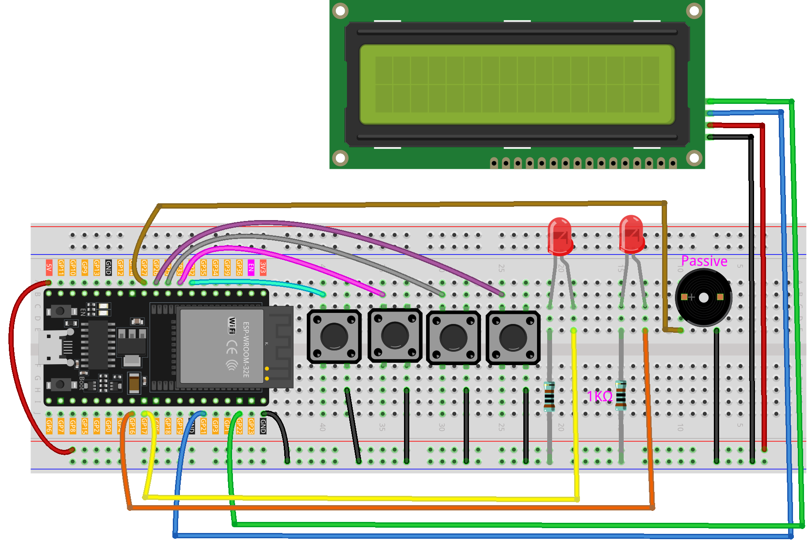

.. _timer:

Timer
==============================================================

.. note::
  
  🌟 Welcome to the SunFounder Facebook Community! Whether you're into Raspberry Pi, Arduino, or ESP32, you'll find inspiration, help ideas here.
   
  - ✅ Be the first to get free learning resources. 
   
  - ✅ Stay updated on new products & exclusive giveaways. 
   
  - ✅ Share your creations and get real feedback.
   
  * 👉 Need faster updates or support? Click [|link_sf_facebook|] join our Facebook community 

  * 👉 Or join our WhatsApp group: Click [|link_sf_whatsapp|]
   
Kit purchase
------------------------
  
Looking for parts? Check out our all-in-one kits below — packed with components, beginner-friendly guides, and tons of fun.

.. image:: img/esp32_kit.png
   :width: 100%
   :align: center
   :target: https://www.sunfounder.com/products/sunfounder-esp32-ultimate-starter-kit-with-esp32-camera-extension-board-battery?_pos=1&_sid=7dcb30fb6&_ss=r&ref=jbzmncle

.. raw:: html

     

.. list-table::
   :widths: 20 20 20
   :header-rows: 1

   * - Name
     - Includes ESP32 board
     - PURCHASE LINK
   * - ESP32 Ultimate Starter Kit
     - ESP32 WROOM 32E +
     - |link_esp32_kit_buy|
   * - Universal Maker Sensor Kit
     -
     - |link_umsk_buy|

Course Introduction
------------------------

In this lesson, you'll learn how to create a timer using LED, button, passive buzzer, and I2C LCD 1602 with ESP32. 

After setting the countdown by pressing the button, the LED will blink every second, and when the countdown ends, the buzzer will sound, and the LED will keep flashing.

.. raw:: html

  <iframe width="700" height="394" src="https://www.youtube.com/embed/Zy0sGvEWFmc?si=7NQco0Sf7GJTJmjl" title="YouTube video player" frameborder="0" allow="accelerometer; autoplay; clipboard-write; encrypted-media; gyroscope; picture-in-picture; web-share" referrerpolicy="strict-origin-when-cross-origin" allowfullscreen></iframe>

.. note::

  If this is your first time working with an ESP32 project, we recommend downloading and reviewing the basic materials first.
  
  * :ref:`install_arduino`
  * :ref:`introduce_arduino`
  * :ref:`install_esp32`

**Required Components**

In this project, we need the following components:

.. list-table::
    :widths: 5 20 5 20
    :header-rows: 1

    *   - SN
        - COMPONENT INTRODUCTION	
        - QUANTITY
        - PURCHASE LINK

    *   - 1
        - ESP-WROOM-32 ESP32 ESP-32S Development Board
        - 1
        - |link_esp32_buy|
    *   - 2
        - USB Type-C cable
        - 1
        - 
    *   - 3
        - Breadboard
        - 1
        - |link_breadboard_buy|
    *   - 4
        - Wires
        - Several
        - |link_wires_buy|
    *   - 5
        - 1kΩ resistor
        - 2
        - |link_resistor_buy|
    *   - 6
        - Button
        - 4
        - |link_button_buy|
    *   - 7
        - LED
        - 2
        - |link_led_buy|
    *   - 8
        - I2C LCD 1602
        - 1
        - |link_i2clcd1602_buy|
    *   - 9
        - Passive Buzzer
        - 1
        - |link_passive_buzzer_buy|

**Wiring**

**Common Connections:**

* **LED**

  - Connect the LEDs **cathode** to a **1kΩ resistor** then to the negative power bus on the breadboard, and the LEDs **anode** to **GPIO16**, **GPIO17** on the ESP32.

* **Button**

  - Connect to breadboard’s negative power bus.
  - Connect to **32** , **33** , **25** , **26** on the ESP32.

* **Passive Buzzer**

  - **＋:** Connect to **GPIO27** on the ESP32.
  - **－:** Connect to breadboard’s negative power bus.

* **I2C LCD 1602**

  - **SDA:** Connect to **GPIO21** on the ESP32.
  - **SCL:** Connect to **GPIO22** on the ESP32.
  - **GND:** Connect to breadboard’s negative power bus.
  - **VCC:** Connect to breadboard’s red power bus.

**Writing the Code**

.. note::

    * You can copy this code into **Arduino IDE**. 
    * To install the library, use the Arduino Library Manager and search for **LiquidCrystal I2C** and install it.
    * Don't forget to select the board(ESP32 Dev module) and the correct port before clicking the **Upload** button.

.. code-block:: arduino

      #include <Wire.h>
      #include <LiquidCrystal_I2C.h>

      // ==== I2C LCD ====
      LiquidCrystal_I2C lcd(0x27, 16, 2);

      // ==== ESP32 pin mapping ====
      // Outputs
      const int buzzerPin = 27;  // Buzzer (active 3.3V, or drive 5V with transistor)
      const int led1Pin   = 16;  // LED1
      const int led2Pin   = 17;  // LED2

      // Inputs (buttons with INPUT_PULLUP)
      const int buttonRed    = 32;
      const int buttonYellow = 33;
      const int buttonGreen  = 26;
      const int buttonBlue   = 25;

      // Timer states
      enum TimerState { IDLE, SET_SS, SET_MM, SET_HH, READY, RUNNING, PAUSED, FINISHED };
      TimerState state = IDLE;

      // Time variables
      int seconds = 0, minutes = 0, hours = 0;
      unsigned long previousMillis = 0;
      unsigned long ledBlinkMillis = 0;
      bool ledState = false;

      // Setting control
      int settingStage = 0;
      unsigned long totalSeconds = 0;

      // Button state tracking
      bool lastYellowState = HIGH;
      bool lastGreenState  = HIGH;
      bool lastBlueState   = HIGH;

      // Red button debouncing
      unsigned long redLastTriggered = 0;
      bool redHandled = false;

      // Function declarations
      void showTitle(String text);
      void updateDisplay();
      void handleButtons();
      void convertTotalSeconds();
      void resetTimer();
      void handleLEDBlink(int interval);
      String formatTime(int val);

      void setup() {
        Serial.begin(9600);

        // Initialize I2C explicitly for ESP32
        Wire.begin(21, 22);  // SDA=21, SCL=22

        lcd.init();
        lcd.backlight();
        showTitle("Timer");

        pinMode(buzzerPin, OUTPUT);
        pinMode(led1Pin, OUTPUT);
        pinMode(led2Pin, OUTPUT);

        pinMode(buttonRed,    INPUT_PULLUP);
        pinMode(buttonYellow, INPUT_PULLUP);
        pinMode(buttonGreen,  INPUT_PULLUP);
        pinMode(buttonBlue,   INPUT_PULLUP);

        updateDisplay();
      }

      void loop() {
        handleButtons();

        if (state == RUNNING) {
          if (millis() - previousMillis >= 1000) {
            previousMillis = millis();
            Serial.print("Tick: ");
            Serial.println(totalSeconds);
            if (totalSeconds > 0) {
              totalSeconds--;
              convertTotalSeconds();
              updateDisplay();
            } else {
              state = FINISHED;
              showTitle("Time's up!");
              tone(buzzerPin, 1000);
              previousMillis = millis();
              Serial.println("Countdown finished. Entered FINISHED state.");
            }
          }
          handleLEDBlink(500);
        } else if (state == FINISHED) {
          handleLEDBlink(200);
          if (millis() - previousMillis >= 3000) {
            noTone(buzzerPin);
            state = IDLE;
            resetTimer();
            updateDisplay();
            Serial.println("Finished alert done. Returning to IDLE.");
          }
        }
      }

      void handleButtons() {
        // Red button (start/pause)
        bool currentRed = digitalRead(buttonRed);
        if (!redHandled && currentRed == LOW && millis() - redLastTriggered > 200) {
          redHandled = true;
          redLastTriggered = millis();
          Serial.println("Red button triggered.");
          Serial.print("Current state: "); Serial.println(state);

          if (state == READY || state == PAUSED) {
            totalSeconds = seconds + minutes * 60 + hours * 3600;
            Serial.print("Computed totalSeconds: "); Serial.println(totalSeconds);
            if (totalSeconds > 0) {
              state = RUNNING;
              previousMillis = millis();
              Serial.println("Switched to RUNNING.");
            } else {
              showTitle("Time = 0!");
              Serial.println("Time is 0. Cannot start.");
              for (int i = 0; i < 4; i++) {
                tone(buzzerPin, 2000);
                digitalWrite(led1Pin, HIGH);
                digitalWrite(led2Pin, HIGH);
                delay(100);
                noTone(buzzerPin);
                digitalWrite(led1Pin, LOW);
                digitalWrite(led2Pin, LOW);
                delay(100);
              }
            }
          } else if (state == RUNNING) {
            state = PAUSED;
            Serial.println("Switched to PAUSED.");
          }
        }
        if (currentRed == HIGH) redHandled = false;

        // Blue button (step through setting stages)
        bool currentBlue = digitalRead(buttonBlue);
        if (lastBlueState == LOW && currentBlue == HIGH) {
          Serial.println("Blue button released.");
          if (state == IDLE || state == SET_SS || state == SET_MM || state == SET_HH || state == READY) {
            settingStage++;
            Serial.print("Setting stage: "); Serial.println(settingStage);
            if (settingStage == 1) state = SET_SS;
            else if (settingStage == 2) state = SET_MM;
            else if (settingStage == 3) state = SET_HH;
            else {
              totalSeconds = seconds + minutes * 60 + hours * 3600;
              state = READY;
              settingStage = 0;
              Serial.print("Time set to: "); Serial.println(totalSeconds);
              Serial.println("Entered READY state.");
            }
            updateDisplay();
          }
        }
        lastBlueState = currentBlue;

        // Green button (increase time value)
        bool currentGreen = digitalRead(buttonGreen);
        if (lastGreenState == LOW && currentGreen == HIGH) {
          Serial.println("Green button released.");
          if (state == SET_SS) {
            seconds = (seconds + 1) % 60;
            Serial.print("Seconds set to: "); Serial.println(seconds);
          } else if (state == SET_MM) {
            minutes = (minutes + 1) % 60;
            Serial.print("Minutes set to: "); Serial.println(minutes);
          } else if (state == SET_HH) {
            hours = (hours + 1) % 100;
            Serial.print("Hours set to: "); Serial.println(hours);
          }
          updateDisplay();
        }
        lastGreenState = currentGreen;

        // Yellow button (reset timer)
        bool currentYellow = digitalRead(buttonYellow);
        if (lastYellowState == LOW && currentYellow == HIGH) {
          Serial.println("Yellow button released. Resetting timer.");
          state = IDLE;
          resetTimer();
          updateDisplay();
        }
        lastYellowState = currentYellow;
      }

      void updateDisplay() {
        String timeStr = formatTime(hours) + " : " + formatTime(minutes) + " : " + formatTime(seconds);
        int padding = (16 - timeStr.length()) / 2;
        lcd.setCursor(0, 1);
        lcd.print("                ");
        lcd.setCursor(padding, 1);
        lcd.print(timeStr);

        if (state == SET_SS) showTitle("Set Timer SS");
        else if (state == SET_MM) showTitle("Set Timer MM");
        else if (state == SET_HH) showTitle("Set Timer HH");
        else if (state == READY || state == PAUSED || state == RUNNING) showTitle("Timer");
        else if (state == IDLE) showTitle("Timer");
      }

      String formatTime(int val) {
        return (val < 10) ? "0" + String(val) : String(val);
      }

      void convertTotalSeconds() {
        hours   = totalSeconds / 3600;
        minutes = (totalSeconds % 3600) / 60;
        seconds = totalSeconds % 60;
      }

      void resetTimer() {
        hours = minutes = seconds = totalSeconds = 0;
        digitalWrite(led1Pin, LOW);
        digitalWrite(led2Pin, LOW);
        noTone(buzzerPin);
        settingStage = 0;
        Serial.println("Timer reset.");
      }

      void handleLEDBlink(int interval) {
        if (millis() - ledBlinkMillis >= interval) {
          ledBlinkMillis = millis();
          ledState = !ledState;
          digitalWrite(led1Pin, ledState);
          digitalWrite(led2Pin, ledState);
        }
      }

      void showTitle(String text) {
        lcd.setCursor(0, 0);
        lcd.print("                ");
        int spaces = (16 - text.length()) / 2;
        lcd.setCursor(spaces, 0);
        lcd.print(text);
      }
