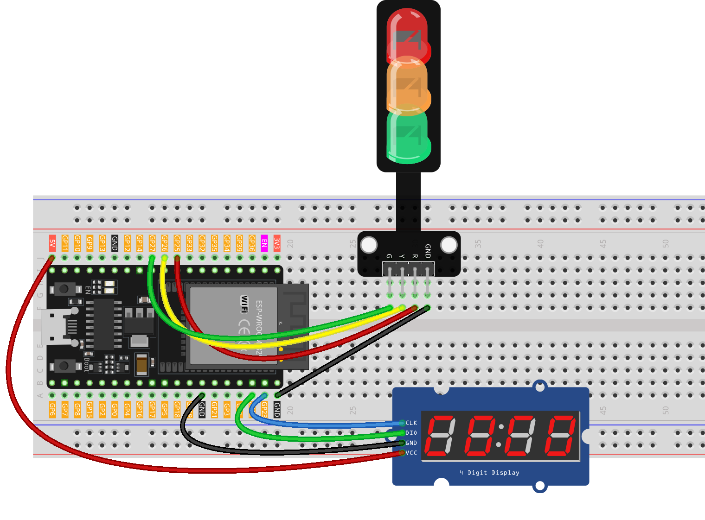

.. _traffic_light:

Traffic light
==============================================================

.. note::
  
  🌟 Welcome to the SunFounder Facebook Community! Whether you're into Raspberry Pi, Arduino, or ESP32, you'll find inspiration, help ideas here.
   
  - ✅ Be the first to get free learning resources. 
   
  - ✅ Stay updated on new products & exclusive giveaways. 
   
  - ✅ Share your creations and get real feedback.
   
  * 👉 Need faster updates or support? Click [|link_sf_facebook|] join our Facebook community 

  * 👉 Or join our WhatsApp group: Click [|link_sf_whatsapp|]
   
  * 🎁 Looking for parts?Check out our all-in-one kits below — packed with components, beginner-friendly guides, and tons of fun.

  .. list-table::
    :widths: 20 20 20
    :header-rows: 1

    *   - Name	
        - Includes ESP32 board
        - PURCHASE LINK
    *   - ESP32 Ultimate Starter Kit	
        - ESP32 WROOM 32E +
        - |link_esp32_kit_buy|
    *   - Universal Maker Sensor Kit
        - 
        - |link_umsk_buy|

Course Introduction
------------------------

In this lesson, you’ll learn how to build a simple traffic light system using the ESP32, a TM1637 4-digit display, and LED. 

The display counts down each light phase—red, yellow, and green—just like a real traffic signal.

.. .. raw:: html

..  <iframe width="700" height="394" src="https://www.youtube.com/embed/U99URknlMXM?si=u0b4J97iM9mtTUK5" title="YouTube video player" frameborder="0" allow="accelerometer; autoplay; clipboard-write; encrypted-media; gyroscope; picture-in-picture; web-share" referrerpolicy="strict-origin-when-cross-origin" allowfullscreen></iframe>

.. note::

  If this is your first time working with an ESP32 project, we recommend downloading and reviewing the basic materials first.
  
  * :ref:`install_arduino`
  * :ref:`introduce_arduino`
  * :ref:`install_esp32`

**Required Components**

In this project, we need the following components:

.. list-table::
    :widths: 5 20 5 20
    :header-rows: 1

    *   - SN
        - COMPONENT INTRODUCTION	
        - QUANTITY
        - PURCHASE LINK

    *   - 1
        - ESP-WROOM-32 ESP32 ESP-32S Development Board
        - 1
        - |link_esp32_buy|
    *   - 2
        - USB Type-C cable
        - 1
        - 
    *   - 3
        - Breadboard
        - 1
        - |link_breadboard_buy|
    *   - 4
        - Wires
        - Several
        - |link_wires_buy|
    *   - 5
        - 4-Digit Segment Display Module
        - 1
        - |link_4segment_buy|
    *   - 6
        - Traffic Light LED
        - 1
        - |link_trafficlinght_buy|

**Wiring**

**Common Connections:**

* **Traffic light LED**

  - **R:** Connect to **GPIO25** on the ESP32.
  - **Y:** Connect to **GPIO26** on the ESP32.
  - **G:** Connect to **GPIO27** on the ESP32.
  - **GND:** Connect to breadboard’s negative power bus.

* **4-Digit Segment Display Module**

  - **CLK:** Connect to **GPIO23** on the ESP32.
  - **DIO:** Connect to **GPIO22** on the ESP32.
  - **GND:** Connect to breadboard’s negative power bus.
  - **VCC:** Connect to breadboard’s red power bus.

**Writing the Code**

.. note::

    * You can copy this code into **Arduino IDE**. 
    * To install the library, use the Arduino Library Manager and search for **TM1637Display** and install it.
    * Don't forget to select the board(ESP32 Dev module) and the correct port before clicking the **Upload** button.

.. code-block:: arduino

      #include <TM1637Display.h>

      // ------- TM1637 pins (ESP32 GPIOs) -------
      #define CLK_PIN 23   // TM1637 CLK -> GPIO23
      #define DIO_PIN 22   // TM1637 DIO -> GPIO22

      // ------- Traffic light pins (ESP32 GPIOs) -------
      const int redPin    = 25;  // Red LED
      const int yellowPin = 26;  // Yellow LED
      const int greenPin  = 27;  // Green LED

      // Create display object
      TM1637Display display(CLK_PIN, DIO_PIN);

      void setup() {
        // Setup traffic light pins
        pinMode(redPin, OUTPUT);
        pinMode(yellowPin, OUTPUT);
        pinMode(greenPin, OUTPUT);

        // Initialize display
        display.setBrightness(7);  // 0 (dim) to 7 (bright)
        display.clear();
      }

      void loop() {
        // Red light phase - 10s
        digitalWrite(redPin, HIGH);
        digitalWrite(yellowPin, LOW);
        digitalWrite(greenPin, LOW);
        countdown(10);

        // Yellow light phase - 3s
        digitalWrite(redPin, LOW);
        digitalWrite(yellowPin, HIGH);
        digitalWrite(greenPin, LOW);
        countdown(3);

        // Green light phase - 10s
        digitalWrite(redPin, LOW);
        digitalWrite(yellowPin, LOW);
        digitalWrite(greenPin, HIGH);
        countdown(10);
      }

      // Countdown function using TM1637 display
      void countdown(int seconds) {
        for (int i = seconds; i > 0; i--) {
          // Show in rightmost 2 digits (positions 2 & 3)
          display.showNumberDec(i, true, 2, 2);
          delay(1000);
        }
        display.clear();
      }
