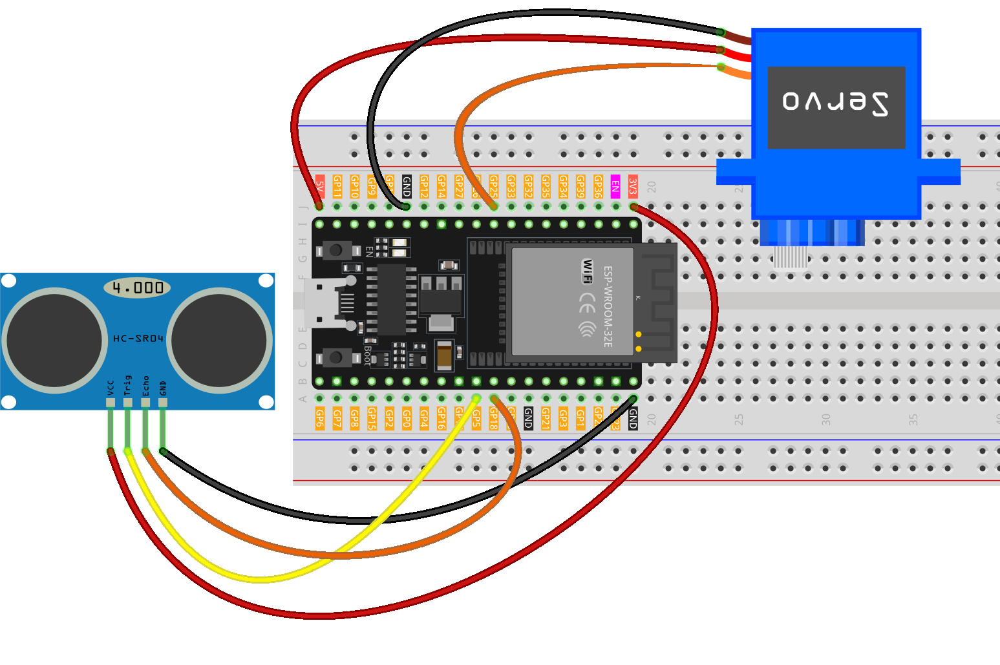

.. _trash_can:

Trash Can
==============================================================

.. note::
  
  🌟 Welcome to the SunFounder Facebook Community! Whether you're into Raspberry Pi, Arduino, or ESP32, you'll find inspiration, help ideas here.
   
  - ✅ Be the first to get free learning resources. 
   
  - ✅ Stay updated on new products & exclusive giveaways. 
   
  - ✅ Share your creations and get real feedback.
   
  * 👉 Need faster updates or support? Click [|link_sf_facebook|] join our Facebook community 

  * 👉 Or join our WhatsApp group: Click [|link_sf_whatsapp|]
   
  * 🎁 Looking for parts?Check out our all-in-one kits below — packed with components, beginner-friendly guides, and tons of fun.
  
  .. list-table::
    :widths: 20 20 20
    :header-rows: 1

    *   - Name	
        - Includes ESP32 board
        - PURCHASE LINK
    *   - ESP32 Ultimate Starter Kit	
        - ESP32 WROOM 32E +
        - |link_esp32_kit_buy|
    *   - Universal Maker Sensor Kit
        - 
        - |link_umsk_buy|

Course Introduction
------------------------

In this lesson, you'll learn how to use an ultrasonic sensor module, a digital servo motor, and an ESP32 board to build a smart trash can.

When the ultrasonic sensor module detects trash being thrown in, the digital servo motor opens the lid of the trash can.

.. .. raw:: html

..  <iframe width="700" height="394" src="https://www.youtube.com/embed/ca2vRwRQJkk?si=Nzmhr1BEuKKSN9NK" title="YouTube video player" frameborder="0" allow="accelerometer; autoplay; clipboard-write; encrypted-media; gyroscope; picture-in-picture; web-share" referrerpolicy="strict-origin-when-cross-origin" allowfullscreen></iframe>

.. note::

  If this is your first time working with an Arduino project, we recommend downloading and reviewing the basic materials first.
  
  * :ref:`install_arduino`
  * :ref:`introduce_arduino`
  * :ref:`install_esp32`

**Required Components**

In this project, we need the following components:

.. list-table::
    :widths: 5 20 5 20
    :header-rows: 1

    *   - SN
        - COMPONENT INTRODUCTION	
        - QUANTITY
        - PURCHASE LINK

    *   - 1
        - ESP-WROOM-32 ESP32 ESP-32S Development Board
        - 1
        - |link_esp32_buy|
    *   - 2
        - USB Type-C cable
        - 1
        - 
    *   - 3
        - Breadboard
        - 1
        - |link_breadboard_buy|
    *   - 4
        - Wires
        - Several
        - |link_wires_buy|
    *   - 5
        - 1kΩ resistor
        - 2
        - |link_resistor_buy|
    *   - 6
        - Ultrasonic Sensor Module
        - 1
        - |link_ultrasonic_buy|
    *   - 7
        - LED
        - 2
        - |link_led_buy|
    *   - 8
        - Digital Servo Motor
        - 1
        - |link_motor_buy|

**Wiring**

**Common Connections:**

* **Digital Servo Motor**

  - **GND:** Connect to **GND** on the ESP32.
  - **VCC:** Connect to **5V** on the ESP32.
  - Connect to **GPIO25** on the ESP32.

* **Ultrasonic Sensor Module**

  - **Trig:** Connect to **GPIO5** on the ESP32.
  - **Echo:** Connect to **GPIO18** on the ESP32.
  - **GND:** Connect to **GND** on the ESP32.
  - **VCC:** Connect to **3.3V** on the ESP32.

**Writing the Code**

.. note::

    * You can copy this code into **Arduino IDE**. 
    * Don't forget to select the board(ESP32 Dev module) and the correct port before clicking the **Upload** button.

.. code-block:: arduino

      #include <ESP32Servo.h>

      // -------- Servo parameters --------
      Servo servo;
      const int servoPin   = 25;   // Any ESP32 GPIO capable of PWM (avoid 34–39, input-only)
      const int openAngle  = 0;
      const int closeAngle = 90;

      // -------- Ultrasonic sensor parameters (HC-SR04 type) --------
      const int trigPin = 5;       // Trigger pin, ESP32 outputs 3.3V
      const int echoPin = 18;      // Echo pin (must be level-shifted to 3.3V)
      long distance, averageDistance;
      long averDist[3];

      // Distance threshold (in cm)
      const int distanceThreshold = 20;

      // Constants
      const unsigned long echoTimeoutUs = 30000UL; // 30ms timeout ≈ 5m max range
      const int servoMinUs = 500;   // Minimum pulse width for servo (µs)
      const int servoMaxUs = 2500;  // Maximum pulse width for servo (µs)

      void setup() {
        Serial.begin(9600);

        pinMode(trigPin, OUTPUT);
        pinMode(echoPin, INPUT); // Input (make sure hardware level shifting is done)

        // Initialize servo: attach at 50Hz, move to closed angle, then detach to save power
        servo.setPeriodHertz(50);
        servo.attach(servoPin, servoMinUs, servoMaxUs);
        servo.write(closeAngle);
        delay(200);
        servo.detach();
      }

      void loop() {
        // Take three consecutive measurements
        for (int i = 0; i < 3; i++) {
          distance = readDistanceCm();
          averDist[i] = distance;
          delay(10);
        }

        // Calculate the average
        averageDistance = (averDist[0] + averDist[1] + averDist[2]) / 3;
        Serial.println(averageDistance);

        // Control the servo based on distance
        if (averageDistance > 0 && averageDistance <= distanceThreshold) {
          // Attach only when needed, reduces idle power and jitter
          if (!servo.attached()) {
            servo.attach(servoPin, servoMinUs, servoMaxUs);
          }
          servo.write(openAngle);
          delay(3500);
        } else {
          if (servo.attached()) {
            servo.write(closeAngle);
            delay(1000);
            servo.detach();
          } else {
            // Maintain loop rhythm even if servo is detached
            delay(50);
          }
        }
      }

      // Measure distance (in cm); returns -1 if timeout
      long readDistanceCm() {
        // Trigger 10µs pulse
        digitalWrite(trigPin, LOW);
        delayMicroseconds(2);
        digitalWrite(trigPin, HIGH);
        delayMicroseconds(10);
        digitalWrite(trigPin, LOW);

        // Measure echo pulse width (with timeout)
        unsigned long duration = pulseIn(echoPin, HIGH, echoTimeoutUs);
        if (duration == 0) {
          return -1; // Timeout / no echo
        }

        // Distance (cm) = pulse width (µs) / 58.0
        long dist = (long)(duration / 58.0);
        return dist;
      }
