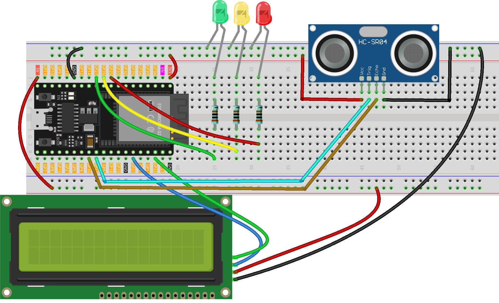

.. _water_level:

Water Level
==============================================================

.. note::
  
  🌟 Welcome to the SunFounder Facebook Community! Whether you're into Raspberry Pi, Arduino, or ESP32, you'll find inspiration, help ideas here.
   
  - ✅ Be the first to get free learning resources. 
   
  - ✅ Stay updated on new products & exclusive giveaways. 
   
  - ✅ Share your creations and get real feedback.
   
  * 👉 Need faster updates or support? Click [|link_sf_facebook|] join our Facebook community 

  * 👉 Or join our WhatsApp group: Click [|link_sf_whatsapp|]
   
  * 🎁 Looking for parts?Check out our all-in-one kits below — packed with components, beginner-friendly guides, and tons of fun.
  
  .. list-table::
    :widths: 20 20 20
    :header-rows: 1

    *   - Name	
        - Includes ESP32 board
        - PURCHASE LINK
    *   - ESP32 Ultimate Starter Kit	
        - ESP32 WROOM 32E +
        - |link_esp32_kit_buy|
    *   - Universal Maker Sensor Kit
        - 
        - |link_umsk_buy|

Course Introduction
------------------------

In this lesson, you’ll learn how to use  an Ultrasonic Sensor Module, a 1602 LCD with the ESP32 to create a Ultrasonic water level monitor system.

The LED lights red when the water is low, turns yellow as it rises, and switches to green once it reaches the set level.

.. raw:: html
 
  <iframe width="700" height="394" src="https://www.youtube.com/embed/mmgcasK1z7E?si=cwn_Yrmhh2Lg8kS1" title="YouTube video player" frameborder="0" allow="accelerometer; autoplay; clipboard-write; encrypted-media; gyroscope; picture-in-picture; web-share" referrerpolicy="strict-origin-when-cross-origin" allowfullscreen></iframe>

.. note::

  If this is your first time working with an ESP32 project, we recommend downloading and reviewing the basic materials first.
  
  * :ref:`install_arduino`
  * :ref:`introduce_arduino`
  * :ref:`install_esp32`

**Required Components**

In this project, we need the following components:

.. list-table::
    :widths: 5 20 5 20
    :header-rows: 1

    *   - SN
        - COMPONENT INTRODUCTION	
        - QUANTITY
        - PURCHASE LINK

    *   - 1
        - ESP-WROOM-32 ESP32 ESP-32S Development Board
        - 1
        - |link_esp32_buy|
    *   - 2
        - USB Type-C cable
        - 1
        - 
    *   - 3
        - Breadboard
        - 1
        - |link_breadboard_buy|
    *   - 4
        - Wires
        - Several
        - |link_wires_buy|
    *   - 5
        - 1kΩ resistor
        - 3
        - |link_resistor_buy|
    *   - 6
        - Ultrasonic Sensor Module
        - 1
        - |link_ultrasonic_buy|
    *   - 7
        - LED
        - 3
        - |link_led_buy|
    *   - 8
        - I2C LCD 1602
        - 1
        - |link_i2clcd1602_buy|

**Wiring**

**Common Connections:**

* **LED**

  - **Green**: Connect the LEDs **cathode** to the negative power bus on the breadboard, and the LED **anode** to a **1kΩ resistor** then to **GPIO27** on the Arduino.
  - **yellow**: Connect the LEDs **cathode** to the negative power bus on the breadboard, and the LED **anode** to a **1kΩ resistor** then to **GPIO26** on the Arduino.
  - **Red**: Connect the LEDs **cathode** to the negative power bus on the breadboard, and the LED **anode** to a **1kΩ resistor** then to **GPIO25** on the Arduino.

* **I2C LCD 1602**

  - **SDA:** Connect to **GPIO21** on the ESP32.
  - **SCL:** Connect to **GPIO22** on the ESP32.
  - **GND:** Connect to breadboard’s negative power bus.
  - **VCC:** Connect to breadboard’s **5V** red power bus.

* **Ultrasonic Sensor Module**

  - **Trig:** Connect to **GPIO17** on the ESP32.
  - **Echo:** Connect to **GPIO16** on the ESP32.
  - **GND:** Connect to breadboard’s negative power bus.
  - **VCC:** Connect to breadboard’s **3.3V** red power bus.

**Writing the Code**

.. note::

    * You can copy this code into **Arduino IDE**. 
    * To install the library, use the Arduino Library Manager and search for **LiquidCrystal I2C** and install it.
    * Don't forget to select the board(ESP32 Dev module) and the correct port before clicking the **Upload** button.

.. code-block:: arduino

      #include <Wire.h>
      #include <LiquidCrystal_I2C.h>

      // ---------------- I2C LCD ----------------
      // I2C address 0x27 is common; change to 0x3F if needed
      LiquidCrystal_I2C lcd(0x27, 16, 2);

      // ---------------- Pin mapping (ESP32) ----------------
      // Use safe, GPIO-capable pins on ESP32
      const int echoPin = 16;   // HC-SR04 ECHO -> through voltage divider to 3.3V
      const int trigPin = 17;   // HC-SR04 TRIG (3.3V OK)

      const int greenLed  = 27; // Green LED (with series resistor)
      const int yellowLed = 26; // Yellow LED
      const int redLed    = 25; // Red LED

      void setup() {
        // I2C init (ESP32 default: SDA=21, SCL=22)
        Wire.begin(21, 22);
        lcd.init();
        lcd.clear();
        lcd.backlight();

        // Ultrasonic sensor pins
        pinMode(echoPin, INPUT);
        pinMode(trigPin, OUTPUT);

        // LED pins
        pinMode(greenLed, OUTPUT);
        pinMode(yellowLed, OUTPUT);
        pinMode(redLed, OUTPUT);

        // Optional: show a splash text
        lcd.setCursor(0,0); lcd.print("Ultrasonic Level");
        lcd.setCursor(0,1); lcd.print("ESP32 Ready");
        delay(800);
        lcd.clear();
      }

      void loop() {
        // Measure distance
        float distance = readDistance();

        // Display on LCD
        lcd.setCursor(0, 0);
        lcd.print("Distance:       ");        // pad to clear leftovers
        lcd.setCursor(10, 0);
        lcd.print(distance, 1);                // one decimal
        lcd.print("cm");

        // LEDs based on distance
        if (distance <= 5) {
          // 0–5 cm -> green
          digitalWrite(greenLed, HIGH);
          digitalWrite(yellowLed, LOW);
          digitalWrite(redLed, LOW);
        } else if (distance > 5 && distance <= 10) {
          // 5–10 cm -> yellow
          digitalWrite(greenLed, LOW);
          digitalWrite(yellowLed, HIGH);
          digitalWrite(redLed, LOW);
        } else if (distance > 10 && distance <= 15) {
          // 10–15 cm -> red
          digitalWrite(greenLed, LOW);
          digitalWrite(yellowLed, LOW);
          digitalWrite(redLed, HIGH);
        } else {
          // >15 cm -> all off
          digitalWrite(greenLed, LOW);
          digitalWrite(yellowLed, LOW);
          digitalWrite(redLed, LOW);
        }

        delay(500);
      }

      // Read distance from HC-SR04 (returns centimeters)
      float readDistance() {
        // Ensure TRIG is low, then send 10us pulse
        digitalWrite(trigPin, LOW);
        delayMicroseconds(2);
        digitalWrite(trigPin, HIGH);
        delayMicroseconds(10);
        digitalWrite(trigPin, LOW);

        // Read ECHO pulse width (timeout 30ms)
        unsigned long duration = pulseIn(echoPin, HIGH, 30000UL);
        if (duration == 0) return 9999.0;       // timeout -> very far

        // Convert to cm (speed of sound ~340m/s)
        float distance = duration * 0.034f / 2.0f;
        return distance;
      }
