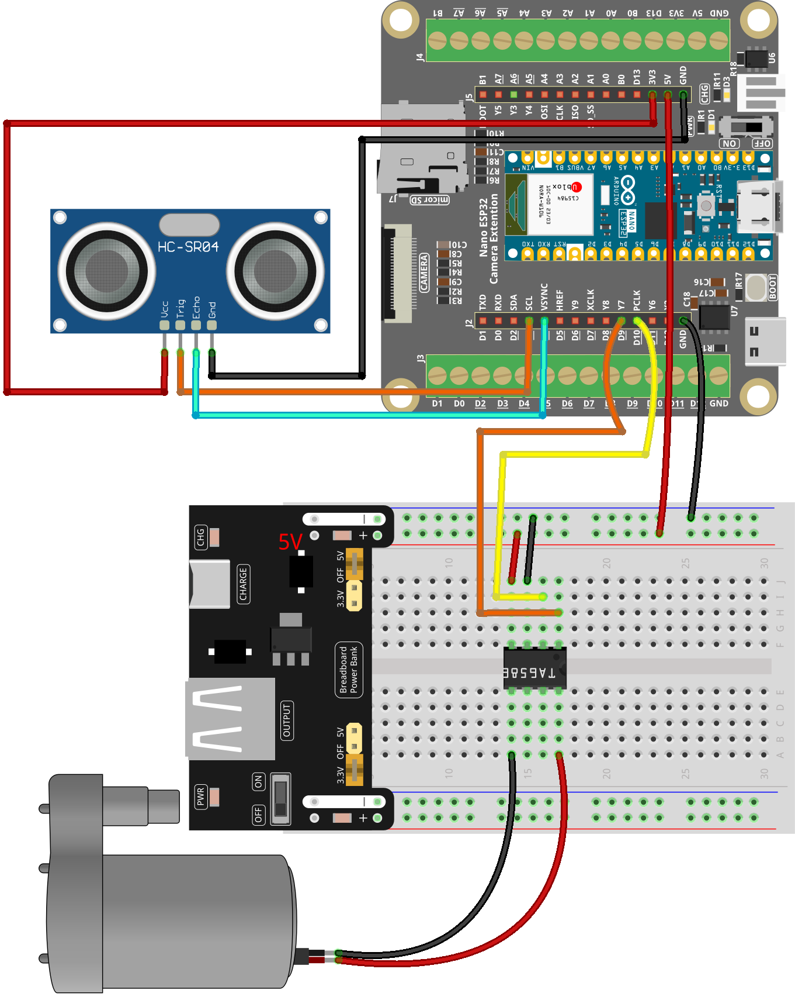

.. _auto_pump:

Auto Pump
==============================================================

.. note::
  
  🌟 Welcome to the SunFounder Facebook Community! Whether you're into Raspberry Pi, Arduino, or ESP32, you'll find inspiration, help ideas here.
   
  - ✅ Be the first to get free learning resources. 
   
  - ✅ Stay updated on new products & exclusive giveaways. 
   
  - ✅ Share your creations and get real feedback.
   
  * 👉 Need faster updates or support? Click [|link_sf_facebook|] join our Facebook community 

  * 👉 Or join our WhatsApp group: Click [|link_sf_whatsapp|]

Kit purchase
------------------------
  
Looking for parts? Check out our all-in-one kits below — packed with components, beginner-friendly guides, and tons of fun.

.. image:: img/esp32_kit.png
   :width: 100%
   :align: center
   :target: https://www.sunfounder.com/products/sunfounder-esp32-ultimate-starter-kit-with-esp32-camera-extension-board-battery?_pos=1&_sid=7dcb30fb6&_ss=r&ref=jbzmncle

.. raw:: html

     

.. list-table::
   :widths: 20 20 20
   :header-rows: 1

   * - Name
     - Includes ESP32 board
     - PURCHASE LINK
   * - ESP32 Ultimate Starter Kit
     - ESP32 WROOM 32E +
     - |link_esp32_kit_buy|
   * - Universal Maker Sensor Kit
     -
     - |link_umsk_buy|

Course Introduction
------------------------

This program uses an Nano ESP32 board with Ultrasonic Sensor Module and a water pump.

The sensor is used to detect the presence of an object. 

When an object is detected, the water pump is activated to dispense liquid .

.. raw:: html

 <iframe width="700" height="394" src="https://www.youtube.com/embed/h5BExXoedok?si=D4SSKPXuv_Mi_0ZH" title="YouTube video player" frameborder="0" allow="accelerometer; autoplay; clipboard-write; encrypted-media; gyroscope; picture-in-picture; web-share" referrerpolicy="strict-origin-when-cross-origin" allowfullscreen></iframe>

.. note::

  If this is your first time working with an ESP32 project, we recommend downloading and reviewing the basic materials first.
  
  * :ref:`install_arduino`
  * :ref:`introduce_arduino`
  * :ref:`install_esp32`

**Required Components**

In this project, we need the following components:

.. list-table::
    :widths: 5 20 5 20
    :header-rows: 1

    *   - SN
        - COMPONENT INTRODUCTION	
        - QUANTITY
        - PURCHASE LINK

    *   - 1
        - Arduino Nano ESP32
        - 1
        - 
    *   - 2
        - USB Type-C cable
        - 1
        - 
    *   - 3
        - Breadboard
        - 1
        - |link_breadboard_buy|
    *   - 4
        - Wires
        - Several
        - |link_wires_buy|
    *   - 5
        - Power Supply
        - 1
        - |link_power_buy|
    *   - 6
        - Ultrasonic Sensor Module
        - 1
        - |link_ultrasonic_buy|
    *   - 7
        - TA6586 - Motor Driver Chip
        - 1
        - 
    *   - 8
        - Centrifugal Pump
        - 1
        - 

**Wiring**

**Common Connections:**

* **Ultrasonic Sensor Module**

  - **Trig:** Connect to **D3** on the ESP32.
  - **Echo:** Connect to **D4** on the ESP32.
  - **GND:** Connect to **GND** on the ESP32.
  - **VCC:** Connect to **3.3V** on the ESP32.

* **TA6586 - Motor Driver Chip**

  - **BI:** Connect to **D9** on the ESP32.
  - **FI:** Connect to **D10** on the ESP32.
  - **GND:** Connect to breadboard’s negative power bus.
  - **VCC:** Connect to breadboard’s red power bus.

* **Centrifugal Pump**

  -  Connect to **TA6586** B0.
  -  Connect to **TA6586** F0.

**Writing the Code**

.. note::

    * You can copy this code into **Arduino IDE**. 
    * Don't forget to select the board(Arduino Nano ESP32) and the correct port before clicking the **Upload** button.

.. code-block:: arduino

    #include <Arduino.h>
    #include <math.h>

    /*
      Arduino Nano ESP32 + Ultrasonic (Echo=D4, Trig=D3) + TA6586 Pump Control

      Behavior:
        - Turn pump ON when distance < ON_THRESHOLD_CM
        - Turn pump OFF when distance > OFF_THRESHOLD_CM (hysteresis)
        - Median-of-5 sampling; pulseIn timeout
        - Min ON/OFF hold times to avoid chattering
    */

    // -------- Pins --------
    // Ultrasonic: Echo -> D4, Trig -> D3
    const uint8_t ECHO_PIN = D4;
    const uint8_t TRIG_PIN = D3;

    // TA6586 motor driver pins (change if you wired differently)
    const uint8_t MOTOR_BI = D9;    // IN1
    const uint8_t MOTOR_FI = D10;   // IN2 

    // -------- Tuning --------
    const float    ON_THRESHOLD_CM   = 10.0f;    // pump ON below this
    const float    OFF_THRESHOLD_CM  = 12.0f;    // pump OFF above this (hysteresis)
    const uint8_t  SAMPLES           = 5;        // median-of-5
    const uint32_t PULSE_TIMEOUT_US  = 30000UL;  // 30ms timeout

    // Minimum hold times to protect the pump from rapid toggling
    const uint32_t MIN_ON_HOLD_MS    = 1500;
    const uint32_t MIN_OFF_HOLD_MS   = 800;

    // Optional: ambient temperature (°C) for speed-of-sound correction
    const float AMBIENT_TEMP_C       = 20.0f;

    // -------- State --------
    enum PumpState { PUMP_OFF = 0, PUMP_ON = 1 };
    PumpState pumpState = PUMP_OFF;
    uint32_t lastToggleMs = 0;

    // -------- Pump helpers --------
    void pumpForward() {
      // Direction depends on your wiring; swap HIGH/LOW or use pumpReverse() if needed.
      digitalWrite(MOTOR_FI, LOW);
      digitalWrite(MOTOR_BI, HIGH);
    }

    void pumpReverse() {
      digitalWrite(MOTOR_BI, LOW);
      digitalWrite(MOTOR_FI, HIGH);
    }

    void pumpStop() {
      // Stop (coast). If your driver supports brake mode, follow its datasheet.
      digitalWrite(MOTOR_BI, LOW);
      digitalWrite(MOTOR_FI, LOW);
    }

    // -------- Ultrasonic helpers --------
    float usPerCm() {
      // Speed of sound (m/s) ≈ 331.4 + 0.6*T(°C)
      float v = 331.4f + 0.6f * AMBIENT_TEMP_C; // m/s
      float us_per_m = 1e6f / v;                // µs per meter (one-way)
      return (us_per_m * 0.01f) * 2.0f;         // round-trip µs per cm
    }

    float measureOnceCm() {
      // Send 10us trigger pulse
      digitalWrite(TRIG_PIN, LOW);
      delayMicroseconds(2);
      digitalWrite(TRIG_PIN, HIGH);
      delayMicroseconds(10);
      digitalWrite(TRIG_PIN, LOW);

      // Read echo pulse width with timeout
      unsigned long dur = pulseIn(ECHO_PIN, HIGH, PULSE_TIMEOUT_US);
      if (dur == 0) return NAN; // timeout -> invalid reading

      return dur / usPerCm();   // convert to cm
    }

    float readDistanceMedianCm() {
      float vals[SAMPLES];

      for (uint8_t i = 0; i < SAMPLES; i++) {
        vals[i] = measureOnceCm();
        delay(5); // small gap between pings
      }

      // Insertion sort for small N; push NANs to the end
      for (uint8_t i = 1; i < SAMPLES; i++) {
        float key = vals[i];
        int j = i - 1;
        while (j >= 0 && (isnan(vals[j]) || vals[j] > key)) {
          vals[j + 1] = vals[j];
          j--;
        }
        vals[j + 1] = key;
      }

      return vals[SAMPLES / 2]; // median
    }

    // -------- Setup / Loop --------
    void setup() {
      // Ultrasonic
      pinMode(ECHO_PIN, INPUT);
      pinMode(TRIG_PIN, OUTPUT);
      digitalWrite(TRIG_PIN, LOW);

      // Pump driver
      pinMode(MOTOR_BI, OUTPUT);
      pinMode(MOTOR_FI, OUTPUT);
      pumpStop(); // safe default

      // Debug serial
      Serial.begin(115200);
      delay(300);
      Serial.println("Nano ESP32: Ultrasonic + Pump (Echo=D4, Trig=D3) ready.");
    }

    void loop() {
      float d = readDistanceMedianCm();
      uint32_t now = millis();
      bool valid = !isnan(d);

      // State machine with hysteresis + min hold times
      switch (pumpState) {
        case PUMP_OFF:
          if (valid && d < ON_THRESHOLD_CM && (now - lastToggleMs >= MIN_OFF_HOLD_MS)) {
            pumpForward();   // switch to pumpReverse() if direction is wrong
            pumpState = PUMP_ON;
            lastToggleMs = now;
            Serial.println("Pump -> ON");
          }
          break;

        case PUMP_ON:
          if (valid && d > OFF_THRESHOLD_CM && (now - lastToggleMs >= MIN_ON_HOLD_MS)) {
            pumpStop();
            pumpState = PUMP_OFF;
            lastToggleMs = now;
            Serial.println("Pump -> OFF");
          }
          break;
      }

      // Debug print
      if (valid) {
        Serial.print("Distance(cm): ");
        Serial.print(d, 1);
        Serial.print(" | State: ");
        Serial.println(pumpState == PUMP_ON ? "ON" : "OFF");
      } else {
        Serial.println("Distance: INVALID (timeout)");
      }

      delay(60);
    }
