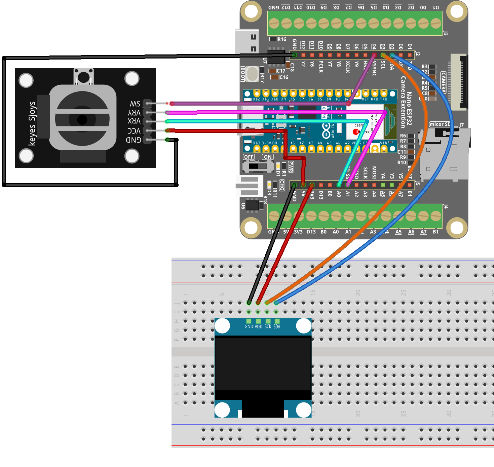

.. _controll_eyes:

Controll eyes
==============================================================

.. note::
  
  🌟 Welcome to the SunFounder Facebook Community! Whether you're into Raspberry Pi, Arduino, or ESP32, you'll find inspiration, help ideas here.
   
  - ✅ Be the first to get free learning resources. 
   
  - ✅ Stay updated on new products & exclusive giveaways. 
   
  - ✅ Share your creations and get real feedback.
   
  * 👉 Need faster updates or support? Click [|link_sf_facebook|] join our Facebook community 

  * 👉 Or join our WhatsApp group: Click [|link_sf_whatsapp|]
   
  * 🎁 Looking for parts?Check out our all-in-one kits below — packed with components, beginner-friendly guides, and tons of fun.

  .. list-table::
    :widths: 20 20 20
    :header-rows: 1

    *   - Name	
        - Includes ESP32 board
        - PURCHASE LINK
    *   - ESP32 Ultimate Starter Kit	
        - ESP32 WROOM 32E +
        - |link_esp32_kit_buy|
    *   - Universal Maker Sensor Kit
        - 
        - |link_umsk_buy|

Course Introduction
------------------------

This Arduino project animates a pair of interactive eyes on an OLED screen, controlled by a joystick. 

The eyes track the joystick's movement, simulating the effect of following an object within a defined range. 

Pressing the joystick button triggers a blinking animation that mimics a natural blink by covering the upper part of the eyes.

.. .. raw:: html

..  <iframe width="700" height="394" src="https://www.youtube.com/embed/FmRoRYiCy1s?si=Pk_Sj_Jo5-23X_Lv" title="YouTube video player" frameborder="0" allow="accelerometer; autoplay; clipboard-write; encrypted-media; gyroscope; picture-in-picture; web-share" referrerpolicy="strict-origin-when-cross-origin" allowfullscreen></iframe>

.. note::

  If this is your first time working with an ESP32 project, we recommend downloading and reviewing the basic materials first.

  * :ref:`install_arduino`
  * :ref:`introduce_arduino`
  * :ref:`install_esp32`

**Required Components**

In this project, we need the following components:

.. list-table::
    :widths: 5 20 5 20
    :header-rows: 1

    *   - SN
        - COMPONENT INTRODUCTION	
        - QUANTITY
        - PURCHASE LINK

    *   - 1
        - Arduino Nano ESP32
        - 1
        - 
    *   - 2
        - USB Type-C cable
        - 1
        - 
    *   - 3
        - Breadboard
        - 1
        - |link_breadboard_buy|
    *   - 4
        - Wires
        - Several
        - |link_wires_buy|
    *   - 5
        - Joystick Module
        - 1
        - |link_joystick_buy|
    *   - 6
        - OLED Display Module
        - 1
        - |link_oled_buy|

**Wiring**

**Common Connections:**

* **Joystick Module**

  - **VRX:** Connect to **A0** on the ESP32.
  - **VRY:** Connect to **A1** on the ESP32.
  - **SW:** Connect to **D4** on the ESP32.
  - **GND:** Connect to breadboard’s negative power bus.
  - **VCC:** Connect to breadboard’s red power bus.

* **OLED Display Module**

  - **SDA:** Connect to **D2** on the Arduino.
  - **SCK:** Connect to **D3** on the Arduino.
  - **GND:** Connect to breadboard’s negative power bus.
  - **VCC:** Connect to breadboard’s red power bus.

**Writing the Code**

.. note::

    * You can copy this code into **Arduino IDE**. 
    * To install the library, use the Arduino Library Manager and search for **Adafruit SSD1306** and **Adafruit GFX** and install it.
    * Don't forget to select the board(Arduino Nano ESP32) and the correct port before clicking the **Upload** button.

.. code-block:: arduino

      /*
        Arduino Nano ESP32 (ESP32-S3)
        RGB LED color blending with potentiometer (LEDC PWM)
      */

      // RGB LED pins (use Dx labels)
      const int redPin   = D9;
      const int greenPin = D10;
      const int bluePin  = D11;

      // Potentiometer pin (ADC)
      const int potPin = A0;

      // PWM settings
      const int PWM_FREQ = 5000;     // 5 kHz
      const int PWM_RES  = 8;        // 8-bit resolution (0~255)

      void setup() {
        Serial.begin(115200);
        delay(200);

        // Attach PWM to pins (Arduino-ESP32 3.x style)
        ledcAttach(redPin,   PWM_FREQ, PWM_RES);
        ledcAttach(greenPin, PWM_FREQ, PWM_RES);
        ledcAttach(bluePin,  PWM_FREQ, PWM_RES);

        // Optional: Set ADC behavior (not required, but helps stability)
        analogReadResolution(12); // ESP32 ADC default is typically 12-bit (0~4095)
      }

      void loop() {
        // Read potentiometer value (ESP32 ADC: 0~4095)
        int potValue = analogRead(potPin);
        Serial.println(potValue);

        // Map ADC value to 0~765 for color blending
        int range = map(potValue, 0, 4095, 0, 765);

        int r = 0, g = 0, b = 0;

        // Blend RGB colors based on range
        if (range <= 255) {
          r = 255;
          g = range;
          b = 0;
        } else if (range <= 510) {
          r = 510 - range;
          g = 255;
          b = range - 255;
        } else {
          r = 0;
          g = 765 - range;
          b = 255;
        }

        // Output PWM (inverted for common-anode RGB LED)
        // If you are using common-cathode, remove the "255 -" inversion.
        ledcWrite(redPin,   255 - r);
        ledcWrite(greenPin, 255 - g);
        ledcWrite(bluePin,  255 - b);

        delay(20);
      }
