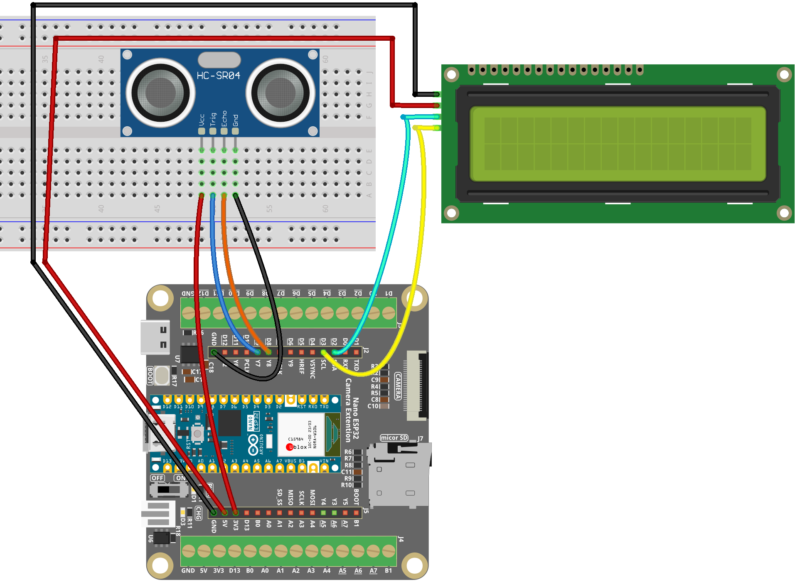

.. _distance_display:

Distance Display
==============================================================

.. note::
  
  🌟 Welcome to the SunFounder Facebook Community! Whether you're into Raspberry Pi, Arduino, or ESP32, you'll find inspiration, help ideas here.
   
  - ✅ Be the first to get free learning resources. 
   
  - ✅ Stay updated on new products & exclusive giveaways. 
   
  - ✅ Share your creations and get real feedback.
   
  * 👉 Need faster updates or support? Click [|link_sf_facebook|] join our Facebook community 

  * 👉 Or join our WhatsApp group: Click [|link_sf_whatsapp|]
   
  * 🎁 Looking for parts?Check out our all-in-one kits below — packed with components, beginner-friendly guides, and tons of fun.
  
  .. list-table::
    :widths: 20 20 20
    :header-rows: 1

    *   - Name	
        - Includes ESP32 board
        - PURCHASE LINK
    *   - ESP32 Ultimate Starter Kit	
        - ESP32 WROOM 32E +
        - |link_esp32_kit_buy|
    *   - Universal Maker Sensor Kit
        - 
        - |link_umsk_buy|

Course Introduction
------------------------

In this project, we use an ultrasonic sensor and an I2C 1602 LCD with an Arduino Nano ESP32 board to create a real-time distance measurement display system. 

The ultrasonic sensor continuously measures the distance to an obstacle, and the result is shown on the LCD screen in centimeters. 

The system updates the display approximately every 800 milliseconds, making it suitable for simple proximity detection applications.

.. raw:: html
 
  <iframe width="700" height="394" src="https://www.youtube.com/embed/dR6PZV8Ntd4?si=K_l3cPqSVk4Rrr2h" title="YouTube video player" frameborder="0" allow="accelerometer; autoplay; clipboard-write; encrypted-media; gyroscope; picture-in-picture; web-share" referrerpolicy="strict-origin-when-cross-origin" allowfullscreen></iframe>

.. note::

  If this is your first time working with an ESP32 project, we recommend downloading and reviewing the basic materials first.
  
  * :ref:`install_arduino`
  * :ref:`introduce_arduino`
  * :ref:`install_esp32`

**Required Components**

In this project, we need the following components:

.. list-table::
    :widths: 5 20 5 20
    :header-rows: 1

    *   - SN
        - COMPONENT INTRODUCTION	
        - QUANTITY
        - PURCHASE LINK

    *   - 1
        - Arduino Nano ESP32
        - 1
        - 
    *   - 2
        - USB Type-C cable
        - 1
        - 
    *   - 3
        - Breadboard
        - 1
        - |link_breadboard_buy|
    *   - 4
        - Wires
        - Several
        - |link_wires_buy|
    *   - 5
        - Ultrasonic Sensor Module
        - 1
        - |link_ultrasonic_buy|
    *   - 6
        - I2C LCD 1602
        - 1
        - |link_i2clcd1602_buy|

**Wiring**

**Common Connections:**

* **I2C LCD 1602**

  - **SDA:** Connect to **D2** on the ESP32.
  - **SCL:** Connect to **D3** on the ESP32.
  - **GND:** Connect to **GND** on the ESP32 Extension Board.
  - **VCC:** Connect to **5V** on the ESP32 Extension Board.

* **Ultrasonic Sensor Module**

  - **Trig:** Connect to **D7** on the ESP32.
  - **Echo:** Connect to **D8** on the ESP32.
  - **GND:** Connect to **GND** on the ESP32 Extension Board.
  - **VCC:** Connect to **3.3V** on the ESP32 Extension Board.

**Writing the Code**

.. note::

    * You can copy this code into **Arduino IDE**. 
    * To install the library, use the Arduino Library Manager and search for **LiquidCrystal I2C** and install it.
    * Don't forget to select the board(Arduino Nano ESP32) and the correct port before clicking the **Upload** button.

.. code-block:: arduino

      #include <Wire.h>
      #include <LiquidCrystal_I2C.h>

      LiquidCrystal_I2C lcd(0x27, 16, 2);  // I2C address 0x27, 16 columns, 2 rows

      // Ultrasonic sensor pins (Dx labels for Arduino Nano ESP32)
      const int echoPin = D8;   // HC-SR04 ECHO (through voltage divider!)
      const int trigPin = D9;   // HC-SR04 TRIG

      // PulseIn timeout (30ms ~ 5m max range)
      const uint32_t ECHO_TIMEOUT_US = 30000;

      void setup() {
        // Init serial
        Serial.begin(115200);
        delay(300);

        Serial.println("Ultrasonic + LCD test (I2C on D2/D3)");

        // Ultrasonic pins
        pinMode(echoPin, INPUT);
        pinMode(trigPin, OUTPUT);
        digitalWrite(trigPin, LOW);

        // -------- I2C init on D2 (SDA), D3 (SCL) --------
        Wire.begin(D2, D3);   // SDA = D2, SCL = D3
        // -----------------------------------------------

        lcd.init();
        lcd.clear();
        lcd.backlight();

        lcd.setCursor(0, 0);
        lcd.print("Distance:");
      }

      void loop() {
        float distance = readDistanceCm();  // distance in cm, -1 means timeout/no echo

        // Serial debug output
        if (distance < 0) {
          Serial.println("Ultrasonic: No Echo");
        } else {
          Serial.print("Ultrasonic distance: ");
          Serial.print(distance, 1);
          Serial.println(" cm");
        }

        lcd.setCursor(0, 1);
        lcd.print("                "); // clear line

        lcd.setCursor(0, 1);
        if (distance < 0) {
          lcd.print("No Echo");
        } else {
          lcd.print(distance, 1);
          lcd.print(" cm");
        }

        delay(800);
      }

      // Read distance in cm, returns -1 if no echo (timeout)
      float readDistanceCm() {
        // Trigger pulse
        digitalWrite(trigPin, LOW);
        delayMicroseconds(2);
        digitalWrite(trigPin, HIGH);
        delayMicroseconds(10);
        digitalWrite(trigPin, LOW);

        // Read echo pulse width with timeout
        uint32_t duration = pulseIn(echoPin, HIGH, ECHO_TIMEOUT_US);
        if (duration == 0) return -1.0f;

        // Convert to cm
        return (float)duration / 58.0f;
      }
