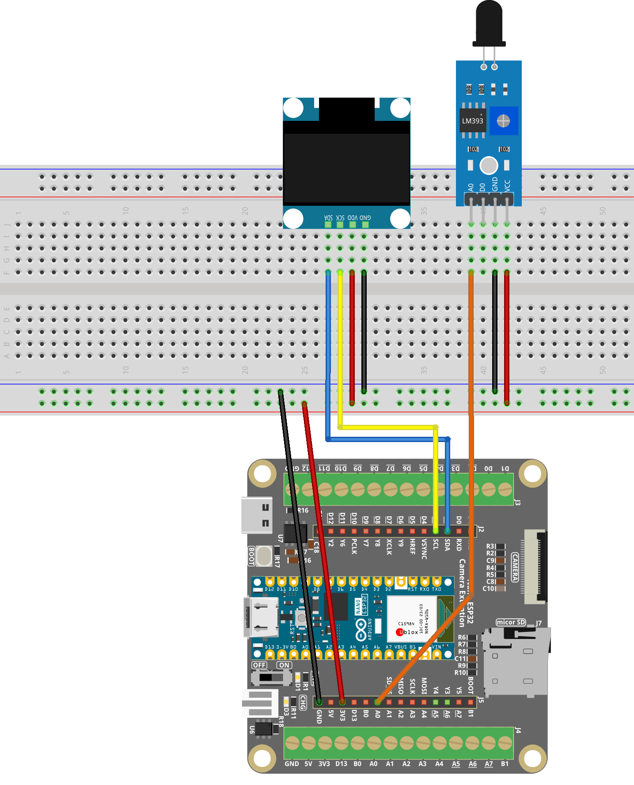

.. _flame_monitor1.0:

Flame Monitor 1.0
==============================================================

.. note::
  
  🌟 Welcome to the SunFounder Facebook Community! Whether you're into Raspberry Pi, Arduino, or ESP32, you'll find inspiration, help ideas here.
   
  - ✅ Be the first to get free learning resources. 
   
  - ✅ Stay updated on new products & exclusive giveaways. 
   
  - ✅ Share your creations and get real feedback.
   
  * 👉 Need faster updates or support? Click [|link_sf_facebook|] join our Facebook community 

  * 👉 Or join our WhatsApp group: Click [|link_sf_whatsapp|]
   
Kit purchase
------------------------
  
Looking for parts? Check out our all-in-one kits below — packed with components, beginner-friendly guides, and tons of fun.

.. image:: img/esp32_kit.png
   :width: 100%
   :align: center
   :target: https://www.sunfounder.com/products/sunfounder-esp32-ultimate-starter-kit-with-esp32-camera-extension-board-battery?_pos=1&_sid=7dcb30fb6&_ss=r&ref=jbzmncle

.. raw:: html

     

.. list-table::
   :widths: 20 20 20
   :header-rows: 1

   * - Name
     - Includes ESP32 board
     - PURCHASE LINK
   * - ESP32 Ultimate Starter Kit
     - ESP32 WROOM 32E +
     - |link_esp32_kit_buy|
   * - Universal Maker Sensor Kit
     -
     - |link_umsk_buy|

Course Introduction
------------------------

In this lesson, you’ll learn how to use a Flame Sensor and an OLED Display with the Arduino Nano ESP32. 
The OLED shows the flame intensity in real time and alerts with “FIRE!” when a flame is detected.

.. raw:: html

 <iframe width="700" height="394" src="https://www.youtube.com/embed/j2S_2r-MNmY?si=F-5_njU3N_tUpT6Q" title="YouTube video player" frameborder="0" allow="accelerometer; autoplay; clipboard-write; encrypted-media; gyroscope; picture-in-picture; web-share" referrerpolicy="strict-origin-when-cross-origin" allowfullscreen></iframe>

.. note::

  If this is your first time working with an ESP32 project, we recommend downloading and reviewing the basic materials first.

  * :ref:`install_arduino`
  * :ref:`introduce_arduino`
  * :ref:`install_esp32`

**Required Components**

In this project, we need the following components:

.. list-table::
    :widths: 5 20 5 20
    :header-rows: 1

    *   - SN
        - COMPONENT INTRODUCTION	
        - QUANTITY
        - PURCHASE LINK

    *   - 1
        - Arduino Nano ESP32
        - 1
        - 
    *   - 2
        - USB Type-C cable
        - 1
        - 
    *   - 3
        - Breadboard
        - 1
        - |link_breadboard_buy|
    *   - 4
        - Wires
        - Several
        - |link_wires_buy|
    *   - 5
        - Flame Sensor Module
        - 1
        - |link_flame_buy|
    *   - 6
        - OLED Display Module
        - 1
        - |link_oled_buy|

**Wiring**

**Common Connections:**

* **Flame Sensor Module**

  - **A0:** Connect to **A0** on the ESP32.
  - **GND:** Connect to **GND** on the ESP32 Extension Board.
  - **VCC:** Connect to **3.3V** on the ESP32 Extension Board.

* **OLED Display Module**

  - **SDA:** Connect to **D2** on the Arduino.
  - **SCK:** Connect to **D3** on the Arduino.
  - **GND:** Connect to **GND** on the ESP32 Extension Board.
  - **VCC:** Connect to **3.3V** on the ESP32 Extension Board.

**Writing the Code**

.. note::

    * You can copy this code into **Arduino IDE**. 
    * To install the library, use the Arduino Library Manager and search for **Adafruit SSD1306** and **Adafruit GFX** and install it.
    * Don't forget to select the board(Arduino Nano ESP32) and the correct port before clicking the **Upload** button.

.. code-block:: arduino

      #include <Wire.h>
      #include <Adafruit_GFX.h>
      #include <Adafruit_SSD1306.h>

      #define SCREEN_WIDTH 128
      #define SCREEN_HEIGHT 64
      #define OLED_RESET -1
      #define SCREEN_ADDRESS 0x3C

      Adafruit_SSD1306 display(SCREEN_WIDTH, SCREEN_HEIGHT, &Wire, OLED_RESET);

      // Flame sensor analog pin (Nano ESP32)
      #define FLAME_PIN A0

      // ESP32 ADC parameters
      const int ADC_BITS = 12;          // 0~4095
      const int ADC_MAX  = 4095;

      // Threshold for fire detection (adjust after checking Serial values)
      const int FIRE_THRESHOLD = 1200;

      void setup() {
        Serial.begin(115200);
        delay(200);
        Serial.println("Flame Sensor with OLED test (Nano ESP32)");

      #if defined(ARDUINO_ARCH_ESP32)
        analogReadResolution(ADC_BITS);       // 0~4095
        analogSetAttenuation(ADC_11db);       // better range/stability
      #endif

        // I2C init
        // Option 1 (recommended if you wired OLED to D2/D3):
        Wire.begin(D2, D3);   // SDA = D2, SCL = D3
        // Option 2 (use board default I2C pins):
        // Wire.begin();

        // Initialize OLED
        if (!display.begin(SSD1306_SWITCHCAPVCC, SCREEN_ADDRESS)) {
          Serial.println("SSD1306 allocation failed");
          while (true) delay(1000);
        }

        display.clearDisplay();
        display.setTextColor(SSD1306_WHITE);
      }

      void loop() {
        // Read raw ADC value from flame sensor
        int rawValue = analogRead(FLAME_PIN);  // 0~4095 on ESP32

        // Invert value: higher means stronger flame signal (depending on sensor module)
        int flameValue = ADC_MAX - rawValue;

        // Fire detection based on threshold
        bool fireDetected = (flameValue > FIRE_THRESHOLD);

        // Serial debug output
        Serial.print("raw=");
        Serial.print(rawValue);
        Serial.print("  flame=");
        Serial.print(flameValue);
        Serial.print("  status=");
        Serial.println(fireDetected ? "FIRE" : "SAFE");

        // OLED display output
        display.clearDisplay();

        display.setTextSize(1);
        display.setCursor(0, 0);
        display.println("Flame Intensity:");

        display.setTextSize(2);
        display.setCursor(0, 12);
        display.print(flameValue);

        display.setTextSize(1);
        display.setCursor(0, 40);
        display.println("Status:");

        display.setTextSize(2);
        display.setCursor(0, 50);
        display.print(fireDetected ? "FIRE!" : "SAFE");

        display.display();

        delay(500);
      }
