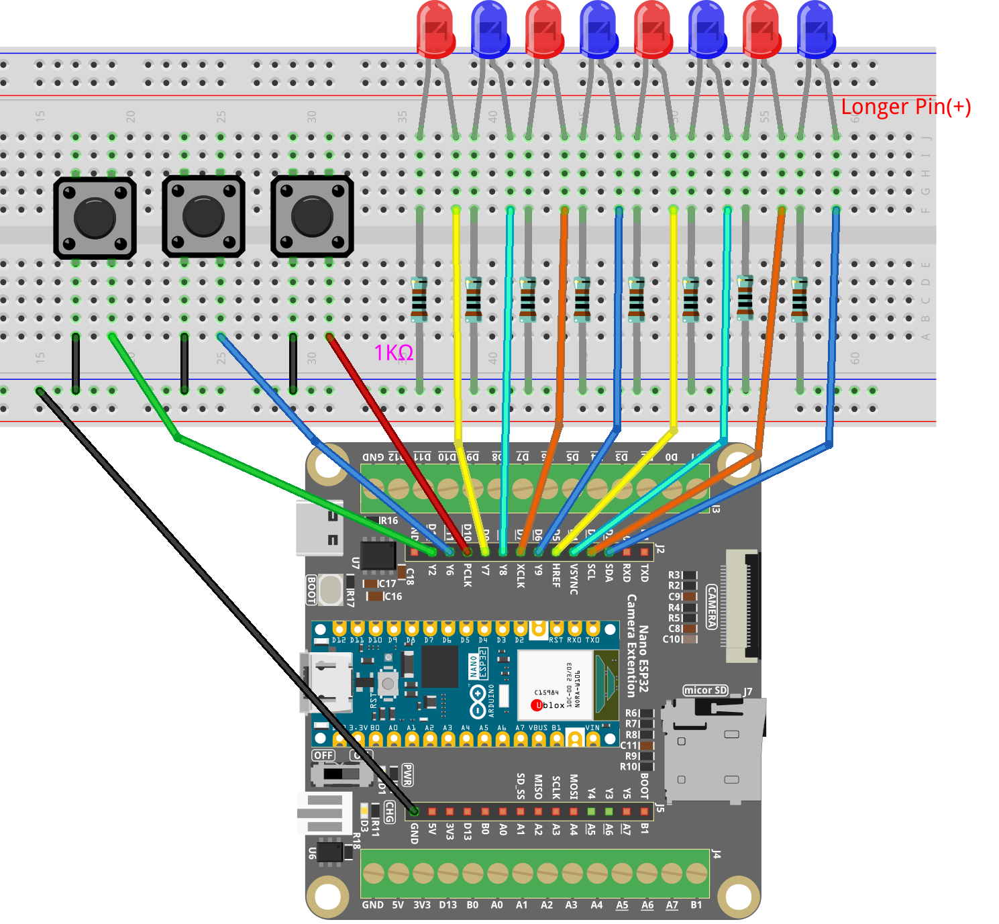

.. _light_play1.0:

Light Play 1.0
==============================================================

.. note::
  
  🌟 Welcome to the SunFounder Facebook Community! Whether you're into Raspberry Pi, Arduino, or ESP32, you'll find inspiration, help ideas here.
   
  - ✅ Be the first to get free learning resources. 
   
  - ✅ Stay updated on new products & exclusive giveaways. 
   
  - ✅ Share your creations and get real feedback.
   
  * 👉 Need faster updates or support? Click [|link_sf_facebook|] join our Facebook community 

  * 👉 Or join our WhatsApp group: Click [|link_sf_whatsapp|]
   
  * 🎁 Looking for parts?Check out our all-in-one kits below — packed with components, beginner-friendly guides, and tons of fun.
  
  .. list-table::
    :widths: 20 20 20
    :header-rows: 1

    *   - Name	
        - Includes ESP32 board
        - PURCHASE LINK
    *   - ESP32 Ultimate Starter Kit	
        - ESP32 WROOM 32E +
        - |link_esp32_kit_buy|
    *   - Universal Maker Sensor Kit
        - 
        - |link_umsk_buy|

Course Introduction
------------------------

In this lesson, you will learn how to use Arduino Nano ESP32 along with buttons, LEDs, and resistors to create a light show. 

Pressing the button will switch between different lighting modes.

.. raw:: html

  <iframe width="700" height="394" src="https://www.youtube.com/embed/jwVcp_ffz8A?si=zLfNm06976Gr_d7S" title="YouTube video player" frameborder="0" allow="accelerometer; autoplay; clipboard-write; encrypted-media; gyroscope; picture-in-picture; web-share" referrerpolicy="strict-origin-when-cross-origin" allowfullscreen></iframe>

.. note::

  If this is your first time working with an ESP32 project, we recommend downloading and reviewing the basic materials first.
  
  * :ref:`install_arduino`
  * :ref:`introduce_arduino`
  * :ref:`install_esp32`

**Required Components**

In this project, we need the following components:

.. list-table::
    :widths: 5 20 5 20
    :header-rows: 1

    *   - SN
        - COMPONENT INTRODUCTION	
        - QUANTITY
        - PURCHASE LINK

    *   - 1
        - Arduino Nano ESP32
        - 1
        - 
    *   - 2
        - USB Type-C cable
        - 1
        - 
    *   - 3
        - Breadboard
        - 1
        - |link_breadboard_buy|
    *   - 4
        - Wires
        - Several
        - |link_wires_buy|
    *   - 5
        - 1kΩ resistor
        - Several
        - |link_resistor_buy|
    *   - 6
        - Button
        - 3
        - |link_button_buy|
    *   - 7
        - LED
        - Several
        - |link_led_buy|

**Wiring**

**Common Connections:**

* **LED**

  - Connect the LEDs **cathode** to a **1kΩ resistor** then to the negative power bus on the breadboard, and the LEDs **anode** to **D2** to **D9** on the ESP32.

* **Red Button**

  - Connect to breadboard’s negative power bus.
  - Connect to **D10** on the ESP32.

* **Blue Button**

  - Connect to breadboard’s negative power bus.
  - Connect to **D11** on the ESP32.

* **Green Button**

  - Connect to breadboard’s negative power bus.
  - Connect to **D12** on the ESP32.

**Writing the Code**

.. note::

    * You can copy this code into **Arduino IDE**. 
    * Don't forget to select the board(Arduino Nano ESP32) and the correct port before clicking the **Upload** button.

.. code-block:: arduino

      // Arduino Nano ESP32 version (use Dx labels)

      // LED pins (8 LEDs connected to D2 ~ D9)
      const int ledPins[8] = {D2, D3, D4, D5, D6, D7, D8, D9};

      // Button pins
      const int redButton   = D10;
      const int blueButton  = D11;
      const int greenButton = D12;

      // Variables to track previous button states
      bool prevRedPressed = false;
      bool prevBluePressed = false;
      bool prevGreenPressed = false;

      void setup() {
        // Set all LED pins as outputs and turn them off
        for (int i = 0; i < 8; i++) {
          pinMode(ledPins[i], OUTPUT);
          digitalWrite(ledPins[i], LOW);
        }

        // Set buttons as input with internal pull-up resistors
        pinMode(redButton, INPUT_PULLUP);
        pinMode(blueButton, INPUT_PULLUP);
        pinMode(greenButton, INPUT_PULLUP);

        Serial.begin(115200); // Debug output for ESP32
      }

      void loop() {
        handleRedButton();    // Play red light sequence
        handleBlueButton();   // Play blue LED flowing animation
        handleGreenButton();  // Play full pattern sequence
      }

      // --- Red button: Runs a 6-step light show pattern ---
      void handleRedButton() {
        bool isPressed = (digitalRead(redButton) == LOW);
        if (isPressed && !prevRedPressed) {
          Serial.println("Red button pressed -> 6-step pattern");
          runRedSequence();
          delay(300); // Simple debounce
        }
        prevRedPressed = isPressed;
      }

      void runRedSequence() {
        // Step 1: All LEDs on
        setAll(HIGH);
        delay(1000);

        // Step 2: Only blue LEDs on (even indices)
        for (int i = 0; i < 8; i++)
          digitalWrite(ledPins[i], (i % 2 == 0) ? HIGH : LOW);
        delay(1000);

        // Step 3: Only red LEDs on (odd indices)
        for (int i = 0; i < 8; i++)
          digitalWrite(ledPins[i], (i % 2 == 1) ? HIGH : LOW);
        delay(1000);

        // Step 4: All LEDs on
        setAll(HIGH);
        delay(1000);

        // Step 5: Only blue LEDs on again
        for (int i = 0; i < 8; i++)
          digitalWrite(ledPins[i], (i % 2 == 0) ? HIGH : LOW);
        delay(1000);

        // Step 6: Turn all LEDs off
        setAll(LOW);
      }

      // --- Blue button: Flowing LED animation, back and forth x2 ---
      void handleBlueButton() {
        bool isPressed = (digitalRead(blueButton) == LOW);
        if (isPressed && !prevBluePressed) {
          Serial.println("Blue button pressed -> flowing animation");

          for (int round = 0; round < 2; round++) {
            // Forward flow
            for (int i = 0; i < 8; i++) {
              lightOneOnly(i);
              delay(100);
            }
            // Backward flow
            for (int i = 6; i >= 0; i--) {
              lightOneOnly(i);
              delay(100);
            }

            clearAll();
            delay(100); // Small gap between rounds
          }

          delay(300);
        }
        prevBluePressed = isPressed;
      }

      // Lights only one LED at the specified index
      void lightOneOnly(int index) {
        for (int i = 0; i < 8; i++) {
          digitalWrite(ledPins[i], (i == index) ? HIGH : LOW);
        }
      }

      // --- Green button: Four full LED pattern cycles ---
      void handleGreenButton() {
        bool isPressed = (digitalRead(greenButton) == LOW);
        if (isPressed && !prevGreenPressed) {
          Serial.println("Green button pressed -> full sequence");

          // Pattern 1: Light up and off from left to right
          for (int i = 0; i < 8; i++) {
            digitalWrite(ledPins[i], HIGH);
            delay(100);
          }
          for (int i = 0; i < 8; i++) {
            digitalWrite(ledPins[i], LOW);
            delay(100);
          }

          // Pattern 2: Right to left on and off
          for (int i = 7; i >= 0; i--) {
            digitalWrite(ledPins[i], HIGH);
            delay(100);
          }
          for (int i = 7; i >= 0; i--) {
            digitalWrite(ledPins[i], LOW);
            delay(100);
          }

          // Pattern 3: Left to right on, right to left off
          for (int i = 0; i < 8; i++) {
            digitalWrite(ledPins[i], HIGH);
            delay(100);
          }
          for (int i = 7; i >= 0; i--) {
            digitalWrite(ledPins[i], LOW);
            delay(100);
          }

          // Pattern 4: Right to left on, left to right off
          for (int i = 7; i >= 0; i--) {
            digitalWrite(ledPins[i], HIGH);
            delay(100);
          }
          for (int i = 0; i < 8; i++) {
            digitalWrite(ledPins[i], LOW);
            delay(100);
          }

          clearAll(); // Make sure all LEDs are off
          delay(300);
        }
        prevGreenPressed = isPressed;
      }

      // Turns all LEDs on or off
      void setAll(int state) {
        for (int i = 0; i < 8; i++) {
          digitalWrite(ledPins[i], state);
        }
      }

      // Turns off all LEDs
      void clearAll() {
        setAll(LOW);
      }
