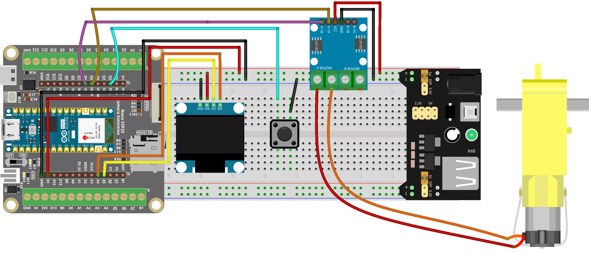

.. _speed_meter:

Speed Meter
==============================================================

.. note::
  
  🌟 Welcome to the SunFounder Facebook Community! Whether you're into Raspberry Pi, Arduino, or ESP32, you'll find inspiration, help ideas here.
   
  - ✅ Be the first to get free learning resources. 
   
  - ✅ Stay updated on new products & exclusive giveaways. 
   
  - ✅ Share your creations and get real feedback.
   
  * 👉 Need faster updates or support? Click [|link_sf_facebook|] join our Facebook community 

  * 👉 Or join our WhatsApp group: Click [|link_sf_whatsapp|]
   
🎁 Kit purchase
------------------------
  
Looking for parts? Check out our all-in-one kits below — packed with components, beginner-friendly guides, and tons of fun.

.. image:: img/esp32_kit.png
   :width: 100%
   :align: center
   :target: https://www.sunfounder.com/products/sunfounder-esp32-ultimate-starter-kit-with-esp32-camera-extension-board-battery?_pos=1&_sid=7dcb30fb6&_ss=r&ref=jbzmncle

.. raw:: html

     

.. list-table::
   :widths: 20 20 20
   :header-rows: 1

   * - Name
     - Includes ESP32 board
     - PURCHASE LINK
   * - ESP32 Ultimate Starter Kit
     - ESP32 WROOM 32E +
     - |link_esp32_kit_buy|
   * - Universal Maker Sensor Kit
     -
     - |link_umsk_buy|

Course Introduction
------------------------

In this lesson, you’ll learn how to use an L9110 Motor Driver Module, a TT motor, and an OLED display with the Arduino Nano ESP32 to build a simple Motor Speed Control system.

A button press cycles through multiple speed levels, and the motor speed is displayed on the OLED as both a numeric RPM value and a bar graph.

.. raw:: html

  <iframe width="700" height="394" src="https://www.youtube.com/embed/nukceXGJAb0?si=YBYWfoO6Q-Jjhszt" title="YouTube video player" frameborder="0" allow="accelerometer; autoplay; clipboard-write; encrypted-media; gyroscope; picture-in-picture; web-share" referrerpolicy="strict-origin-when-cross-origin" allowfullscreen></iframe>

.. note::

  If this is your first time working with an Arduino project, we recommend downloading and reviewing the basic materials first.
  
  * :ref:`install_arduino`
  * :ref:`introduce_arduino`
  * :ref:`install_esp32`

**Required Components**

In this project, we need the following components:

.. list-table::
    :widths: 5 20 5 20
    :header-rows: 1

    *   - SN
        - COMPONENT INTRODUCTION	
        - QUANTITY
        - PURCHASE LINK

    *   - 1
        - Arduino Nano ESP32
        - 1
        - 
    *   - 2
        - USB Cable
        - 1
        - 
    *   - 3
        - Breadboard
        - 1
        - |link_breadboard_buy|
    *   - 4
        - Wires
        - Several
        - |link_wires_buy|
    *   - 5
        - L9110 Motor Driver Module
        - 1
        - 
    *   - 6
        - OLED Display Module
        - 1
        - |link_oled_buy|
    *   - 7
        - TT Motor
        - 1
        - 
    *   - 8
        - Button
        - 1
        - |link_button_buy|

**Wiring**

**Common Connections:**

* **OLED Display Module**

  - **SDA:** Connect to **A4** on the ESP32.
  - **SCK:** Connect to **A5** on the ESP32.
  - **GND:** Connect to breadboard’s negative power bus.
  - **VCC:** Connect to breadboard’s red power bus.

* **Button**

  - Connect to breadboard’s negative power bus.
  - Connect to **D2** on the ESP32.

* **TT Motor**

  -  Connect to **MOTOR A** on the L9110 Motor Driver Module.

* **L9110 Motor Driver Module**

  - **GND:** Connect to breadboard’s negative power bus.
  - **VCC:** Connect to breadboard’s red power bus.
  - **A-1B:** Connect to **D5** on the Arduino.
  - **A-1A:** Connect to **D6** on the Arduino.

**Writing the Code**

.. note::

    * You can copy this code into **Arduino IDE**. 
    * To install the library, use the Arduino Library Manager and search for **Adafruit SSD1306** and **Adafruit GFX** and install it.
    * Don't forget to select the board(Arduino UNO R4) and the correct port before clicking the **Upload** button.

.. code-block:: arduino

      #include <Wire.h>
      #include <Adafruit_GFX.h>
      #include <Adafruit_SSD1306.h>

      // -------------------- OLED Settings --------------------
      #define SCREEN_WIDTH 128
      #define SCREEN_HEIGHT 64
      #define OLED_RESET    -1
      #define OLED_ADDR     0x3C

      Adafruit_SSD1306 display(SCREEN_WIDTH, SCREEN_HEIGHT, &Wire, OLED_RESET);

      // -------------------- Motor Pins (L9110) --------------------
      #define MOTOR_PIN1 5
      #define MOTOR_PIN2 6

      // -------------------- Button Pin --------------------
      #define BUTTON_PIN 2

      // -------------------- Motor Speed Levels --------------------
      // PWM duty values (0..255)
      int speedLevels[5] = {0, 190, 200, 230, 255};
      int currentLevel = 0;

      // -------------------- Button Debounce --------------------
      bool lastButtonState = HIGH;
      unsigned long lastDebounceTime = 0;
      const unsigned long debounceDelay = 200;

      // -------------------- ESP32 PWM (LEDC) Settings --------------------
      // New ESP32 core supports ledcAttach(pin, freq, resolutionBits)
      const uint32_t PWM_FREQ = 20000;   // 20kHz
      const uint8_t  PWM_RES  = 8;       // 8-bit => duty 0..255

      // -------------------- Helper: set motor duty --------------------
      void setMotorPWM(int duty1, int duty2) {
        // Clamp to 0..255
        if (duty1 < 0) duty1 = 0;
        if (duty1 > 255) duty1 = 255;
        if (duty2 < 0) duty2 = 0;
        if (duty2 > 255) duty2 = 255;

        // Write PWM duty by pin (ESP32 new API)
        ledcWrite(MOTOR_PIN1, duty1);
        ledcWrite(MOTOR_PIN2, duty2);
      }

      void setup() {
        pinMode(BUTTON_PIN, INPUT_PULLUP);

        // -------------------- Setup ESP32 PWM --------------------
        // Attach PWM to both motor pins
        ledcAttach(MOTOR_PIN1, PWM_FREQ, PWM_RES);
        ledcAttach(MOTOR_PIN2, PWM_FREQ, PWM_RES);

        // Motor stop at boot
        setMotorPWM(0, 0);

        // -------------------- Initialize OLED --------------------
        if (!display.begin(SSD1306_SWITCHCAPVCC, OLED_ADDR)) {
          while (true) { delay(1000); } // Stop if OLED not found
        }
        display.clearDisplay();
        display.display();
      }

      void loop() {
        handleButton();
        updateMotor();
        drawSpeed();
        delay(50);
      }

      void handleButton() {
        bool buttonState = digitalRead(BUTTON_PIN);

        // Detect falling edge with debounce
        if (buttonState == LOW && lastButtonState == HIGH &&
            (millis() - lastDebounceTime) > debounceDelay) {

          currentLevel++;
          if (currentLevel > 4) currentLevel = 0; // Loop back to stop
          lastDebounceTime = millis();
        }

        lastButtonState = buttonState;
      }

      void updateMotor() {
        int speed = speedLevels[currentLevel];

        // Forward: IN1 = PWM, IN2 = 0
        // Stop: both 0
        if (speed == 0) {
          setMotorPWM(0, 0);
        } else {
          setMotorPWM(speed, 0);
        }
      }

      void drawSpeed() {
        int pwm = speedLevels[currentLevel];

        // Approximate RPM display (just a rough mapping)
        float rpm = (pwm / 255.0f) * 200.0f;

        // Bar length (max 100px)
        int barLength = map(pwm, 0, 255, 0, 100);

        display.clearDisplay();

        // --- Display numeric speed (big font) ---
        display.setTextSize(2);
        display.setTextColor(SSD1306_WHITE);
        display.setCursor(0, 0);
        display.print("RPM");

        display.setCursor(0, 20);
        display.print((int)rpm);

        // --- Draw bar graph ---
        display.drawRect(10, 50, 100, 10, SSD1306_WHITE);
        display.fillRect(10, 50, barLength, 10, SSD1306_WHITE);

        display.display();
      }
