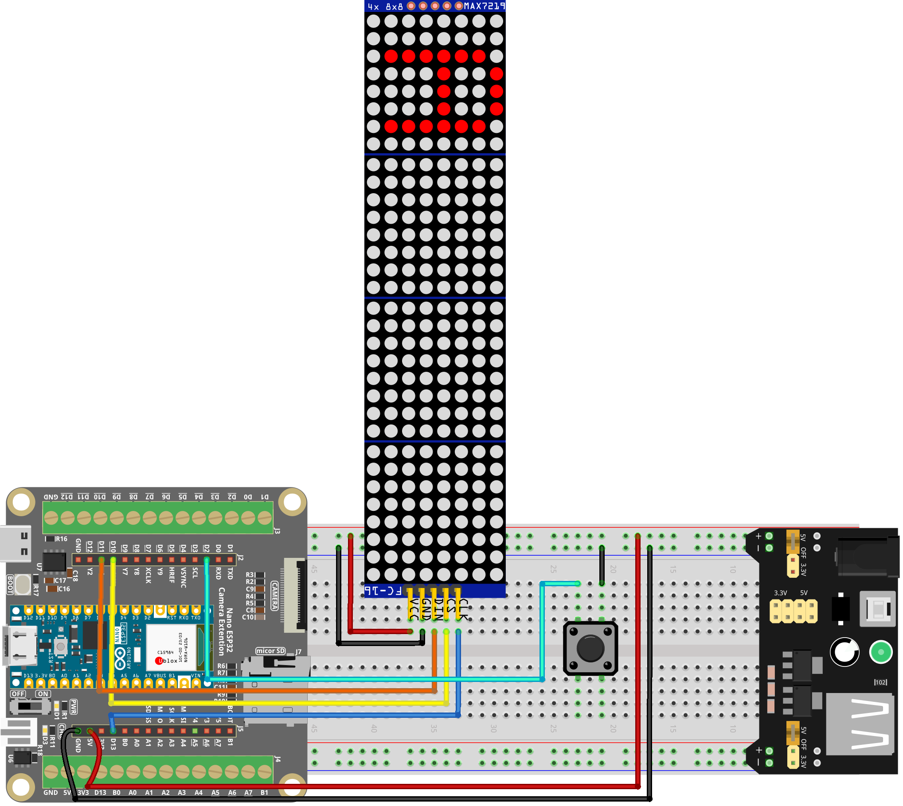

.. _stacker_blocks:

Stacker Blocks
==============================================================

.. note::
  
  🌟 Welcome to the SunFounder Facebook Community! Whether you're into Raspberry Pi, Arduino, or ESP32, you'll find inspiration, help ideas here.
   
  - ✅ Be the first to get free learning resources. 
   
  - ✅ Stay updated on new products & exclusive giveaways. 
   
  - ✅ Share your creations and get real feedback.
   
  * 👉 Need faster updates or support? Click [|link_sf_facebook|] join our Facebook community 

  * 👉 Or join our WhatsApp group: Click [|link_sf_whatsapp|]
   
🎁 Kit purchase
------------------------
  
Looking for parts? Check out our all-in-one kits below — packed with components, beginner-friendly guides, and tons of fun.

.. image:: img/esp32_kit.png
   :width: 100%
   :align: center
   :target: https://www.sunfounder.com/products/sunfounder-esp32-ultimate-starter-kit-with-esp32-camera-extension-board-battery?_pos=1&_sid=7dcb30fb6&_ss=r&ref=jbzmncle

.. raw:: html

     

.. list-table::
   :widths: 20 20 20
   :header-rows: 1

   * - Name
     - Includes ESP32 board
     - PURCHASE LINK
   * - ESP32 Ultimate Starter Kit
     - ESP32 WROOM 32E +
     - |link_esp32_kit_buy|
   * - Universal Maker Sensor Kit
     -
     - |link_umsk_buy|

Course Introduction
------------------------

In this lesson, you’ll learn how to use a MAX7219 Dot Matrix Module, a button with the Arduino Nano ESP32 to create a stacker blocks game. 

The MAX7219 Dot Matrix Module will display the game, and players can use the button to control the gameplay in the stacker blocks game.

.. raw:: html

  <iframe width="700" height="394" src="https://www.youtube.com/embed/KeWxADHv7xc?si=iqmMYMTcAAtZ89sC" title="YouTube video player" frameborder="0" allow="accelerometer; autoplay; clipboard-write; encrypted-media; gyroscope; picture-in-picture; web-share" referrerpolicy="strict-origin-when-cross-origin" allowfullscreen></iframe>

.. note::

  If this is your first time working with an Arduino project, we recommend downloading and reviewing the basic materials first.

  * :ref:`install_arduino`
  * :ref:`introduce_arduino`
  * :ref:`install_esp32`

**Required Components**

In this project, we need the following components:

.. list-table::
    :widths: 5 20 5 20
    :header-rows: 1

    *   - SN
        - COMPONENT INTRODUCTION	
        - QUANTITY
        - PURCHASE LINK

    *   - 1
        - Arduino Nano ESP32
        - 1
        - 
    *   - 2
        - USB Type-C cable
        - 1
        - 
    *   - 3
        - Breadboard
        - 1
        - |link_breadboard_buy|
    *   - 4
        - Wires
        - Several
        - |link_wires_buy|
    *   - 5
        - MAX7219 Dot Matrix Module
        - 1
        - |link_martix_buy|
    *   - 6
        - Button
        - 1
        - |link_button_buy|

**Wiring**

**Common Connections:**

* **MAX7219 Dot Matrix Module**

  - **CLK:** Connect to **D13** on the ESP32.
  - **CS:** Connect to **D10** on the ESP32.
  - **DIN:** Connect to **D11** on the ESP32.
  - **GND:** Connect to **GND** on the ESP32 Extension Board.
  - **VCC:** Connect to **5V** on the ESP32 Extension Board.

* **Button**

  - **GND:** Connect to **GND** on the ESP32 Extension Board.
  - Connect to **D2** on the ESP32.

**Writing the Code**

.. note::

    * You can copy this code into **Arduino IDE**. 
    * Don't forget to select the board(Arduino Nano ESP32) and the correct port before clicking the **Upload** button.

.. code-block:: arduino

      // Arduino Nano ESP32 - 4x MAX7219 (32x8) Stacking Block Game
      // - ESP32-compatible bit-bang MAX7219 driver
      // - 4 daisy-chained MAX7219 modules => total width = 32 columns
      // - Button places blocks
      // - Blocks appear from bottom to top (right to left by columns)

      // -------------------- MAX7219 Pins (Nano ESP32) --------------------
      #define DIN_PIN  11   // Data to MAX7219 DIN
      #define CLK_PIN  13   // Clock to MAX7219 CLK
      #define CS_PIN   10   // Chip Select to MAX7219 CS/LOAD

      // -------------------- Input Pin --------------------
      const int buttonPin = 2;   // Button (active LOW, using INPUT_PULLUP)

      // -------------------- Game Constants --------------------
      const int MODULES = 4;         // Number of MAX7219 modules
      const int blockColumns = 2;    // Each block occupies 2 columns
      const int TOTAL_COLS = 32;     // 4 modules * 8 columns

      // -------------------- Minimal MAX7219 Driver (ESP32 compatible) --------------------
      class MAX7219Chain {
      public:
        MAX7219Chain(int din, int clk, int cs, int modules)
        : _din(din), _clk(clk), _cs(cs), _modules(modules) {}

        void begin(uint8_t intensity /*0..15*/) {
          pinMode(_din, OUTPUT);
          pinMode(_clk, OUTPUT);
          pinMode(_cs,  OUTPUT);

          digitalWrite(_cs, HIGH);
          digitalWrite(_clk, LOW);

          sendCmdAll(0x0F, 0x00); // Display test: off
          sendCmdAll(0x09, 0x00); // Decode mode: none
          sendCmdAll(0x0B, 0x07); // Scan limit: 0..7
          sendCmdAll(0x0C, 0x01); // Shutdown: normal operation
          setIntensity(intensity);
          clear();
        }

        void setIntensity(uint8_t intensity) {
          if (intensity > 15) intensity = 15;
          sendCmdAll(0x0A, intensity);
        }

        void clear() {
          for (int m = 0; m < _modules; m++) {
            for (int row = 0; row < 8; row++) _buf[m][row] = 0;
          }
          refreshAll();
        }

        // row: 0..7, col: 0..7
        void setLed(int module, int row, int col, bool on) {
          if (module < 0 || module >= _modules) return;
          if (row < 0 || row > 7) return;
          if (col < 0 || col > 7) return;

          if (on) _buf[module][row] |=  (1 << col);
          else    _buf[module][row] &= ~(1 << col);
        }

        void clearModule(int module) {
          if (module < 0 || module >= _modules) return;
          for (int row = 0; row < 8; row++) _buf[module][row] = 0;
        }

        void refreshAll() {
          for (int row = 0; row < 8; row++) {
            digitalWrite(_cs, LOW);
            for (int m = _modules - 1; m >= 0; m--) {
              shiftOut8(row + 1);         // digit register: 1..8
              shiftOut8(_buf[m][row]);    // row data
            }
            digitalWrite(_cs, HIGH);
          }
        }

      private:
        int _din, _clk, _cs, _modules;
        uint8_t _buf[MODULES][8] = {0};

        void shiftOut8(uint8_t v) {
          for (int i = 7; i >= 0; i--) {
            digitalWrite(_clk, LOW);
            digitalWrite(_din, (v >> i) & 1);
            digitalWrite(_clk, HIGH);
          }
          digitalWrite(_clk, LOW);
        }

        void sendCmdAll(uint8_t reg, uint8_t data) {
          digitalWrite(_cs, LOW);
          for (int m = 0; m < _modules; m++) {
            shiftOut8(reg);
            shiftOut8(data);
          }
          digitalWrite(_cs, HIGH);
        }
      };

      MAX7219Chain lc(DIN_PIN, CLK_PIN, CS_PIN, MODULES);

      // -------------------- Game State --------------------
      int currentWidth = 4;
      int currentPos = -4;
      int direction = 1;
      int moveDelay = 150;
      bool gameOver = false;
      unsigned long lastMoveTime = 0;
      int maxPosition = 0;
      int buttonPressCount = 0;
      int currentLayerCount = 0;

      struct BlockLayer {
        int position;   // top row
        int width;      // height
        int startCol;   // global start column in 0..31
        int colWidth;   // always blockColumns (2)
      };

      BlockLayer layers[32];

      // -------------------- Helpers --------------------
      void updateMaxPosition() {
        maxPosition = 7 + currentWidth;
      }

      // Debounced button check (waits for release)
      bool checkButton() {
        if (digitalRead(buttonPin) == LOW) {
          delay(20);
          if (digitalRead(buttonPin) == LOW) {
            while (digitalRead(buttonPin) == LOW) { delay(1); }
            return true;
          }
        }
        return false;
      }

      // Map global column (0..31) to physical module + local column.
      // This version flips the module order so the game starts from the bottom module,
      // while keeping the block column order unchanged.
      void mapColumn(int globalCol, int &module, int &col) {
        int logicalModule = globalCol / 8;      // 0..3
        module = (MODULES - 1) - logicalModule; // flip: 0<->3, 1<->2
        col = 7 - (globalCol % 8);              // keep original column mirroring
      }

      // Compute the start column for a given layer index so that
      // layers fill from right to left (bottom to top visually).
      int layerStartCol(int layerIndex) {
        // layerIndex = 0 => start at 30 (right-most 2 columns)
        // layerIndex = 1 => start at 28, ...
        return TOTAL_COLS - (layerIndex + 1) * blockColumns;
      }

      // Draw all fixed layers + current moving block into buffer and refresh
      void updateDisplay() {
        for (int m = 0; m < MODULES; m++) lc.clearModule(m);

        // Draw placed layers
        for (int i = 0; i < currentLayerCount; i++) {
          int startCol = layers[i].startCol;
          int colWidth = layers[i].colWidth;

          for (int colOffset = 0; colOffset < colWidth; colOffset++) {
            int globalCol = startCol + colOffset;
            int module, col; mapColumn(globalCol, module, col);
            if (module >= MODULES) continue;

            for (int j = 0; j < layers[i].width; j++) {
              int row = layers[i].position + j;
              if (row >= 0 && row < 8) lc.setLed(module, row, col, true);
            }
          }
        }

        // Draw moving block if not game over
        if (!gameOver) {
          int startCol = layerStartCol(currentLayerCount);

          for (int colOffset = 0; colOffset < blockColumns; colOffset++) {
            int globalCol = startCol + colOffset;
            int module, col; mapColumn(globalCol, module, col);
            if (module >= MODULES) continue;

            for (int j = 0; j < currentWidth; j++) {
              int row = currentPos + j;
              if (row >= 0 && row < 8) lc.setLed(module, row, col, true);
            }
          }
        }

        lc.refreshAll();
      }

      void clearMovingBlock() {
        int startCol = layerStartCol(currentLayerCount);

        for (int colOffset = 0; colOffset < blockColumns; colOffset++) {
          int globalCol = startCol + colOffset;
          int module, col; mapColumn(globalCol, module, col);
          if (module >= MODULES) continue;

          for (int j = 0; j < currentWidth; j++) {
            int row = currentPos + j;
            if (row >= 0 && row < 8) lc.setLed(module, row, col, false);
          }
        }
      }

      void displayMovingBlock() {
        int startCol = layerStartCol(currentLayerCount);

        for (int colOffset = 0; colOffset < blockColumns; colOffset++) {
          int globalCol = startCol + colOffset;
          int module, col; mapColumn(globalCol, module, col);
          if (module >= MODULES) continue;

          for (int j = 0; j < currentWidth; j++) {
            int row = currentPos + j;
            if (row >= 0 && row < 8) lc.setLed(module, row, col, true);
          }
        }

        lc.refreshAll();
      }

      // Simple & safe: redraw everything when a block is placed
      void updatePlacedBlockDisplay(int /*layerIndex*/) {
        updateDisplay();
      }

      // Place the block and compute overlap with the previous layer
      void placeBlock() {
        buttonPressCount++;

        if (buttonPressCount == 4) moveDelay = 120;
        else if (buttonPressCount == 8) moveDelay = 90;
        else if (buttonPressCount == 12) moveDelay = 60;

        // First layer
        if (currentLayerCount == 0) {
          layers[0].position = currentPos;
          layers[0].width = currentWidth;
          layers[0].startCol = layerStartCol(0);
          layers[0].colWidth = blockColumns;
          currentLayerCount = 1;

          updateMaxPosition();
          currentPos = random(-currentWidth, maxPosition + 1);

          updatePlacedBlockDisplay(0);
          return;
        }

        // Overlap with previous layer
        int prevPos = layers[currentLayerCount - 1].position;
        int prevWidth = layers[currentLayerCount - 1].width;

        int overlapTop = max(prevPos, currentPos);
        int overlapBottom = min(prevPos + prevWidth - 1, currentPos + currentWidth - 1);

        // No overlap => game over
        if (overlapBottom < overlapTop) {
          clearMovingBlock();
          lc.refreshAll();
          gameOver = true;
          return;
        }

        // Save overlap as new layer
        layers[currentLayerCount].position = overlapTop;
        layers[currentLayerCount].width = overlapBottom - overlapTop + 1;
        layers[currentLayerCount].startCol = layerStartCol(currentLayerCount);
        layers[currentLayerCount].colWidth = blockColumns;

        currentWidth = layers[currentLayerCount].width;
        currentLayerCount++;

        // If full width reached, end game
        int totalUsedCols = currentLayerCount * blockColumns;
        if (totalUsedCols >= TOTAL_COLS) {
          gameOver = true;
          updateDisplay();
          return;
        }

        updateMaxPosition();
        currentPos = random(-currentWidth, maxPosition + 1);

        updatePlacedBlockDisplay(currentLayerCount - 1);
      }

      void setup() {
        pinMode(buttonPin, INPUT_PULLUP);

        lc.begin(8);
        lc.clear();

        currentLayerCount = 0;
        currentWidth = 4;
        currentPos = -currentWidth;

        randomSeed((uint32_t)analogRead(A0) ^ (uint32_t)micros());

        updateMaxPosition();
        updateDisplay();
      }

      void loop() {
        // Game over blink + reset
        if (gameOver) {
          static bool blinkState = false;
          static unsigned long lastBlinkTime = 0;

          if (millis() - lastBlinkTime > 500) {
            lastBlinkTime = millis();
            blinkState = !blinkState;
            if (blinkState) updateDisplay();
            else lc.clear();
          }

          if (checkButton()) {
            gameOver = false;
            currentLayerCount = 0;
            currentWidth = 4;
            currentPos = -currentWidth;
            moveDelay = 150;
            direction = 1;
            buttonPressCount = 0;
            updateMaxPosition();
            updateDisplay();
          }
          return;
        }

        // Move the block periodically
        unsigned long now = millis();
        if (now - lastMoveTime > (unsigned long)moveDelay) {
          lastMoveTime = now;

          clearMovingBlock();
          currentPos += direction;

          // Reflect at boundaries
          if (currentPos < -currentWidth) {
            int overshoot = (-currentWidth) - currentPos;
            currentPos = -currentWidth + overshoot;
            direction = -direction;
          } else if (currentPos > maxPosition) {
            int overshoot = currentPos - maxPosition;
            currentPos = maxPosition - overshoot - (currentWidth - 1);
            direction = -direction;
          }

          displayMovingBlock();
        }

        // Place block on button press
        if (checkButton()) {
          placeBlock();
        }
      }
