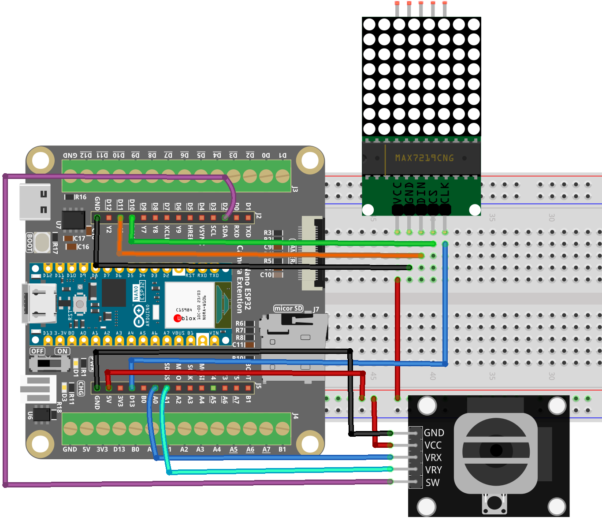

.. _Tetris1.0:

Tetris 1.0
==============================================================

.. note::
  
  🌟 Welcome to the SunFounder Facebook Community! Whether you're into Raspberry Pi, Arduino, or ESP32, you'll find inspiration, help ideas here.
   
  - ✅ Be the first to get free learning resources. 
   
  - ✅ Stay updated on new products & exclusive giveaways. 
   
  - ✅ Share your creations and get real feedback.
   
  * 👉 Need faster updates or support? Click [|link_sf_facebook|] join our Facebook community 

  * 👉 Or join our WhatsApp group: Click [|link_sf_whatsapp|]
  
  * 🎁 Looking for parts?Check out our all-in-one kits below — packed with components, beginner-friendly guides, and tons of fun.
  
  .. list-table::
    :widths: 20 20 20
    :header-rows: 1

    *   - Name	
        - Includes ESP32 board
        - PURCHASE LINK
    *   - ESP32 Ultimate Starter Kit	
        - ESP32 WROOM 32E +
        - |link_esp32_kit_buy|
    *   - Universal Maker Sensor Kit
        - 
        - |link_umsk_buy|

Course Introduction
------------------------

In this project, we use a MAX7219 8x8 Dot Matrix module, a joystick, and an Nano ESP32 board to play a classic Tetris game.

The falling blocks are controlled using the joystick for left, right, down, and rotation.

.. .. raw:: html
 
.. <iframe width="700" height="394" src="https://www.youtube.com/embed/_zZuwgufLBg?si=f7chyOB_esjepr0y" title="YouTube video player" frameborder="0" allow="accelerometer; autoplay; clipboard-write; encrypted-media; gyroscope; picture-in-picture; web-share" referrerpolicy="strict-origin-when-cross-origin" allowfullscreen></iframe>

.. note::

  If this is your first time working with an Arduino project, we recommend downloading and reviewing the basic materials first.
  
  * :ref:`install_arduino`
  * :ref:`introduce_arduino`
  * :ref:`install_esp32`

**Required Components**

In this project, we need the following components:

.. list-table::
    :widths: 5 20 5 20
    :header-rows: 1

    *   - SN
        - COMPONENT INTRODUCTION	
        - QUANTITY
        - PURCHASE LINK

    *   - 1
        - Arduino Nano ESP32
        - 1
        - 
    *   - 2
        - USB Type-C cable
        - 1
        - 
    *   - 3
        - Breadboard
        - 1
        - |link_breadboard_buy|
    *   - 4
        - Wires
        - Several
        - |link_wires_buy|
    *   - 5
        - Joystick Module
        - 1
        - |link_joystick_buy|
    *   - 6
        - MAX7219 Dot Matrix Module
        - 1
        - |link_martix1_buy|

**Wiring**

**Common Connections:**

* **MAX7219 Dot Matrix Module**

  - **CLK:** Connect to **D13** on the ESP32.
  - **CS:** Connect to **D10** on the ESP32.
  - **DIN:** Connect to **D11** on the ESP32.
  - **GND:** Connect to **GND** on the ESP32 Extension Board.
  - **VCC:** Connect to **5V** on the ESP32 Extension Board.

* **Joystick Module**

  - **SW:** Connect to **D2** on the ESP32.
  - **VRY:** Connect to **A1** on the ESP32.
  - **VRX:** Connect to **A0** on the ESP32.
  - **GND:** Connect to **GND** on the ESP32 Extension Board.
  - **VCC:** Connect to **3.3V** on the ESP32 Extension Board

**Writing the Code**

.. note::

    * You can copy this code into **Arduino IDE**. 
    * Don't forget to select the board(Arduino Nano ESP32) and the correct port before clicking the **Upload** button.

.. code-block:: arduino

      // Arduino Nano ESP32 Tetris Game for 8x8 MAX7219 + Joystick
      // - No LedControl (AVR-only). Uses a tiny MAX7219 bit-bang driver compatible with ESP32.
      // - MAX7219: DIN/CLK/CS
      // - Joystick: VRx/VRy on A0/A1, SW on D2 (pull-up)
      // - Press joystick button to start and rotate
      // - Move left/right with VRx, control drop speed with VRy

      // -------------------- MAX7219 Pins (Nano ESP32) --------------------
      #define DIN  11   // Data to MAX7219 DIN
      #define CS   10   // Chip Select to MAX7219 CS/LOAD
      #define CLK  13   // Clock to MAX7219 CLK

      // -------------------- Joystick Pins (Nano ESP32) --------------------
      #define VRx  A0
      #define VRy  A1
      #define SW    2   // Digital input with pull-up

      // -------------------- Minimal MAX7219 Driver --------------------
      class MAX7219_8x8 {
      public:
        MAX7219_8x8(int din, int clk, int cs) : _din(din), _clk(clk), _cs(cs) {}

        void begin(uint8_t intensity /*0..15*/) {
          pinMode(_din, OUTPUT);
          pinMode(_clk, OUTPUT);
          pinMode(_cs,  OUTPUT);

          digitalWrite(_cs, HIGH);
          digitalWrite(_clk, LOW);

          // Init MAX7219
          sendCmd(0x0F, 0x00); // Display test: off
          sendCmd(0x09, 0x00); // Decode mode: none
          sendCmd(0x0B, 0x07); // Scan limit: 8 digits (0..7)
          sendCmd(0x0C, 0x01); // Shutdown: normal operation
          setIntensity(intensity);
          clear();
        }

        void setIntensity(uint8_t intensity /*0..15*/) {
          if (intensity > 15) intensity = 15;
          sendCmd(0x0A, intensity);
        }

        void clear() {
          for (int row = 0; row < 8; row++) setRow(row, 0x00);
        }

        // row: 0..7, data: bit0->col0 ... bit7->col7
        void setRow(uint8_t row, uint8_t data) {
          // MAX7219 digit registers are 1..8
          sendCmd(row + 1, data);
        }

      private:
        int _din, _clk, _cs;

        void shiftOut16(uint8_t reg, uint8_t data) {
          // MSB first: reg then data
          for (int i = 7; i >= 0; i--) {
            digitalWrite(_clk, LOW);
            digitalWrite(_din, (reg >> i) & 1);
            digitalWrite(_clk, HIGH);
          }
          for (int i = 7; i >= 0; i--) {
            digitalWrite(_clk, LOW);
            digitalWrite(_din, (data >> i) & 1);
            digitalWrite(_clk, HIGH);
          }
          digitalWrite(_clk, LOW);
        }

        void sendCmd(uint8_t reg, uint8_t data) {
          digitalWrite(_cs, LOW);
          shiftOut16(reg, data);
          digitalWrite(_cs, HIGH);
        }
      };

      MAX7219_8x8 lc(DIN, CLK, CS);

      // -------------------- Game Data --------------------
      byte field[8];  // 8 rows, 8 columns
      int score = 0;

      struct Block {
        const int (*shape)[2];
        int len;
        int x, y;
        int rotation;
        char type;
      };

      // Block definitions with all rotations
      const int I[2][4][2] = {{{0,0},{0,1},{0,2},{0,3}}, {{-1,1},{0,1},{1,1},{2,1}}};
      const int O[1][4][2] = {{{0,0},{1,0},{0,1},{1,1}}};
      const int T[4][4][2] = {{{1,0},{0,1},{1,1},{2,1}}, {{1,0},{1,1},{1,2},{0,1}}, {{0,1},{1,1},{2,1},{1,2}}, {{1,0},{1,1},{1,2},{2,1}}};
      const int L[4][4][2] = {{{0,0},{0,1},{0,2},{1,2}}, {{0,0},{1,0},{2,0},{0,1}}, {{0,0},{1,0},{1,1},{1,2}}, {{2,0},{0,1},{1,1},{2,1}}};
      const int J[4][4][2] = {{{1,0},{1,1},{1,2},{0,2}}, {{0,0},{0,1},{1,1},{2,1}}, {{0,0},{1,0},{0,1},{0,2}}, {{0,0},{1,0},{2,0},{2,1}}};
      const int S[2][4][2] = {{{1,0},{2,0},{0,1},{1,1}}, {{1,0},{1,1},{2,1},{2,2}}};
      const int Z[2][4][2] = {{{0,0},{1,0},{1,1},{2,1}}, {{2,0},{1,1},{2,1},{1,2}}};

      Block current;
      unsigned long lastDrop = 0;
      unsigned long dropInterval = 500;
      bool gameRunning = false;

      // -------------------- Utility --------------------
      int clampInt(int v, int lo, int hi) {
        if (v < lo) return lo;
        if (v > hi) return hi;
        return v;
      }

      // -------------------- Game Core --------------------
      void resetGame() {
        for (int i = 0; i < 8; i++) field[i] = 0;
        score = 0;
      }

      bool checkCollision(int x, int y) {
        for (int i = 0; i < current.len; i++) {
          int px = x + current.shape[i][0];
          int py = y + current.shape[i][1];
          if (px < 0 || px >= 8 || py < 0 || py >= 8) return true;
          if (field[py] & (1 << px)) return true;
        }
        return false;
      }

      void gameOver() {
        for (int i = 0; i < 6; i++) {
          for (int y = 0; y < 8; y++) {
            byte row = field[y];
            byte out = 0;
            for (int x = 0; x < 8; x++) {
              bool ledOn = (i % 2 == 0) && (row & (1 << x));
              if (ledOn) out |= (1 << x);
            }
            lc.setRow(y, out);
          }
          delay(300);
        }
        gameRunning = false;
      }

      void spawnBlock() {
        int r = random(7);
        switch (r) {
          case 0: current = {I[0], 4, 3, 0, 0, 'I'}; break;
          case 1: current = {O[0], 4, 3, 0, 0, 'O'}; break;
          case 2: current = {T[0], 4, 3, 0, 0, 'T'}; break;
          case 3: current = {L[0], 4, 3, 0, 0, 'L'}; break;
          case 4: current = {J[0], 4, 3, 0, 0, 'J'}; break;
          case 5: current = {S[0], 4, 3, 0, 0, 'S'}; break;
          case 6: current = {Z[0], 4, 3, 0, 0, 'Z'}; break;
        }
        if (checkCollision(current.x, current.y)) gameOver();
      }

      bool moveBlock(int dx, int dy) {
        if (!checkCollision(current.x + dx, current.y + dy)) {
          current.x += dx;
          current.y += dy;
          return true;
        }
        return false;
      }

      void placeBlock() {
        for (int i = 0; i < current.len; i++) {
          int px = current.x + current.shape[i][0];
          int py = current.y + current.shape[i][1];
          if (px >= 0 && px < 8 && py >= 0 && py < 8) {
            field[py] |= (1 << px);
          }
        }
      }

      void clearLines() {
        for (int y = 0; y < 8; y++) {
          if (field[y] == 0xFF) {
            for (int j = y; j > 0; j--) field[j] = field[j - 1];
            field[0] = 0;
            score += 10;
          }
        }
      }

      void draw() {
        for (int y = 0; y < 8; y++) {
          byte row = field[y];
          for (int i = 0; i < current.len; i++) {
            int px = current.x + current.shape[i][0];
            int py = current.y + current.shape[i][1];
            if (py == y && px >= 0 && px < 8) row |= (1 << px);
          }
          lc.setRow(y, row);
        }
      }

      void rotateBlock() {
        int nextRot = current.rotation + 1;
        int maxRot = 1;
        const int (*nextShape)[2] = nullptr;

        switch (current.type) {
          case 'I': maxRot = 2; nextShape = I[nextRot % maxRot]; break;
          case 'O': return;
          case 'T': maxRot = 4; nextShape = T[nextRot % maxRot]; break;
          case 'L': maxRot = 4; nextShape = L[nextRot % maxRot]; break;
          case 'J': maxRot = 4; nextShape = J[nextRot % maxRot]; break;
          case 'S': maxRot = 2; nextShape = S[nextRot % maxRot]; break;
          case 'Z': maxRot = 2; nextShape = Z[nextRot % maxRot]; break;
          default: return;
        }

        const int (*oldShape)[2] = current.shape;
        int oldRot = current.rotation;

        current.shape = nextShape;
        current.rotation = nextRot % maxRot;

        if (checkCollision(current.x, current.y)) {
          current.shape = oldShape;
          current.rotation = oldRot;
        }
      }

      // -------------------- Input Handling --------------------
      void handleInput() {
        // ESP32 ADC default 0..4095
        int x = analogRead(VRx);
        int y = analogRead(VRy);

        // Left/right thresholds
        if (x < 1200) {
          moveBlock(1, 0);   // 保留你原来的“反向”
          delay(150);
        } else if (x > 2800) {
          moveBlock(-1, 0);
          delay(150);
        }

        // Drop speed control
        int mapped = map(y, 2048, 4095, 0, 600);
        mapped = clampInt(mapped, 0, 600);
        dropInterval = 700 - mapped;

        // Rotate (active LOW)
        if (digitalRead(SW) == LOW) {
          rotateBlock();
          delay(200);
        }
      }

      void setup() {
        pinMode(SW, INPUT_PULLUP);

        lc.begin(8);   // intensity 0..15
        lc.clear();

        randomSeed((uint32_t)micros());
      }

      void loop() {
        // Press joystick button to start
        if (!gameRunning && digitalRead(SW) == LOW) {
          resetGame();
          spawnBlock();
          gameRunning = true;
          delay(200); // debounce
        }

        if (gameRunning) {
          handleInput();

          if (millis() - lastDrop > dropInterval) {
            if (!moveBlock(0, 1)) {
              placeBlock();
              clearLines();
              spawnBlock();
            }
            lastDrop = millis();
          }
          draw();
        }
      }
