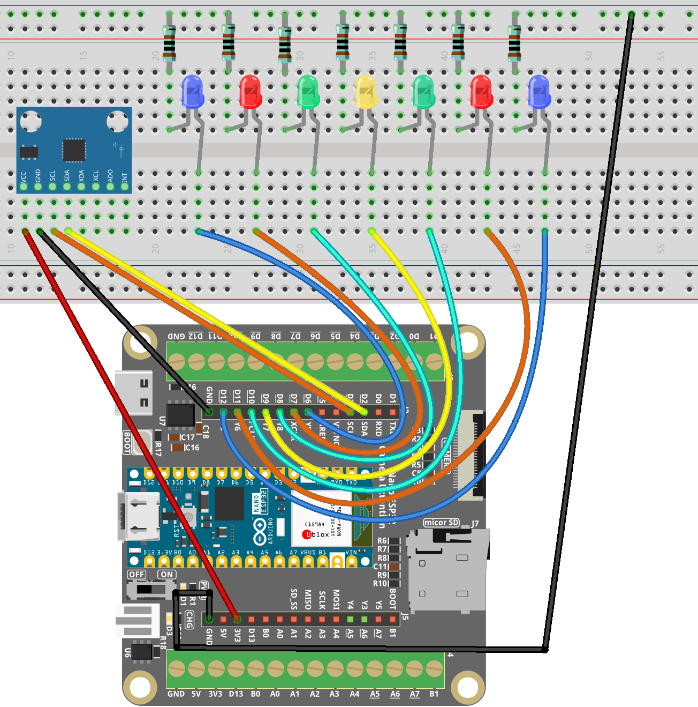

.. _tilt_led2.0:

Tilt LED 2.0
==============================================================

.. note::
  
  🌟 Welcome to the SunFounder Facebook Community! Whether you're into Raspberry Pi, Arduino, or ESP32, you'll find inspiration, help ideas here.
   
  - ✅ Be the first to get free learning resources. 
   
  - ✅ Stay updated on new products & exclusive giveaways. 
   
  - ✅ Share your creations and get real feedback.
   
  * 👉 Need faster updates or support? Click [|link_sf_facebook|] join our Facebook community 

  * 👉 Or join our WhatsApp group: Click [|link_sf_whatsapp|]
   
Kit purchase
------------------------
  
Looking for parts? Check out our all-in-one kits below — packed with components, beginner-friendly guides, and tons of fun.

.. image:: img/esp32_kit.png
   :width: 100%
   :align: center
   :target: https://www.sunfounder.com/products/sunfounder-esp32-ultimate-starter-kit-with-esp32-camera-extension-board-battery?_pos=1&_sid=7dcb30fb6&_ss=r&ref=jbzmncle

.. raw:: html

     

.. list-table::
   :widths: 20 20 20
   :header-rows: 1

   * - Name
     - Includes ESP32 board
     - PURCHASE LINK
   * - ESP32 Ultimate Starter Kit
     - ESP32 WROOM 32E +
     - |link_esp32_kit_buy|
   * - Universal Maker Sensor Kit
     -
     - |link_umsk_buy|

Course Introduction
------------------------

This project controls an array of LEDs based on the tilt angle detected by an MPU6050 sensor. 

The LEDs illuminate in response to X-axis tilt, visually indicating the board's orientation. 

Tilt angles are continuously calculated from acceleration data provided by the MPU6050, and corresponding LEDs activate according to predefined angle thresholds.

.. .. raw:: html

..  <iframe width="700" height="394" src="https://www.youtube.com/embed/OXlBMpb3I4w?si=rRUzFHYCo-mWYsns" title="YouTube video player" frameborder="0" allow="accelerometer; autoplay; clipboard-write; encrypted-media; gyroscope; picture-in-picture; web-share" referrerpolicy="strict-origin-when-cross-origin" allowfullscreen></iframe>

.. note::

  If this is your first time working with an ESP32 project, we recommend downloading and reviewing the basic materials first.

  * :ref:`install_arduino`
  * :ref:`introduce_arduino`
  * :ref:`install_esp32`

**Required Components**

In this project, we need the following components:

.. list-table::
    :widths: 5 20 5 20
    :header-rows: 1

    *   - SN
        - COMPONENT INTRODUCTION
        - QUANTITY
        - PURCHASE LINK

    *   - 1
        - Arduino Nano ESP32
        - 1
        - 
    *   - 2
        - USB Type-C cable
        - 1
        - 
    *   - 3
        - Breadboard
        - 1
        - |link_breadboard_buy|
    *   - 4
        - Wires
        - Several
        - |link_wires_buy|
    *   - 5
        - 1kΩ resistor
        - Several
        - |link_resistor_buy|
    *   - 6
        - LED
        - Several
        - |link_led_buy|
    *   - 7
        - MPU6050 Module
        - 1
        - |link_mpu6050_buy|

**Wiring**

**Common Connections:**

* **LED**

  - Connect the LEDs **cathode** to a **1kΩ resistor** then to the negative power bus on the breadboard, and the LEDs **anode** to **D6** to **D12** on the ESP32.

* **MPU6050**

  - **SDA:** Connect to **D2** on the ESP32.
  - **SCL:** Connect to **D3** on the ESP32.
  - **GND:** Connect to breadboard’s negative power bus.
  - **VCC:** Connect to breadboard’s red power bus.

**Writing the Code**

.. note::

    * You can copy this code into **Arduino IDE**. 
    * To install the library, use the Arduino Library Manager and search for **MPU6050** and install it.
    * Don't forget to select the board(Arduino Nano ESP32) and the correct port before clicking the **Upload** button.

.. code-block:: arduino

    #include <Wire.h>
    #include <MPU6050.h>

    MPU6050 mpu;

    // LED pins (you have verified these work)
    // Pin -> LED -> Resistor -> GND (HIGH = ON)
    const int ledPins[] = {12, 11, 10, 9, 8, 7, 6};
    const int ledCount = sizeof(ledPins) / sizeof(ledPins[0]);

    // 6 boundaries -> 7 LED regions
    const float thresholds[] = {-30, -15, -5, 5, 15, 30};

    // LED helpers
    void ledWrite(int pin, bool on) {
      digitalWrite(pin, on ? HIGH : LOW);
    }

    void allLedsOff() {
      for (int i = 0; i < ledCount; i++) ledWrite(ledPins[i], false);
    }

    void allLedsOn() {
      for (int i = 0; i < ledCount; i++) ledWrite(ledPins[i], true);
    }

    // LED self-test to confirm wiring
    void ledSelfTest() {
      allLedsOff();

      for (int i = 0; i < ledCount; i++) {
        ledWrite(ledPins[i], true);
        delay(200);
        ledWrite(ledPins[i], false);
      }

      allLedsOn();
      delay(400);
      allLedsOff();
      delay(200);
    }

    // Map angle to LED index
    int getLEDIndex(float angleX) {
      const int n = sizeof(thresholds) / sizeof(thresholds[0]);
      for (int i = 0; i < n; i++) {
        if (angleX < thresholds[i]) return i;
      }
      return ledCount - 1;
    }

    void updateLEDs(float angleX) {
      allLedsOff();
      int idx = getLEDIndex(angleX);
      if (idx >= 0 && idx < ledCount) {
        ledWrite(ledPins[idx], true);
      }
    }

    void setup() {
      Serial.begin(115200);
      delay(200);

      // LED setup
      for (int i = 0; i < ledCount; i++) {
        pinMode(ledPins[i], OUTPUT);
        ledWrite(ledPins[i], false);
      }

      Serial.println("LED self-test start...");
      ledSelfTest();
      Serial.println("LED self-test done.");

      // ---- I2C init (IMPORTANT CHANGE) ----
      // MPU6050 SDA -> D2
      // MPU6050 SCL -> D3
      Wire.begin(D2, D3);

      // MPU6050 init
      Serial.println("Init MPU6050...");
      mpu.initialize();

      if (!mpu.testConnection()) {
        Serial.println("MPU6050 connection failed. Blinking all LEDs.");
        while (true) {
          allLedsOn();
          delay(300);
          allLedsOff();
          delay(300);
        }
      }

      Serial.println("MPU6050 connected.");
    }

    void loop() {
      int16_t ax, ay, az;
      mpu.getAcceleration(&ax, &ay, &az);

      // Calculate tilt angle around X axis
      float angleX = atan2((float)ay, (float)az) * 180.0f / PI;

      Serial.print("angleX=");
      Serial.println(angleX);

      updateLEDs(angleX);
      delay(100);
    }
