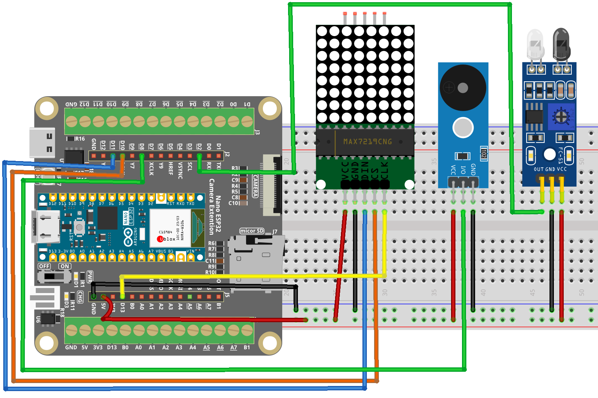

.. _xmas_gadget:

Xmas Gadget
==============================================================

.. note::
  
  🌟 Welcome to the SunFounder Facebook Community! Whether you're into Raspberry Pi, Arduino, or ESP32, you'll find inspiration, help ideas here.
   
  - ✅ Be the first to get free learning resources. 
   
  - ✅ Stay updated on new products & exclusive giveaways. 
   
  - ✅ Share your creations and get real feedback.
   
  * 👉 Need faster updates or support? Click [|link_sf_facebook|] join our Facebook community 

  * 👉 Or join our WhatsApp group: Click [|link_sf_whatsapp|]
  
  * 🎁 Looking for parts?Check out our all-in-one kits below — packed with components, beginner-friendly guides, and tons of fun.
  
  .. list-table::
    :widths: 20 20 20
    :header-rows: 1

    *   - Name	
        - Includes ESP32 board
        - PURCHASE LINK
    *   - ESP32 Ultimate Starter Kit	
        - ESP32 WROOM 32E +
        - |link_esp32_kit_buy|
    *   - Universal Maker Sensor Kit
        - 
        - |link_umsk_buy|

Course Introduction
------------------------

In this project, we use an Arduino Nano ESP32 drives a MAX7219 LED matrix and buzzer to display animated Christmas patterns with synchronized music, triggered by an obstacle sensor.

.. raw:: html
 
  <iframe width="700" height="394" src="https://www.youtube.com/embed/xAZSOtPlNj8?si=UhgEku1lag_Agqx3" title="YouTube video player" frameborder="0" allow="accelerometer; autoplay; clipboard-write; encrypted-media; gyroscope; picture-in-picture; web-share" referrerpolicy="strict-origin-when-cross-origin" allowfullscreen></iframe>

.. note::

  If this is your first time working with an Arduino project, we recommend downloading and reviewing the basic materials first.
  
  * :ref:`install_arduino`
  * :ref:`introduce_arduino`
  * :ref:`install_esp32`

**Required Components**

In this project, we need the following components:

.. list-table::
    :widths: 5 20 5 20
    :header-rows: 1

    *   - SN
        - COMPONENT INTRODUCTION	
        - QUANTITY
        - PURCHASE LINK

    *   - 1
        - Arduino Nano ESP32
        - 1
        - 
    *   - 2
        - USB Type-C cable
        - 1
        - 
    *   - 3
        - Breadboard
        - 1
        - |link_breadboard_buy|
    *   - 4
        - Wires
        - Several
        - |link_wires_buy|
    *   - 5
        - IR Obstacle Avoidance Sensor Module
        - 1
        - |link_IR_module_buy|
    *   - 6
        - MAX7219 Dot Matrix Module
        - 1
        - |link_martix1_buy|
    *   - 7
        - Buzzer Modudle
        - 1
        - |link_buzzer_module_buy|

**Wiring**

**Common Connections:**

* **MAX7219 Dot Matrix Module**

  - **CLK:** Connect to **D13** on the ESP32.
  - **CS:** Connect to **D10** on the ESP32.
  - **DIN:** Connect to **D11** on the ESP32.
  - **GND:** Connect to **GND** on the ESP32 Extension Board
  - **VCC:** Connect to **5V** on the ESP32 Extension Board.

* **Buzzer Module**

  - **I/0:** Connect to **D2** on the ESP32.
  - **＋:** Connect to breadboard’s red power bus. 
  - **－:** Connect to **3.3V** on the ESP32 Extension Board.

* **IR Obstacle Avoidance Sensor Module**

  - **OUT:** Connect to **D8** on the ESP32.
  - **GND:** Connect to **GND** on the ESP32 Extension Board
  - **VCC:** Connect to **3.3V** on the ESP32 Extension Board.

**Writing the Code**

.. note::

    * Before you begin, you need to upload the **pitches.h** library to your Arduino. Copy the contents of the library into the Arduino IDE, save it as **pitches.h** and then upload it to your Arduino.

.. code-block:: arduino

      #define NOTE_B0  31
      #define NOTE_C1  33
      #define NOTE_CS1 35
      #define NOTE_D1  37
      #define NOTE_DS1 39
      #define NOTE_E1  41
      #define NOTE_F1  44
      #define NOTE_FS1 46
      #define NOTE_G1  49
      #define NOTE_GS1 52
      #define NOTE_A1  55
      #define NOTE_AS1 58
      #define NOTE_B1  62
      #define NOTE_C2  65
      #define NOTE_CS2 69
      #define NOTE_D2  73
      #define NOTE_DS2 78
      #define NOTE_E2  82
      #define NOTE_F2  87
      #define NOTE_FS2 93
      #define NOTE_G2  98
      #define NOTE_GS2 104
      #define NOTE_A2  110
      #define NOTE_AS2 117
      #define NOTE_B2  123
      #define NOTE_C3  131
      #define NOTE_CS3 139
      #define NOTE_D3  147
      #define NOTE_DS3 156
      #define NOTE_E3  165
      #define NOTE_F3  175
      #define NOTE_FS3 185
      #define NOTE_G3  196
      #define NOTE_GS3 208
      #define NOTE_A3  220
      #define NOTE_AS3 233
      #define NOTE_B3  247
      #define NOTE_C4  262
      #define NOTE_CS4 277
      #define NOTE_D4  294
      #define NOTE_DS4 311
      #define NOTE_E4  330
      #define NOTE_F4  349
      #define NOTE_FS4 370
      #define NOTE_G4  392
      #define NOTE_GS4 415
      #define NOTE_A4  440
      #define NOTE_AS4 466
      #define NOTE_B4  494
      #define NOTE_C5  523
      #define NOTE_CS5 554
      #define NOTE_D5  587
      #define NOTE_DS5 622
      #define NOTE_E5  659
      #define NOTE_F5  698
      #define NOTE_FS5 740
      #define NOTE_G5  784
      #define NOTE_GS5 831
      #define NOTE_A5  880
      #define NOTE_AS5 932
      #define NOTE_B5  988
      #define NOTE_C6  1047
      #define NOTE_CS6 1109
      #define NOTE_D6  1175
      #define NOTE_DS6 1245
      #define NOTE_E6  1319
      #define NOTE_F6  1397
      #define NOTE_FS6 1480
      #define NOTE_G6  1568
      #define NOTE_GS6 1661
      #define NOTE_A6  1760
      #define NOTE_AS6 1865
      #define NOTE_B6  1976
      #define NOTE_C7  2093
      #define NOTE_CS7 2217
      #define NOTE_D7  2349
      #define NOTE_DS7 2489
      #define NOTE_E7  2637
      #define NOTE_F7  2794
      #define NOTE_FS7 2960
      #define NOTE_G7  3136
      #define NOTE_GS7 3322
      #define NOTE_A7  3520
      #define NOTE_AS7 3729
      #define NOTE_B7  3951
      #define NOTE_C8  4186
      #define NOTE_CS8 4435
      #define NOTE_D8  4699
      #define NOTE_DS8 4978

.. note::

    * You can copy this code into **Arduino IDE**. 
    * Don't forget to select the board(Arduino Nano ESP32) and the correct port before clicking the **Upload** button.

.. code-block:: arduino

      // Arduino Nano ESP32 - Obstacle Triggered Christmas LED + Melody
      // - MAX7219 8x8 LED matrix (bit-bang driver, ESP32 compatible)
      // - Obstacle sensor triggers animation + melody
      // - Buzzer plays melody while LED brightness "breathes"
      // Wiring is provided below the sketch.

      #include "pitches.h"

      // -------------------- Pin definitions (Nano ESP32) --------------------
      const int sensorPin = 2;   // Obstacle sensor digital output pin
      const int buzzerPin = 8;   // Buzzer pin (use a PWM-capable pin if possible)

      // MAX7219 pins (match your previous reference wiring)
      #define DIN  11            // MAX7219 DIN
      #define CS   10            // MAX7219 CS/LOAD
      #define CLK  13            // MAX7219 CLK

      // -------------------- Minimal MAX7219 Driver (ESP32 compatible) --------------------
      class MAX7219_8x8 {
      public:
        MAX7219_8x8(int din, int clk, int cs) : _din(din), _clk(clk), _cs(cs) {}

        void begin(uint8_t intensity /*0..15*/) {
          pinMode(_din, OUTPUT);
          pinMode(_clk, OUTPUT);
          pinMode(_cs,  OUTPUT);

          digitalWrite(_cs, HIGH);
          digitalWrite(_clk, LOW);

          // MAX7219 init sequence
          sendCmd(0x0F, 0x00); // Display test: off
          sendCmd(0x09, 0x00); // Decode mode: none
          sendCmd(0x0B, 0x07); // Scan limit: 0..7 (8 digits)
          sendCmd(0x0C, 0x01); // Shutdown: normal operation
          setIntensity(intensity);
          clear();
        }

        void setIntensity(uint8_t intensity) {
          if (intensity > 15) intensity = 15;
          sendCmd(0x0A, intensity);
        }

        void clear() {
          for (int row = 0; row < 8; row++) setRow(row, 0x00);
        }

        // row: 0..7, data bits are columns (bit0 = col0)
        void setRow(uint8_t row, uint8_t data) {
          sendCmd(row + 1, data);
        }

        // Column write compatible with LedControl::setColumn()
        // col: 0..7, data bits are rows (bit0 = row0)
        void setColumn(uint8_t col, uint8_t data) {
          for (int r = 0; r < 8; r++) {
            bool on = (data >> r) & 0x01;
            if (on) _rowBuf[r] |=  (1 << col);
            else    _rowBuf[r] &= ~(1 << col);
          }
          for (int r = 0; r < 8; r++) setRow(r, _rowBuf[r]);
        }

        void clearBuffered() {
          for (int r = 0; r < 8; r++) _rowBuf[r] = 0;
          clear();
        }

      private:
        int _din, _clk, _cs;
        uint8_t _rowBuf[8] = {0};

        void shiftOut16(uint8_t reg, uint8_t data) {
          // MSB first: reg then data
          for (int i = 7; i >= 0; i--) {
            digitalWrite(_clk, LOW);
            digitalWrite(_din, (reg >> i) & 1);
            digitalWrite(_clk, HIGH);
          }
          for (int i = 7; i >= 0; i--) {
            digitalWrite(_clk, LOW);
            digitalWrite(_din, (data >> i) & 1);
            digitalWrite(_clk, HIGH);
          }
          digitalWrite(_clk, LOW);
        }

        void sendCmd(uint8_t reg, uint8_t data) {
          digitalWrite(_cs, LOW);
          shiftOut16(reg, data);
          digitalWrite(_cs, HIGH);
        }
      };

      MAX7219_8x8 lc(DIN, CLK, CS);

      // -------------------- LED matrix patterns --------------------
      byte treePattern[8] = {
        B00010000, B00111000, B01111100, B11111110,
        B00111000, B01111100, B11111110, B00111000
      };

      byte sockPattern[8] = {
        B11111000, B11111000, B01110000, B01110000,
        B01111000, B01111110, B01111111, B01111111
      };

      byte bellPattern[8] = {
        B00000010, B00011100, B00111100, B11111100,
        B00111000, B01010000, B00010000, B00000000
      };

      byte bellMirror[8] = {
        B01000000, B00111000, B00111100, B00111111,
        B00011100, B00001010, B00001000, B00000000
      };

      byte hatPattern[8] = {
        B00001100, B00011110, B00111101, B01111000,
        B01111000, B01111000, B11111100, B11111100
      };

      byte letterX[8] = {
        B10000001, B01000010, B00100100, B00011000,
        B00011000, B00100100, B01000010, B10000001
      };

      byte letterM[8] = {
        B10000001, B11000011, B10100101, B10011001,
        B10000001, B10000001, B10000001, B10000001
      };

      byte letterA[8] = {
        B00111100, B01100110, B11000011, B11000011,
        B11111111, B11000011, B11000011, B11000011
      };

      byte letterS[8] = {
        B00111110, B01100000, B01100000, B00111100,
        B00000110, B00000110, B01100110, B00111100
      };

      // -------------------- Melody (stored in flash) --------------------
      // On ESP32, PROGMEM is supported by Arduino core.
      // We will read values with pgm_read_word().
      const int melody[] PROGMEM = {
        NOTE_E4, NOTE_E4, NOTE_E4, NOTE_E4, NOTE_E4, NOTE_E4,
        NOTE_E4, NOTE_G4, NOTE_C4, NOTE_D4, NOTE_E4,
        NOTE_F4, NOTE_F4, NOTE_F4, NOTE_F4, NOTE_F4, NOTE_E4, NOTE_E4, NOTE_E4, NOTE_E4,
        NOTE_E4, NOTE_D4, NOTE_D4, NOTE_E4, NOTE_D4, NOTE_G4
      };

      const int noteDurations[] PROGMEM = {
        6, 6, 3, 6, 6, 3,
        6, 6, 6, 6, 3,
        6, 6, 6, 6, 6, 6, 6, 6, 6,
        6, 6, 6, 6, 3, 3
      };

      // -------------------- Display function (same orientation logic as your original) --------------------
      void displayPattern(const byte pattern[8]) {
        lc.clearBuffered();
        for (int col = 0; col < 8; col++) {
          // Reverse order to keep the original orientation
          lc.setColumn(col, pattern[7 - col]);
        }
      }

      // -------------------- Breathing effect synchronized with melody --------------------
      void breathingEffectWithMelody(const byte pattern[8],
                                    const int* melodyProgmem,
                                    const int* durationProgmem,
                                    int noteStart,
                                    int noteCount) {
        int currentNote = noteStart;
        unsigned long previousMillis = 0;
        const int breathIntervalMs = 30;

        int brightness = 0;
        bool increasing = true;

        for (int i = 0; i < noteCount; i++) {
          int durDiv = (int)pgm_read_word(&durationProgmem[currentNote]);
          int freq   = (int)pgm_read_word(&melodyProgmem[currentNote]);

          // Convert duration divider into milliseconds
          int noteDurationMs = 1200 / durDiv;

          // Play note
          tone(buzzerPin, freq, noteDurationMs);

          unsigned long startTime = millis();
          while (millis() - startTime < (unsigned long)(noteDurationMs * 1.30f)) {
            unsigned long now = millis();
            if (now - previousMillis >= (unsigned long)breathIntervalMs) {
              previousMillis = now;

              lc.setIntensity((uint8_t)brightness);
              displayPattern(pattern);

              if (increasing) {
                brightness++;
                if (brightness >= 15) { brightness = 15; increasing = false; }
              } else {
                brightness--;
                if (brightness <= 0)  { brightness = 0;  increasing = true;  }
              }
            }
          }

          noTone(buzzerPin);
          currentNote++;
        }
      }

      void setup() {
        pinMode(sensorPin, INPUT);      // Set obstacle sensor pin as input
        pinMode(buzzerPin, OUTPUT);     // Set buzzer pin as output

        lc.begin(8);                    // Init MAX7219 with medium intensity
        lc.clearBuffered();
      }

      void loop() {
        // Trigger when obstacle is detected (your original logic: LOW means detected)
        if (digitalRead(sensorPin) == LOW) {
          // Use safer type: pointer to an 8-byte array
          byte (*patterns[9])[8] = {
            &treePattern, &sockPattern, &bellPattern, &bellMirror,
            &hatPattern, &letterX, &letterM, &letterA, &letterS
          };

          const int notesPerPattern = 3;
          const int totalNotes = 26;
          const int lastPatternNotes = totalNotes - (notesPerPattern * 8);

          for (int i = 0; i < 9; i++) {
            int noteStart = i * notesPerPattern;
            int noteCount = (i == 8) ? lastPatternNotes : notesPerPattern;

            if (noteCount > 0) {
              breathingEffectWithMelody(*patterns[i], melody, noteDurations, noteStart, noteCount);
            }
          }

          lc.clearBuffered(); // Clear display after completion
        }

        delay(100); // Prevent frequent triggers
      }
