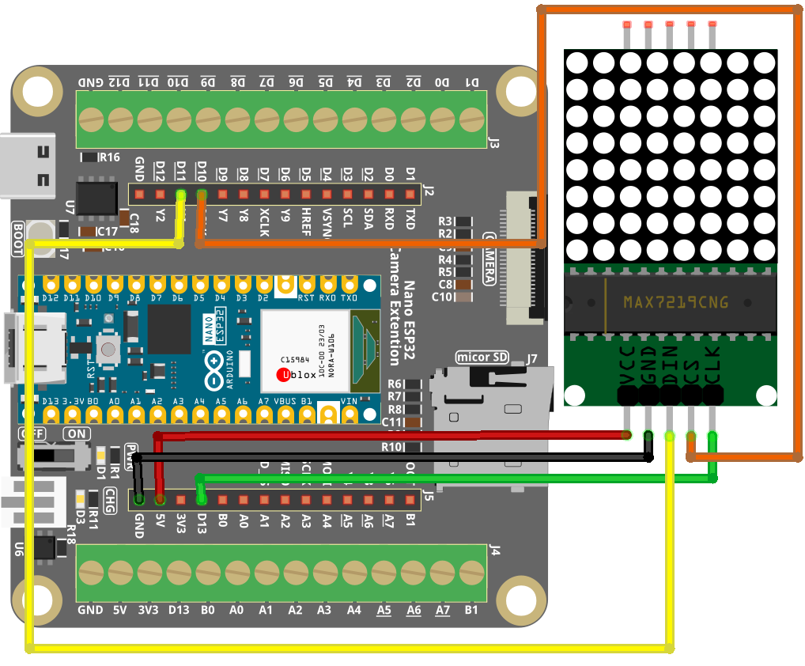

.. _xmas_matrix:

Xmas Matrix
==============================================================

.. note::
  
  🌟 Welcome to the SunFounder Facebook Community! Whether you're into Raspberry Pi, Arduino, or ESP32, you'll find inspiration, help ideas here.
   
  - ✅ Be the first to get free learning resources. 
   
  - ✅ Stay updated on new products & exclusive giveaways. 
   
  - ✅ Share your creations and get real feedback.
   
  * 👉 Need faster updates or support? Click [|link_sf_facebook|] join our Facebook community 

  * 👉 Or join our WhatsApp group: Click [|link_sf_whatsapp|]
  
🎁 Kit purchase
------------------------
  
Looking for parts? Check out our all-in-one kits below — packed with components, beginner-friendly guides, and tons of fun.

.. image:: img/esp32_kit.png
   :width: 100%
   :align: center
   :target: https://www.sunfounder.com/products/sunfounder-esp32-ultimate-starter-kit-with-esp32-camera-extension-board-battery?_pos=1&_sid=7dcb30fb6&_ss=r&ref=jbzmncle

.. raw:: html

     

.. list-table::
   :widths: 20 20 20
   :header-rows: 1

   * - Name
     - Includes ESP32 board
     - PURCHASE LINK
   * - ESP32 Ultimate Starter Kit
     - ESP32 WROOM 32E +
     - |link_esp32_kit_buy|
   * - Universal Maker Sensor Kit
     -
     - |link_umsk_buy|

Course Introduction
------------------------

This project uses an Arduino Nano ESP32 and a MAX7219 8×8 LED matrix to display animated Christmas patterns with a smooth breathing-light effect.

.. raw:: html
 
  <iframe width="700" height="394" src="https://www.youtube.com/embed/DTmtV8rApo0?si=wAFG2pkrC3vER7Q-" title="YouTube video player" frameborder="0" allow="accelerometer; autoplay; clipboard-write; encrypted-media; gyroscope; picture-in-picture; web-share" referrerpolicy="strict-origin-when-cross-origin" allowfullscreen></iframe>

.. note::

  If this is your first time working with an Arduino project, we recommend downloading and reviewing the basic materials first.
  
  * :ref:`install_arduino`
  * :ref:`introduce_arduino`
  * :ref:`install_esp32`

**Required Components**

In this project, we need the following components:

.. list-table::
    :widths: 5 20 5 20
    :header-rows: 1

    *   - SN
        - COMPONENT INTRODUCTION	
        - QUANTITY
        - PURCHASE LINK

    *   - 1
        - Arduino Nano ESP32
        - 1
        - 
    *   - 2
        - USB Type-C cable
        - 1
        - 
    *   - 3
        - Breadboard
        - 1
        - |link_breadboard_buy|
    *   - 4
        - Wires
        - Several
        - |link_wires_buy|
    *   - 5
        - MAX7219 Dot Matrix Module
        - 1
        - |link_martix1_buy|

**Wiring**

**Common Connections:**

* **MAX7219 Dot Matrix Module**

  - **CLK:** Connect to **D13** on the ESP32.
  - **CS:** Connect to **D10** on the ESP32.
  - **DIN:** Connect to **D11** on the ESP32.
  - **GND:** Connect to **GND** on the ESP32 Extension Board.
  - **VCC:** Connect to **5V** on the ESP32 Extension Board.

**Writing the Code**

.. note::

    * You can copy this code into **Arduino IDE**. 
    * Don't forget to select the board(Arduino Nano ESP32) and the correct port before clicking the **Upload** button.

.. code-block:: arduino

      // Arduino Nano ESP32 - MAX7219 8x8 LED Matrix Christmas Animations
      // - Compatible with ESP32 (no AVR-only LedControl library)
      // - Uses a minimal MAX7219 bit-bang driver
      // Wiring (same as your Nano ESP32 Tetris reference):
      //   DIN -> D11
      //   CS  -> D10
      //   CLK -> D13

      // -------------------- MAX7219 Pins (Nano ESP32) --------------------
      #define DIN  11   // Data to MAX7219 DIN
      #define CS   10   // Chip Select to MAX7219 CS/LOAD
      #define CLK  13   // Clock to MAX7219 CLK

      // -------------------- Minimal MAX7219 Driver (ESP32 compatible) --------------------
      class MAX7219_8x8 {
      public:
        MAX7219_8x8(int din, int clk, int cs) : _din(din), _clk(clk), _cs(cs) {}

        // Initialize MAX7219
        void begin(uint8_t intensity /*0..15*/) {
          pinMode(_din, OUTPUT);
          pinMode(_clk, OUTPUT);
          pinMode(_cs,  OUTPUT);

          digitalWrite(_cs, HIGH);
          digitalWrite(_clk, LOW);

          // MAX7219 setup
          sendCmd(0x0F, 0x00); // Display test: off
          sendCmd(0x09, 0x00); // Decode mode: none
          sendCmd(0x0B, 0x07); // Scan limit: 8 digits (0..7)
          sendCmd(0x0C, 0x01); // Shutdown: normal operation
          setIntensity(intensity);
          clear();
        }

        // Set brightness 0..15
        void setIntensity(uint8_t intensity) {
          if (intensity > 15) intensity = 15;
          sendCmd(0x0A, intensity);
        }

        // Clear display
        void clear() {
          for (int row = 0; row < 8; row++) setRow(row, 0x00);
        }

        // Set a row (row: 0..7), bits in data are columns (bit0 = col0)
        void setRow(uint8_t row, uint8_t data) {
          // MAX7219 digit registers are 1..8
          sendCmd(row + 1, data);
        }

        // Set a column (col: 0..7), bits in data are rows (bit0 = row0)
        // This matches LedControl's setColumn() behavior.
        void setColumn(uint8_t col, uint8_t data) {
          // Update internal buffer as rows, then write all rows.
          // For each row r, set/clear the bit at "col" based on data bit r.
          for (int r = 0; r < 8; r++) {
            bool on = (data >> r) & 0x01;
            if (on) _rowBuf[r] |=  (1 << col);
            else    _rowBuf[r] &= ~(1 << col);
          }
          // Push buffer to MAX7219
          for (int r = 0; r < 8; r++) setRow(r, _rowBuf[r]);
        }

        // Clear internal buffer + display (useful when using setColumn)
        void clearBuffered() {
          for (int r = 0; r < 8; r++) _rowBuf[r] = 0;
          clear();
        }

      private:
        int _din, _clk, _cs;
        uint8_t _rowBuf[8] = {0};

        // Shift out 16 bits: register then data, MSB first
        void shiftOut16(uint8_t reg, uint8_t data) {
          for (int i = 7; i >= 0; i--) {
            digitalWrite(_clk, LOW);
            digitalWrite(_din, (reg >> i) & 1);
            digitalWrite(_clk, HIGH);
          }
          for (int i = 7; i >= 0; i--) {
            digitalWrite(_clk, LOW);
            digitalWrite(_din, (data >> i) & 1);
            digitalWrite(_clk, HIGH);
          }
          digitalWrite(_clk, LOW);
        }

        // Send one command to MAX7219
        void sendCmd(uint8_t reg, uint8_t data) {
          digitalWrite(_cs, LOW);
          shiftOut16(reg, data);
          digitalWrite(_cs, HIGH);
        }
      };

      MAX7219_8x8 lc(DIN, CLK, CS);

      // -------------------- Patterns (8x8) --------------------
      // Note: These patterns are the same as your original sketch.

      byte treeBase[8] = {
        B00010000,
        B00111000,
        B01111100,
        B11111110,
        B00111000,
        B01111100,
        B11111110,
        B00111000
      };

      byte bellBase[8] = {
        B00000010,
        B00011100,
        B00111100,
        B11111100,
        B00111000,
        B01010000,
        B00010000,
        B00000000
      };

      byte bellMirror[8] = {
        B01000000,
        B00111000,
        B00111100,
        B00111111,
        B00011100,
        B00001010,
        B00001000,
        B00000000
      };

      byte hatBase[8] = {
        B00001100,
        B00011110,
        B00111101,
        B01111000,
        B01111000,
        B01111000,
        B11111100,
        B11111100
      };

      byte letterX[8] = {
        B10000001,
        B01000010,
        B00100100,
        B00011000,
        B00011000,
        B00100100,
        B01000010,
        B10000001
      };

      byte letterM[8] = {
        B10000001,
        B11000011,
        B10100101,
        B10011001,
        B10000001,
        B10000001,
        B10000001,
        B10000001
      };

      byte letterA[8] = {
        B00111100,
        B01100110,
        B11000011,
        B11000011,
        B11111111,
        B11000011,
        B11000011,
        B11000011
      };

      byte letterS[8] = {
        B00111110,
        B01100000,
        B01100000,
        B00111100,
        B00000110,
        B00000110,
        B01100110,
        B00111100
      };

      // -------------------- Display Helpers --------------------

      // Display pattern using column writes (keeps your original orientation logic)
      // The original code reversed the order: pattern[7 - i]
      void displayPattern(const byte pattern[8]) {
        lc.clearBuffered(); // Clear matrix + internal buffer

        for (int col = 0; col < 8; col++) {
          // Write column data in reverse order for correct orientation
          lc.setColumn(col, pattern[7 - col]);
        }
      }

      // Breathing brightness effect
      void displayWithBreathing(const byte pattern[8], int repeat) {
        for (int r = 0; r < repeat; r++) {
          for (int brightness = 0; brightness <= 15; brightness++) {
            lc.setIntensity((uint8_t)brightness); // Increase brightness
            displayPattern(pattern);
            delay(30);
          }
          for (int brightness = 15; brightness >= 0; brightness--) {
            lc.setIntensity((uint8_t)brightness); // Decrease brightness
            displayPattern(pattern);
            delay(30);
          }
        }
      }

      void setup() {
        // Initialize MAX7219
        lc.begin(15);     // Start with max intensity
        lc.clearBuffered();
      }

      void loop() {
        // Christmas tree breathing effect (twice)
        displayWithBreathing(treeBase, 2);

        // Bell breathing effect (original + mirrored)
        displayWithBreathing(bellBase, 1);
        displayWithBreathing(bellMirror, 1);

        // Christmas hat breathing effect (twice)
        displayWithBreathing(hatBase, 2);

        // Display "XMAS" breathing effect
        displayWithBreathing(letterX, 1);
        displayWithBreathing(letterM, 1);
        displayWithBreathing(letterA, 1);
        displayWithBreathing(letterS, 1);

        // Delay before repeating
        delay(500);
      }
